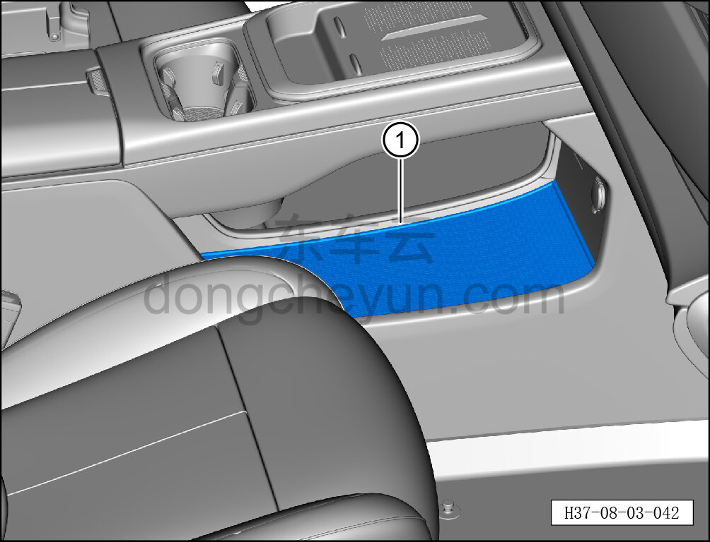

# Снятие и установка резинового коврика вещевого отсека

> Внутренняя и внешняя отделка › Центральная консоль › Снятие и установка центральной консоли  
> Оригинал: `拆卸与安装储物盒胶垫` · [dongcheyun 56746](https://dongcheyun.com/p/56746), страница `546be27638cb465e86d4d9a1b459433a` · [оглавление](../README.md)

**Порядок снятия**

1. Выключите все электроприборы, отключите питание.

2. Выполните операцию обесточивания автомобиля для ремонта. См. [3.1.4.1 Обесточивание автомобиля](../03-техническое-обслуживание/005-обесточивание-автомобиля.md)

3. Снимите резиновый коврик вещевого отсека.

a. Снимите резиновый коврик вещевого отсека ①.

**Порядок установки**

Установка выполняется в обратном порядке.
