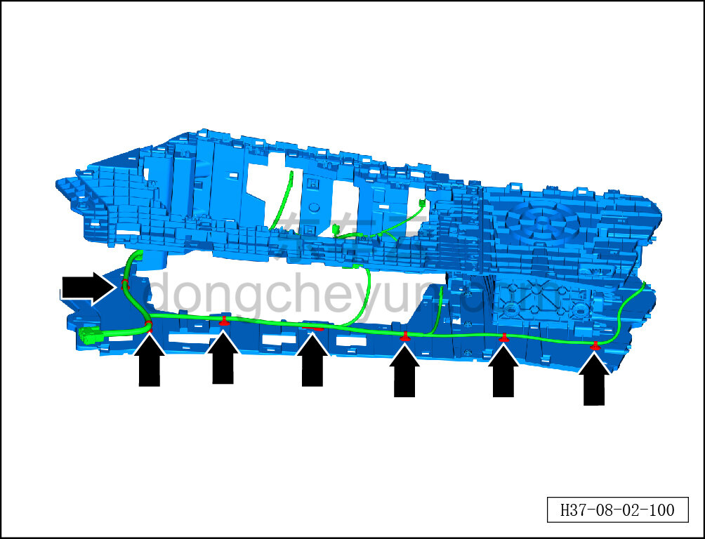
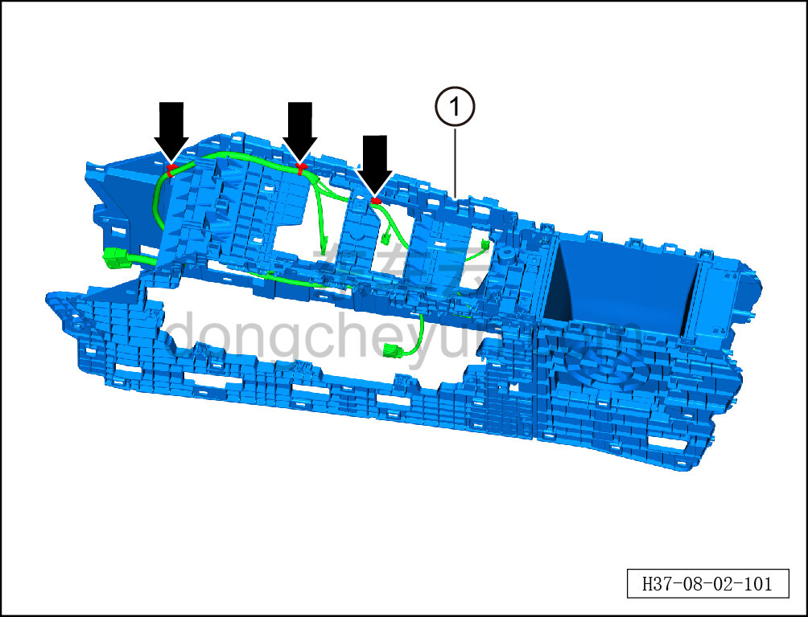

# Снятие и установка каркаса центральной консоли

> Внутренняя и внешняя отделка › Центральная консоль › Снятие и установка центральной консоли  
> Оригинал: `拆卸与安装副仪表板骨架` · [dongcheyun 56746](https://dongcheyun.com/p/56746), страница `1febed2530994fd9855a5f49f5e6c09d` · [оглавление](../README.md)

**Порядок снятия**

1. Выключите все электроприборы, отключите питание.

2. Выполните операцию обесточивания автомобиля для ремонта. См. [3.1.4.1 Обесточивание автомобиля](../03-техническое-обслуживание/005-обесточивание-автомобиля.md)

3. Снимите центральную консоль в сборе. См. [8.3.4.8 Снятие и установка центральной консоли в сборе](098-снятие-и-установка-центральной-консоли-в-сборе.md)

4. Снимите панель подстаканников. См. [8.3.4.20 Снятие и установка панели подстаканников](110-снятие-и-установка-панели-подстаканников.md)

5. Снимите левую и правую боковые панели центральной консоли. См. [8.3.4.5 Снятие и установка левой боковой панели центральной консоли](095-снятие-и-установка-левой-боковой-панели-центральной.md)

6. Снимите подлокотник центральной консоли. См. [8.3.4.6 Снятие и установка подлокотника центральной консоли](096-снятие-и-установка-подлокотника-центральной-консоли.md)

7. Снимите заглушку ароматизатора. См. [8.3.4.10 Снятие и установка заглушки ароматизатора](100-снятие-и-установка-заглушки-ароматизатора.md)

8. Снимите кронштейн ароматизатора. См. [8.3.4.11 Снятие и установка кронштейна ароматизатора](101-снятие-и-установка-кронштейна-ароматизатора.md)

9. Снимите тоннельный кожух в сборе. См. [8.3.4.22 Снятие и установка тоннельного кожуха в сборе](112-снятие-и-установка-тоннельного-кожуха-в-сборе.md)

10. Снимите переднюю антенну PS. См. [9.7.3.1 Снятие и установка передней антенны PS](../09-электрическая-и-электронная-система/061-снятие-и-установка-передней-антенны-ps.md)

11. Снимите подсветку подножия центральной консоли. См. [9.9.7.4 Снятие и установка подсветки подножия панели приборов](../09-электрическая-и-электронная-система/087-снятие-и-установка-подсветки-ног-в-панели-приборов.md)

12. Снимите каркас центральной консоли.

a. Удерживая фиксатор разъёма, отсоедините разъём подключения передней антенны PS.

b. Съёмником обивки отсоедините 3 крепёжные защёлки жгута проводов центральной консоли и снимите жгут проводов центральной консоли.

c. Снимите каркас центральной консоли ①.

**Порядок установки**

Установка выполняется в обратном порядке.

**Внимание:**

**-Проверьте крепёжные клипсы на отсутствие повреждений, при необходимости замените.**

**- При установке следите за расположением жгута проводов центральной консоли, чтобы избежать помех.**

**- Проверьте исправность функций центральной консоли.**
