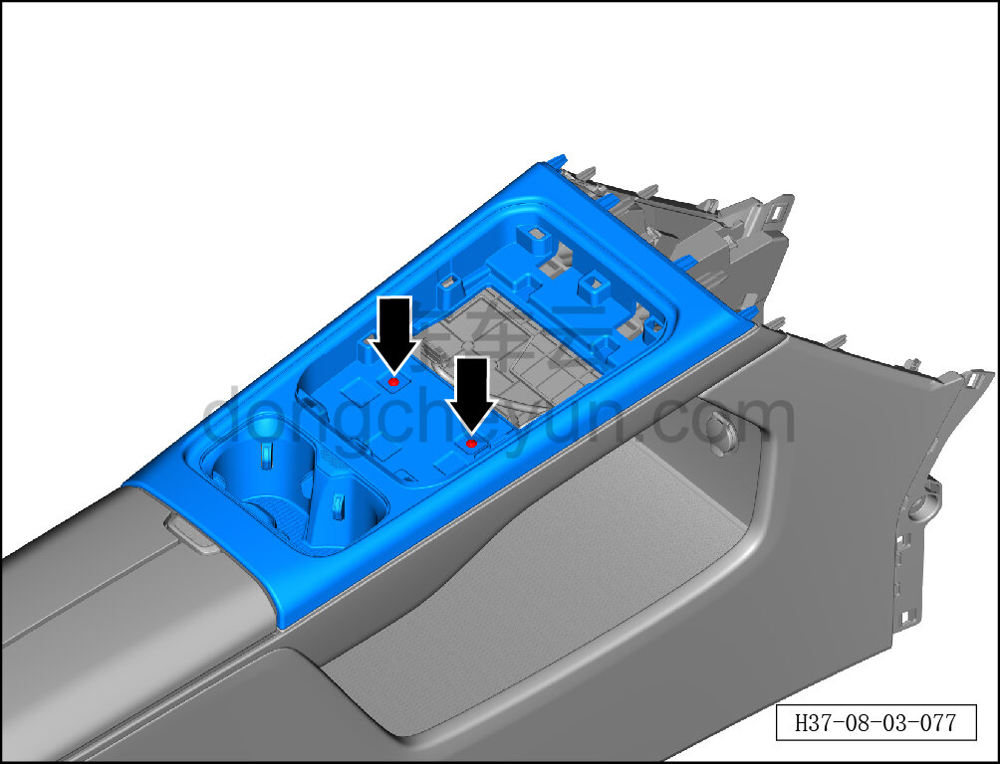
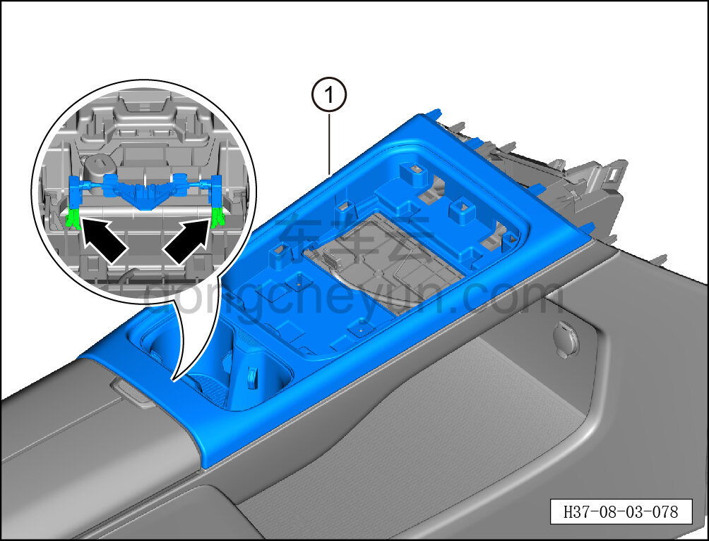

# Снятие и установка панели подстаканников

> Внутренняя и внешняя отделка › Центральная консоль › Снятие и установка центральной консоли  
> Оригинал: `拆卸与安装杯托面板` · [dongcheyun 56746](https://dongcheyun.com/p/56746), страница `b8cf9fabbc4445eca73ec359c58c85c0` · [оглавление](../README.md)

**Порядок снятия**

1. Выключите все электроприборы, отключите питание.

2. Выполните операцию обесточивания автомобиля для ремонта. См. [3.1.4.1 Обесточивание автомобиля](../03-техническое-обслуживание/005-обесточивание-автомобиля.md)

3. Снимите центральную консоль в сборе. См. [8.3.4.8 Снятие и установка центральной консоли в сборе](098-снятие-и-установка-центральной-консоли-в-сборе.md)

4. Снимите панель подстаканников.

a. Головкой T25 выверните 2 крепёжных винта панели подстаканников.

Момент затяжки винта: 1.5±0.5 Н·м

**Внимание:**

**- К нижней части панели подстаканников подключён жгут проводов; после отсоединения панели подстаканников не тяните её резко, чтобы не повредить жгут.**

b. Съёмником обивки отожмите часть ① панели подстаканников.

c. Удерживая фиксатор разъёма, отсоедините 2 разъёма подсветки подстаканников центральной консоли (ambient).

d. Снимите панель подстаканников ①.

**Внимание:**

**- При отжиме накладки съёмником обивки подложите под инструмент нетканый материал, чтобы не повредить окружающие элементы отделки в процессе снятия.**

**Порядок установки**

Установка выполняется в обратном порядке.

**Внимание:**

**- После завершения установки проверьте, что панель подстаканников установлена без перекоса и не отходит.**
