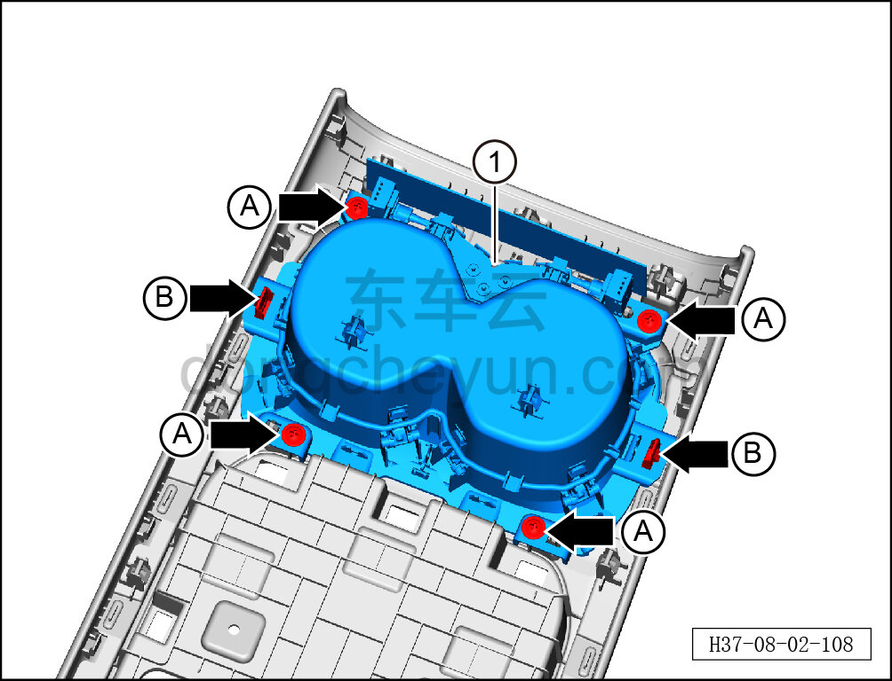

# Снятие и установка открытого подстаканника

> Внутренняя и внешняя отделка › Центральная консоль › Снятие и установка центральной консоли  
> Оригинал: `拆卸与安装敞开式杯托` · [dongcheyun 56746](https://dongcheyun.com/p/56746), страница `54806bdc326649c18b61879903daac12` · [оглавление](../README.md)

**Порядок снятия**

1. Выключите все электроприборы, отключите питание.

2. Выполните операцию обесточивания автомобиля для ремонта. См. [3.1.4.1 Обесточивание автомобиля](../03-техническое-обслуживание/005-обесточивание-автомобиля.md)

3. Снимите центральную консоль в сборе. См. [8.3.4.8 Снятие и установка центральной консоли в сборе](098-снятие-и-установка-центральной-консоли-в-сборе.md)

4. Снимите панель подстаканников. См. [8.3.4.20 Снятие и установка панели подстаканников](110-снятие-и-установка-панели-подстаканников.md)

5. Снимите открытый подстаканник.

a. Головкой T25 выверните 4 крепёжных винта открытого подстаканника.

Момент затяжки винта: 1.5±0.5 Н·м

b. Съёмником обивки отсоедините 2 крепёжные защёлки открытого подстаканника и снимите открытый подстаканник ①.

**Порядок установки**

Установка выполняется в обратном порядке.

**Внимание:**

**- После завершения установки проверьте, что открытый подстаканник установлен без перекоса и не отходит.**
