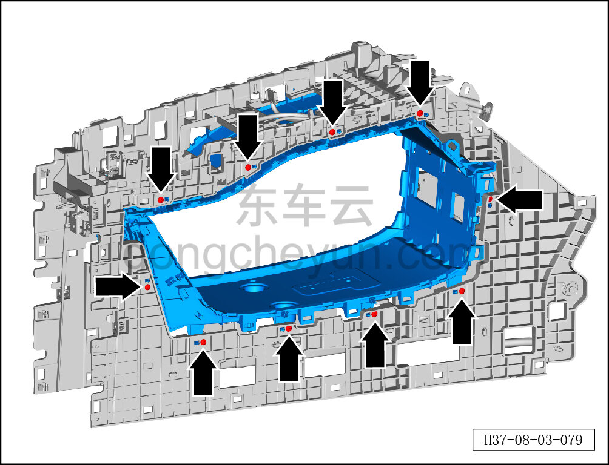
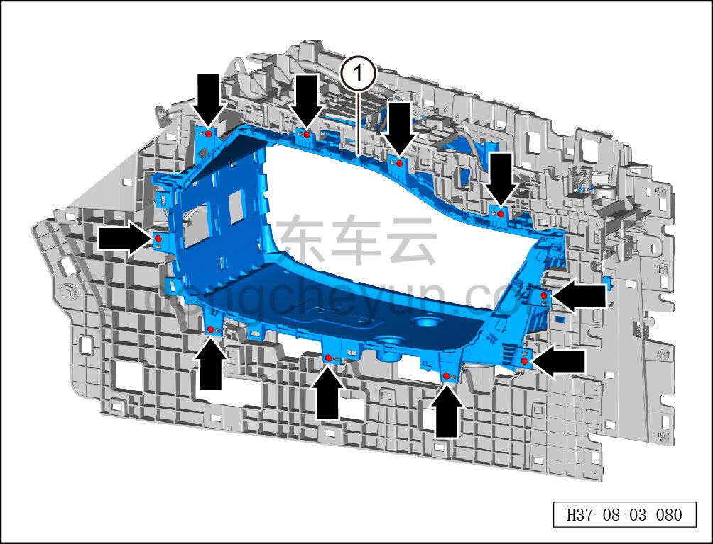

# Снятие и установка тоннельного кожуха в сборе

> Внутренняя и внешняя отделка › Центральная консоль › Снятие и установка центральной консоли  
> Оригинал: `拆卸与安装桥洞总成` · [dongcheyun 56746](https://dongcheyun.com/p/56746), страница `83dedb532e7b4af89a9d041d1197fb96` · [оглавление](../README.md)

**Порядок снятия**

1. Выключите все электроприборы, отключите питание.

2. Выполните операцию обесточивания автомобиля для ремонта. См. [3.1.4.1 Обесточивание автомобиля](../03-техническое-обслуживание/005-обесточивание-автомобиля.md)

3. Снимите центральную консоль в сборе. См. [8.3.4.8 Снятие и установка центральной консоли в сборе](098-снятие-и-установка-центральной-консоли-в-сборе.md)

4. Снимите панель подстаканников. См. [8.3.4.20 Снятие и установка панели подстаканников](110-снятие-и-установка-панели-подстаканников.md)

5. Снимите левую и правую боковые панели центральной консоли. См. [8.3.4.5 Снятие и установка левой боковой панели центральной консоли](095-снятие-и-установка-левой-боковой-панели-центральной.md)

6. Снимите подлокотник центральной консоли. См. [8.3.4.6 Снятие и установка подлокотника центральной консоли](096-снятие-и-установка-подлокотника-центральной-консоли.md)

7. Снимите кронштейн ароматизатора. См. [8.3.4.11 Снятие и установка кронштейна ароматизатора](101-снятие-и-установка-кронштейна-ароматизатора.md)

8. Снимите заглушку ароматизатора. См. [8.3.4.10 Снятие и установка заглушки ароматизатора](100-снятие-и-установка-заглушки-ароматизатора.md)

9. Снимите тоннельный кожух в сборе.

a. Головкой T25 выверните 10 крепёжных винтов с правой стороны тоннельного кожуха в сборе.

Момент затяжки винта: 1.5±0.5 Н·м

b. Головкой T25 выверните 10 крепёжных винтов с правой стороны тоннельного кожуха в сборе.

Момент затяжки винта: 1,5±0,5 Н·м.

c. Снимите тоннельный кожух в сборе с левой стороны центральной консоли ①.

**Порядок установки**

Установка выполняется в обратном порядке.

**Внимание:**

**- После завершения установки проверьте надёжность крепления тоннельного кожуха в сборе.**
