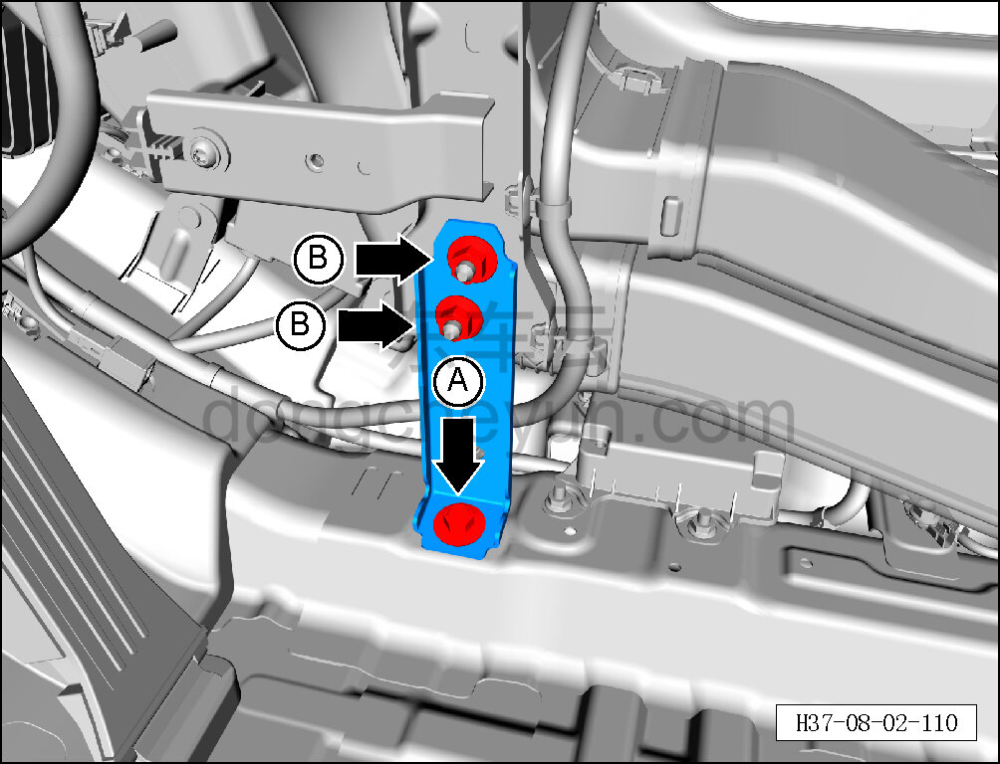
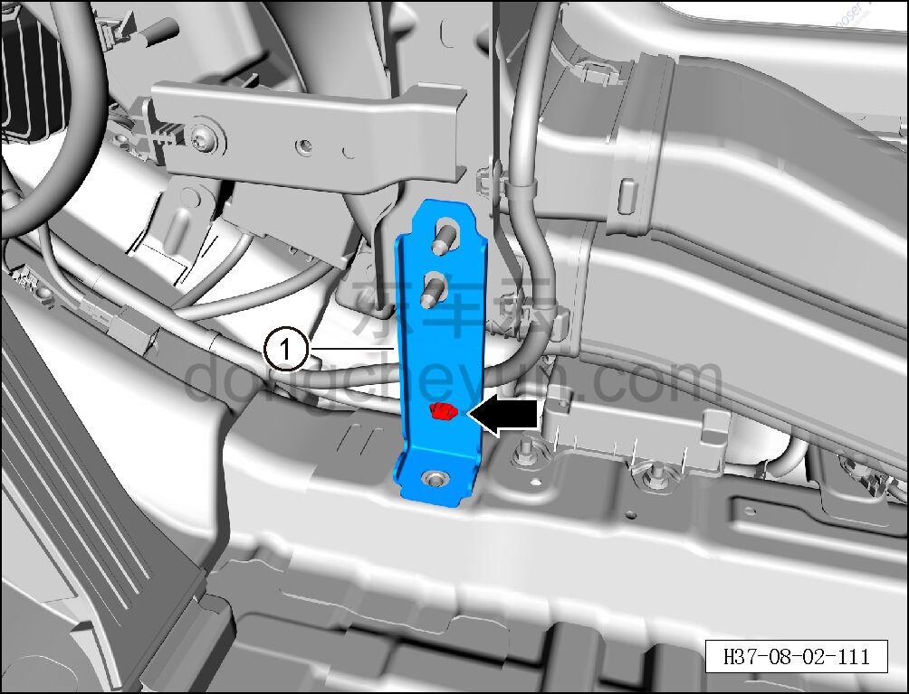

# Снятие и установка левого кронштейна крепления CCB

> Внутренняя и внешняя отделка › Центральная консоль › Снятие и установка центральной консоли  
> Оригинал: `拆卸与安装左 CCB 连接支架` · [dongcheyun 56746](https://dongcheyun.com/p/56746), страница `21c312c0d3db4274a359bea13c22f6cf` · [оглавление](../README.md)

**Порядок снятия**

**Примечание:**

**- Ниже описано снятие и установка левого кронштейна крепления CCB, правый выполняется по аналогии с левым.**

1. Выключите все электроприборы, отключите питание.

2. Выполните операцию обесточивания автомобиля для ремонта. См. [3.1.4.1 Обесточивание автомобиля](../03-техническое-обслуживание/005-обесточивание-автомобиля.md)

3. Снимите центральную консоль в сборе. См. [8.3.4.8 Снятие и установка центральной консоли в сборе](098-снятие-и-установка-центральной-консоли-в-сборе.md)

4. Снимите левый кронштейн крепления CCB.

a. Торцевой головкой на 10 мм выверните крепёжный болт A левого кронштейна крепления CCB.

Момент затяжки болта A: 4±1 Н·м

b. Торцевой головкой на 10 мм выверните 2 крепёжные гайки B левого кронштейна крепления CCB.

Момент затяжки гайки B: 4±1 Н·м

c. Съёмником обивки отсоедините крепёжные защёлки левого кронштейна крепления CCB и снимите левый кронштейн крепления CCB ①.

**Порядок установки**

Установка выполняется в обратном порядке.
