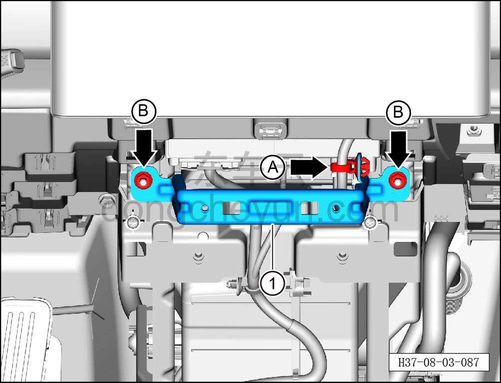

# Снятие и установка переднего усилительного кронштейна центральной консоли

> Внутренняя и внешняя отделка › Центральная консоль › Снятие и установка центральной консоли  
> Оригинал: `拆卸与安装副仪表板前部加强支架` · [dongcheyun 56746](https://dongcheyun.com/p/56746), страница `aeeed1dab9144c40b1d2210d65ca01b8` · [оглавление](../README.md)

**Порядок снятия**

1. Выключите все электроприборы, отключите питание.

2. Выполните обесточивание автомобиля для ремонта. См. [3.1.4.1 Обесточивание автомобиля](../03-техническое-обслуживание/005-обесточивание-автомобиля.md)

3. Снимите центральную консоль в сборе. См. [8.3.4.8 Снятие и установка центральной консоли в сборе](098-снятие-и-установка-центральной-консоли-в-сборе.md)

4. Снимите левую нижнюю накладку в сборе. См. [8.2.4.2 Снятие и установка левой нижней накладки в сборе](055-снятие-и-установка-нижней-левой-защитной-накладки-в.md)

5. Снимите правую торцевую крышку панели приборов. См. [8.2.4.1 Снятие и установка левой торцевой крышки панели приборов](054-снятие-и-установка-левой-торцевой-крышки-панели.md)

6. Снимите центрально-правую накладку. См. [8.2.4.21 Снятие и установка центрально-правой накладки](074-снятие-и-установка-центрально-правой-накладки.md)

7. Снимите передний усилительный кронштейн центральной консоли.

a. Съёмником обивки отожмите крепёжную защёлку A.

b. Головкой T25 выверните 2 крепёжные гайки B переднего усилительного кронштейна центральной консоли.

Момент затяжки гайки: 7±1 Н·м

**Порядок установки**

Установка выполняется в обратном порядке.
