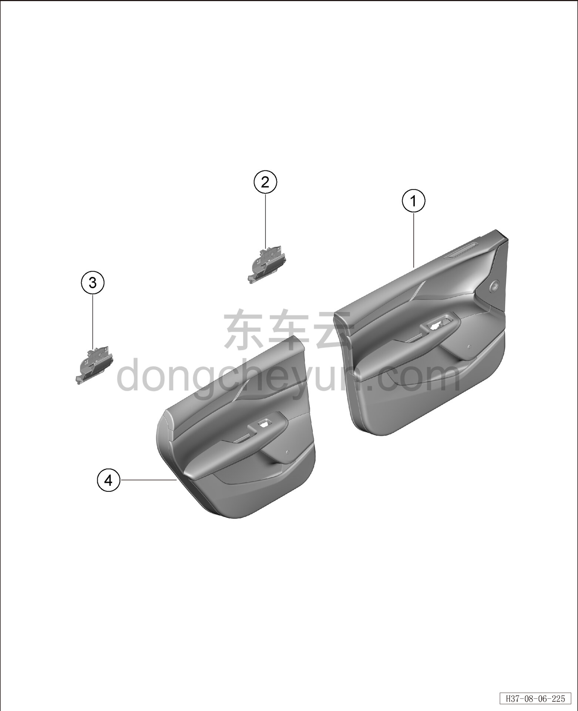
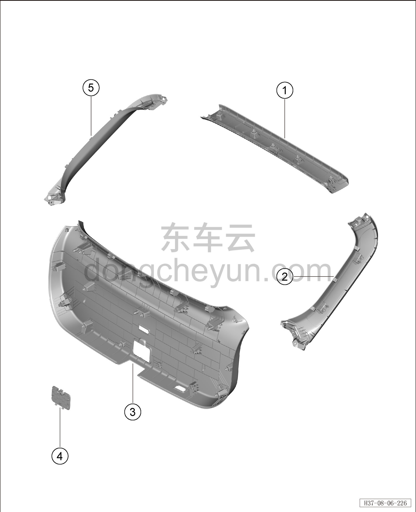

# Покомпонентный вид (деталировка)

> Внутренняя и внешняя отделка › Система обивки дверей и крышек  
> Оригинал: `结构分解图` · [dongcheyun 56746](https://dongcheyun.com/p/56746), страница `9d1d0047484449d0ab28ad064c74aa64` · [оглавление](../README.md)

| № | Наименование детали | Кол-во на автомобиль | Примечание |
|---|---|---|---|
| 1 | Обивка левой передней двери | 1 | - |
| 2 | Левая внутренняя ручка открывания (передняя дверь) | 1 | - |
| 3 | Левая внутренняя ручка открывания (задняя дверь) | 1 | - |
| 4 | Обивка левой задней двери | 1 | - |

| № | Наименование детали | Кол-во на автомобиль | Примечание |
|---|---|---|---|
| 1 | Верхняя накладка двери багажника | 1 | - |
| 2 | Правая накладка двери багажника | 1 | - |
| 3 | Нижняя накладка двери багажника | 1 | - |
| 4 | Крышка аварийного люка | 1 | - |
| 5 | Левая накладка двери багажника | 1 | - |
