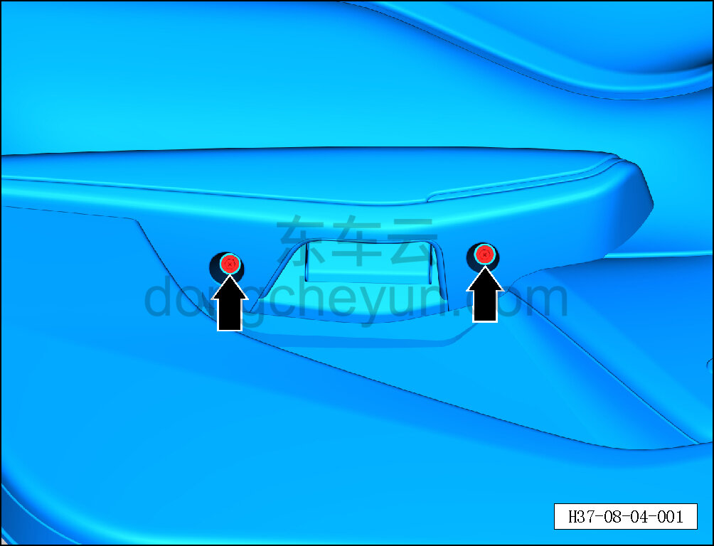
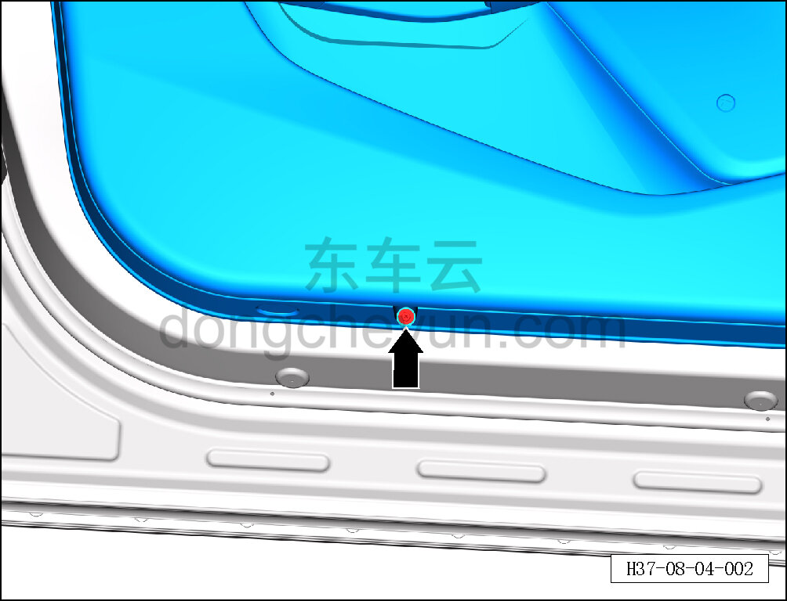
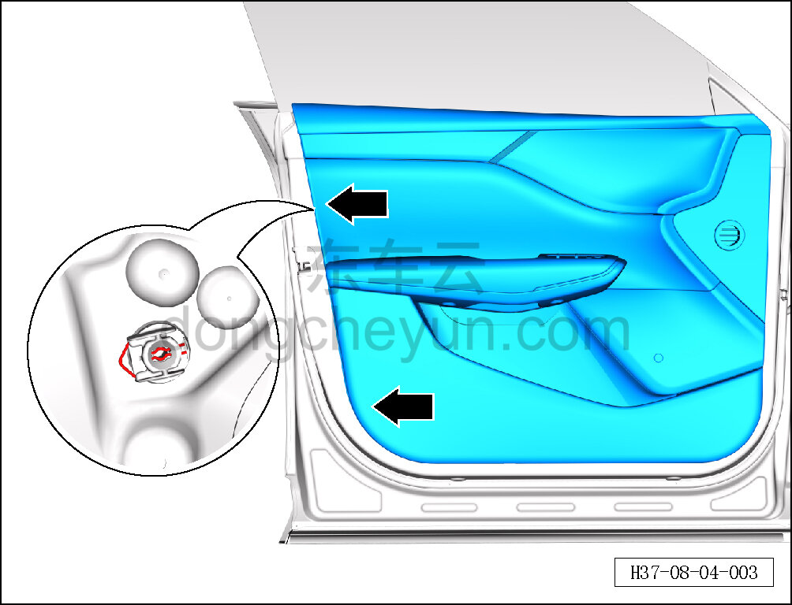
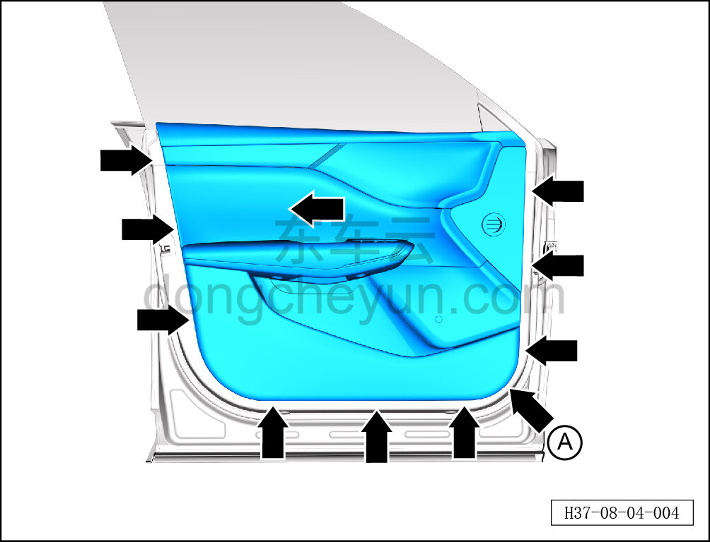
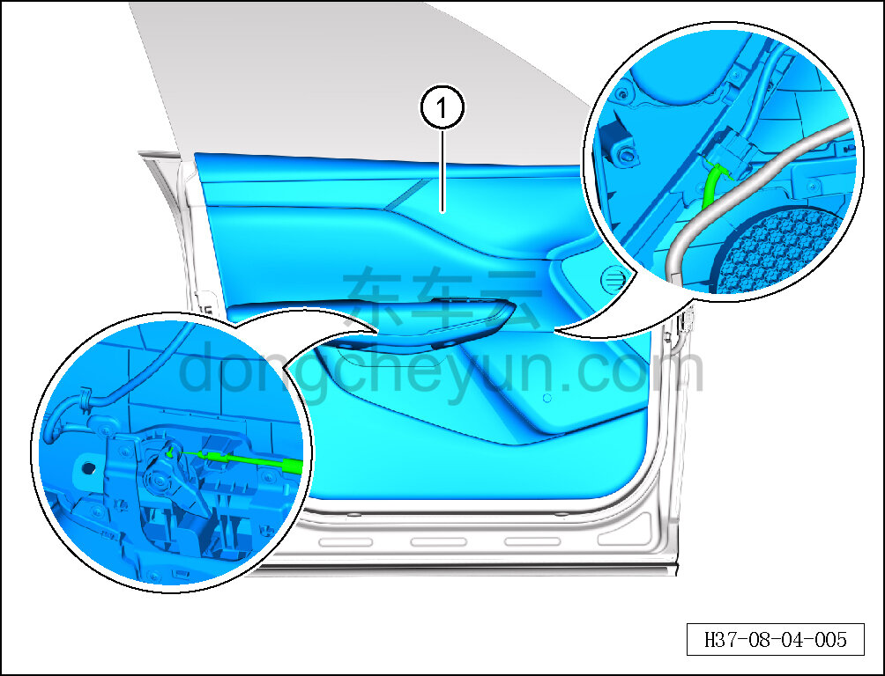

# Снятие и установка обивки левой передней двери

> Внутренняя и внешняя отделка › Система обивки дверей и крышек › Обивка передней двери в сборе  
> Оригинал: `拆卸与安装左前门内饰板` · [dongcheyun 56746](https://dongcheyun.com/p/56746), страница `5413b6c6612a4cf282f7fb2ffb19d28f` · [оглавление](../README.md)

**Порядок снятия**

**Примечание:**

**- Ниже описано снятие и установка обивки левой передней двери, правая выполняется по аналогии с левой.**

1. Выключите все электроприборы, отключите питание.

2. Выполните операцию обесточивания автомобиля для ремонта. См. [3.1.4.1 Обесточивание автомобиля](../03-техническое-обслуживание/005-обесточивание-автомобиля.md)

3. Снимите обивку левой передней двери.

a. Крестовой отвёрткой выверните 2 крепёжных винта обивки левой передней двери.

Момент затяжки винта: 2±0.5 Н·м

b. Крестовой отвёрткой выверните крепёжный винт обивки левой передней двери.

Момент затяжки винта: 2±0.5 Н·м

c. Сначала специальным инструментом для снятия противоударных защёлок обивки двери (H52211001) извлеките фиксирующие штифты 2 противоударных защёлок, затем отсоедините 2 крепёжные противоударные защёлки обивки левой передней двери.

d. Съёмником обивки, начиная с монтажного отверстия у стрелки A, отсоедините 10 крепёжных влагозащитных защёлок обивки левой передней двери.

**Внимание:**

**- К задней стороне обивки левой передней двери подключены тросик и жгут проводов; после отсоединения защёлок не тяните обивку резко, чтобы не повредить жгут.**

e. Частично отсоедините обивку левой передней двери и отсоедините тросик левой внутренней ручки открывания.

f. Удерживая фиксатор разъёма, отсоедините разъём жгута проводов обивки левой передней двери от жгута проводов передней двери.

g. Снимите обивку левой передней двери ①.

**Порядок установки**

Установка выполняется в обратном порядке.

**Внимание:**

**- Проверьте крепёжные защёлки на повреждения и при необходимости замените их.**

**- После завершения установки проверьте нормальность открывания и закрывания двери, а также подъёма и опускания стекла.**
