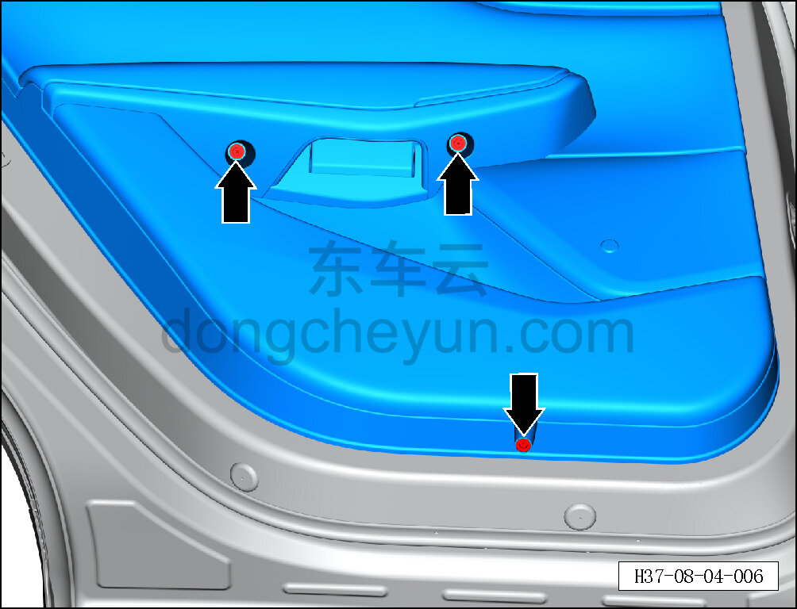
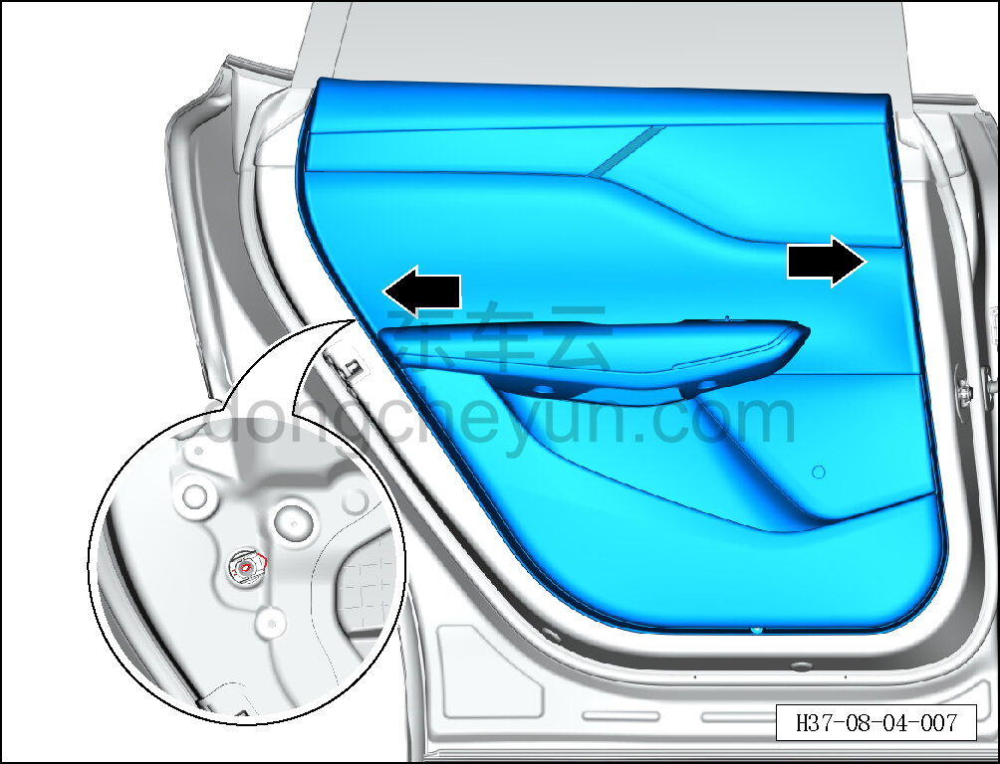
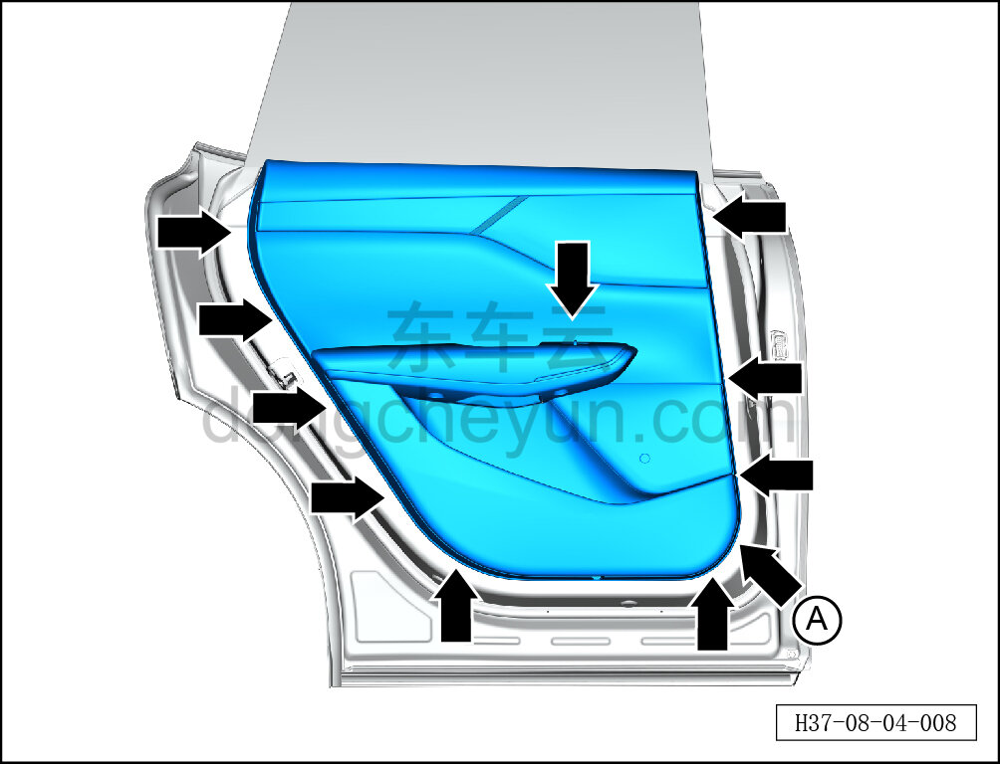
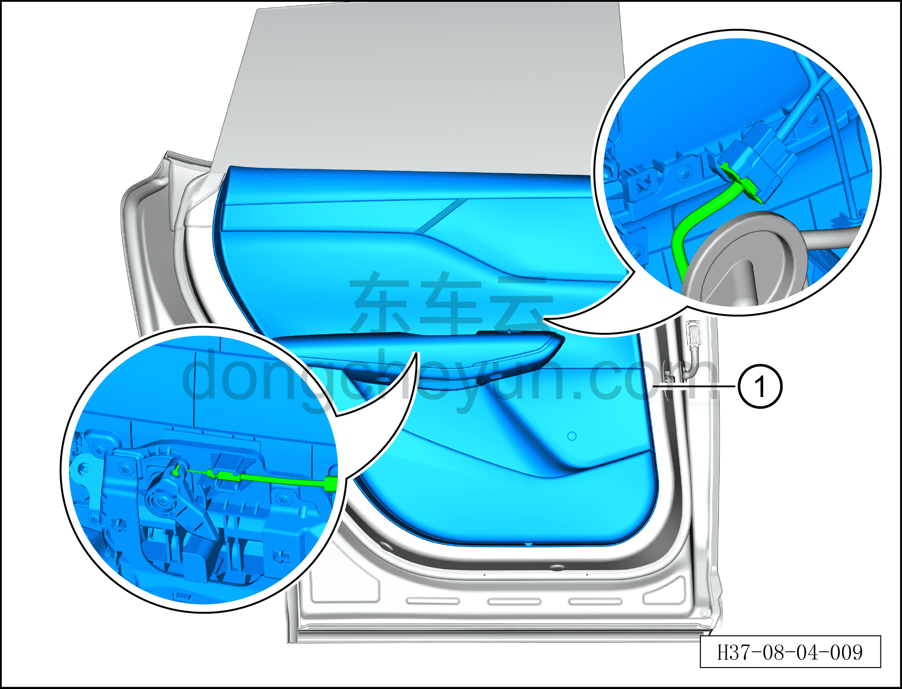

# Снятие и установка обивки левой задней двери

> Внутренняя и внешняя отделка › Система обивки дверей и крышек › Обивка задней двери в сборе  
> Оригинал: `拆卸与安装左后门内饰板` · [dongcheyun 56746](https://dongcheyun.com/p/56746), страница `45cd169970bd4d43896f460dfdda5ac9` · [оглавление](../README.md)

**Порядок снятия**

**Примечание:**

**- Ниже описано снятие и установка обивки левой задней двери, правая выполняется по аналогии с левой.**

1. Выключите все электроприборы, отключите питание.

2. Выполните операцию обесточивания автомобиля для ремонта. См. [3.1.4.1 Обесточивание автомобиля](../03-техническое-обслуживание/005-обесточивание-автомобиля.md)

3. Снимите обивку левой задней двери.

a. Крестовой отвёрткой выверните 3 крепёжных винта обивки левой задней двери.

Момент затяжки винта: 2±0.5 Н·м

b. Сначала специальным инструментом для снятия противоударных защёлок обивки двери (H52211001) извлеките фиксирующие штифты 2 противоударных защёлок, затем отсоедините 2 крепёжные противоударные защёлки обивки левой задней двери.

c. Съёмником обивки, начиная с монтажного отверстия у стрелки A, отсоедините 10 крепёжных влагозащитных защёлок обивки левой задней двери.

**Внимание:**

**- К задней стороне обивки левой задней двери подключены тросик и жгут проводов; после отсоединения защёлок не тяните обивку резко, чтобы не повредить жгут.**

d. Частично отсоедините обивку левой задней двери и отсоедините тросик левой внутренней ручки открывания.

e. Удерживая фиксатор разъёма, отсоедините разъём жгута проводов обивки левой задней двери от жгута проводов задней двери.

f. Снимите обивку левой задней двери ①.

**Порядок установки**

Установка выполняется в обратном порядке.

**Внимание:**

**- Проверьте крепёжные защёлки на повреждения и при необходимости замените их.**

**- После завершения установки проверьте нормальность открывания и закрывания двери, а также подъёма и опускания стекла.**
