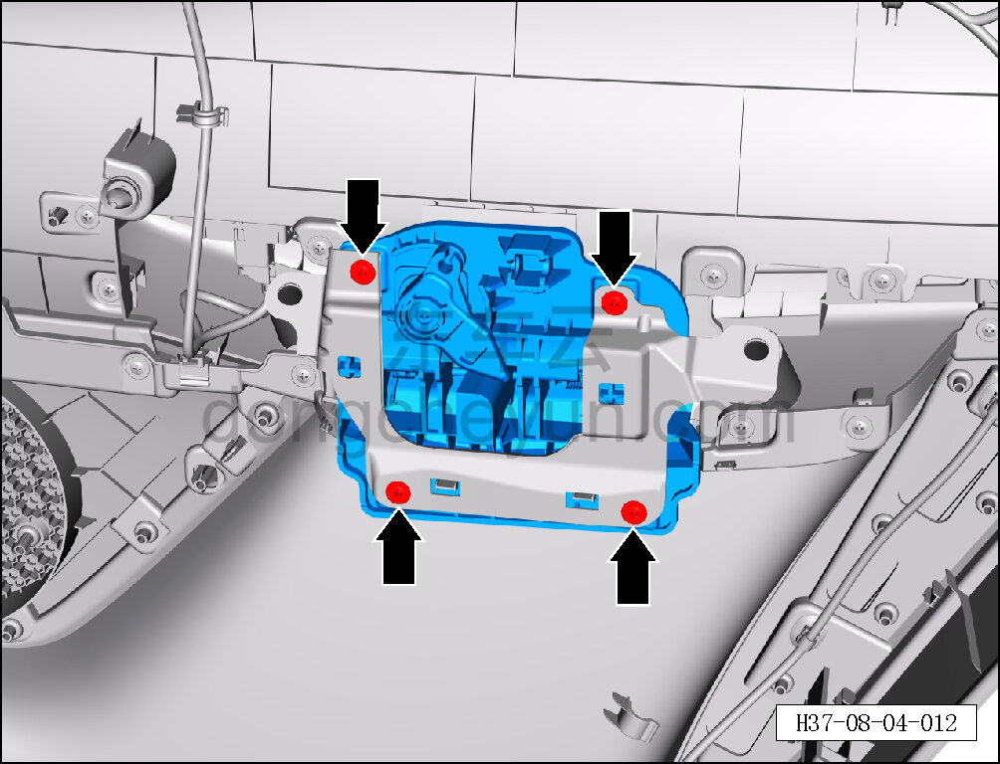
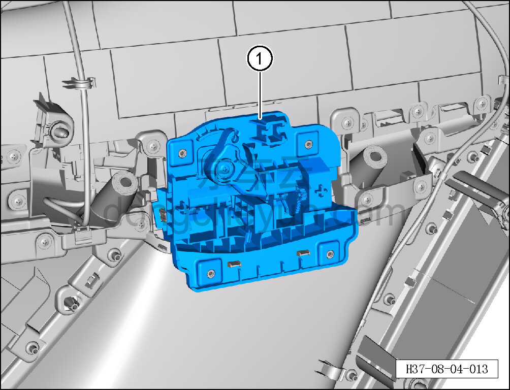

# Снятие и установка левой внутренней ручки открывания (задняя дверь)

> Внутренняя и внешняя отделка › Система обивки дверей и крышек › Обивка задней двери в сборе  
> Оригинал: `拆卸与安装左内开启手柄（后门）` · [dongcheyun 56746](https://dongcheyun.com/p/56746), страница `b67b8369de68497391c13607a81300c6` · [оглавление](../README.md)

**Порядок снятия**

**Примечание:**

**- Ниже описано снятие и установка левой внутренней ручки открывания, правая выполняется по аналогии с левой.**

1. Выключите все электроприборы, отключите питание.

2. Выполните операцию обесточивания автомобиля для ремонта. См. [3.1.4.1 Обесточивание автомобиля](../03-техническое-обслуживание/005-обесточивание-автомобиля.md)

3. Снимите обивку левой задней двери. См. [8.4.3.1 Снятие и установка обивки левой задней двери](119-снятие-и-установка-обивки-левой-задней-двери.md)

4. Снимите левую внутреннюю ручку открывания.

a. Крестовой отвёрткой выверните 4 крепёжных винта левой внутренней ручки открывания и снимите кронштейн.

Момент затяжки винта: 1.5±0.5 Н·м

b. Снимите левую внутреннюю ручку открывания ①.

**Порядок установки**

Установка выполняется в обратном порядке.

**Внимание:**

**- Проверьте крепёжные защёлки на повреждения и при необходимости замените их.**

**- После завершения установки проверьте нормальность работы функции открывания и закрывания.**
