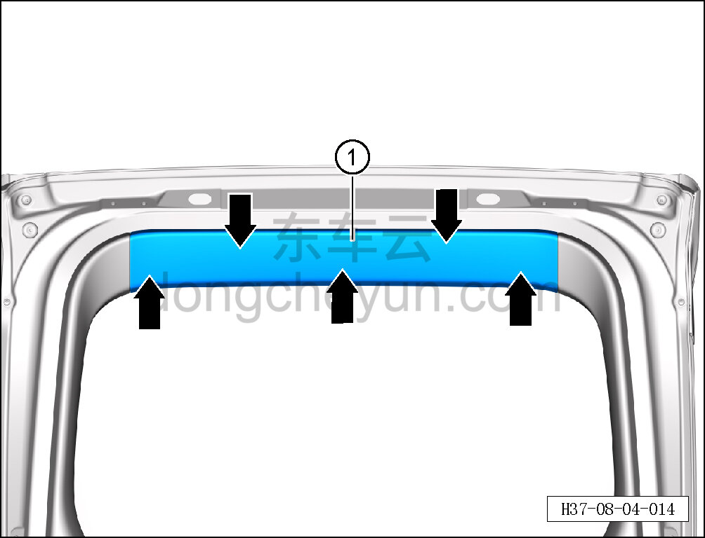

# Снятие и установка верхней накладки двери багажника

> Внутренняя и внешняя отделка › Система обивки дверей и крышек › Обивка двери багажника в сборе  
> Оригинал: `拆卸与安装后背门上装饰板` · [dongcheyun 56746](https://dongcheyun.com/p/56746), страница `d2cfaaa6a7ac4cfcbac893f70b3e8c33` · [оглавление](../README.md)

**Порядок снятия**

1. Откройте дверь багажника.

2. Снимите верхнюю накладку двери багажника.

a. Съёмником обивки отсоедините 5 крепёжных защёлок верхней накладки двери багажника.

b. Снимите верхнюю накладку двери багажника ①.

**Внимание:**

**- При отжиме накладки съёмником обивки подложите под инструмент нетканый материал, чтобы не повредить окружающие элементы отделки в процессе снятия.**

**Порядок установки**

Установка выполняется в обратном порядке.

**Внимание:**

**-Проверьте крепёжные клипсы на отсутствие повреждений, при необходимости замените.**

**- После завершения установки проверьте, что верхняя накладка двери багажника установлена без перекоса и не отходит.**
