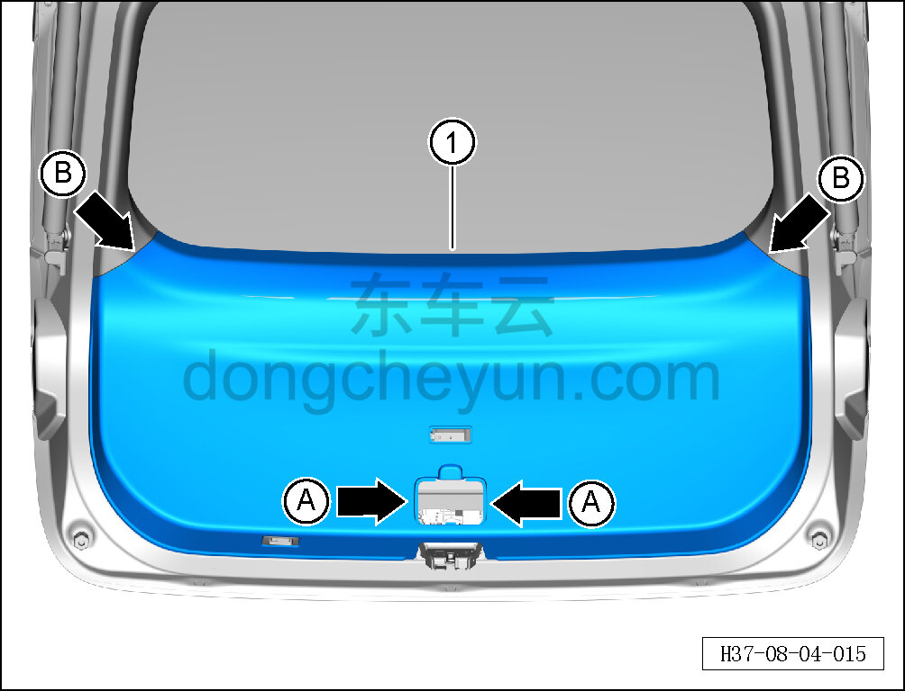
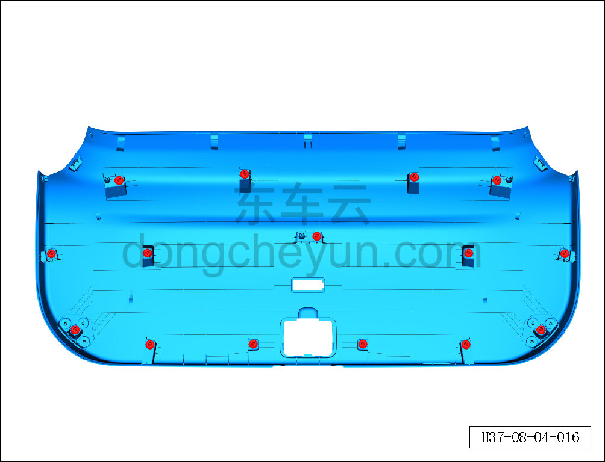

# Снятие и установка нижней накладки двери багажника

> Внутренняя и внешняя отделка › Система обивки дверей и крышек › Обивка двери багажника в сборе  
> Оригинал: `拆卸与安装后背门下装饰板` · [dongcheyun 56746](https://dongcheyun.com/p/56746), страница `8d477ffd40b541078d76215db30b1f6f` · [оглавление](../README.md)

**Порядок снятия**

1. Выключите все электроприборы, отключите питание.

2. Выполните операцию обесточивания автомобиля для ремонта. См. [3.1.4.1 Обесточивание автомобиля](../03-техническое-обслуживание/005-обесточивание-автомобиля.md)

3. Снимите правый светильник багажника. См. [9.9.10.1 Снятие и установка правого светильника багажника](../09-электрическая-и-электронная-система/090-снятие-и-установка-правого-светильника-освещения.md)

4. Снимите выключатель закрывания электропривода двери багажника. См. [9.6.3.3 Снятие и установка выключателя закрывания двери багажника](../09-электрическая-и-электронная-система/056-снятие-и-установка-выключателя-закрытия-двери-багажника.md)

5. Снимите крышку аварийного люка. См. [8.4.4.4 Снятие и установка крышки аварийного люка](124-снятие-и-установка-крышки-аварийного-люка.md)

6. Снимите нижнюю накладку двери багажника.

a. Просуньте обе руки в монтажное отверстие крышки аварийного люка, возьмитесь за оба конца A и с усилием потяните нижнюю накладку двери багажника вниз, чтобы крепёжные защёлки отделились от кузовной панели двери багажника, затем съёмником обивки отожмите край B в месте стыка нижней накладки с левой и правой боковыми накладками двери багажника и поверните, чтобы вывести защёлочное соединение из зацепления.

b. Обеими руками отсоедините крепёжные защёлки нижней накладки двери багажника и снимите нижнюю накладку двери багажника ①.

c. Крепёжные защёлки нижней накладки двери багажника показаны на рисунке слева.

**Порядок установки**

Установка выполняется в обратном порядке.

**Внимание:**

**-Проверьте крепёжные клипсы на отсутствие повреждений, при необходимости замените.**

**- После завершения установки проверьте, что нижняя накладка двери багажника установлена без перекоса и не отходит.**
