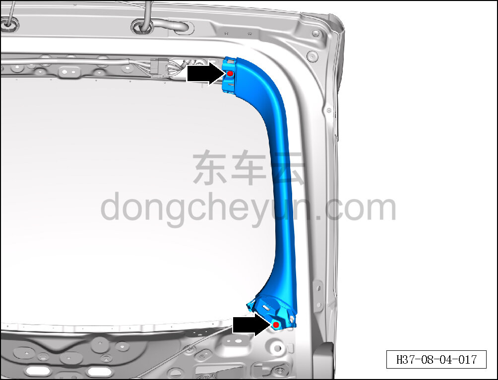
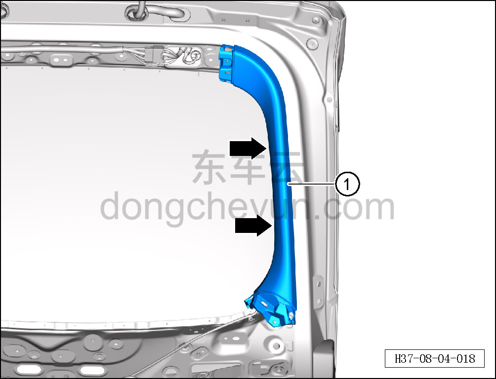

# Снятие и установка левой накладки двери багажника

> Внутренняя и внешняя отделка › Система обивки дверей и крышек › Обивка двери багажника в сборе  
> Оригинал: `拆卸与安装后背门左侧装饰板` · [dongcheyun 56746](https://dongcheyun.com/p/56746), страница `d141272044b840c0915b2f6025248942` · [оглавление](../README.md)

**Порядок снятия**

**Примечание:**

**- Ниже описано снятие и установка левой накладки двери багажника, правая выполняется по аналогии с левой.**

1. Выключите все электроприборы, отключите питание.

2. Выполните операцию обесточивания автомобиля для ремонта. См. [3.1.4.1 Обесточивание автомобиля](../03-техническое-обслуживание/005-обесточивание-автомобиля.md)

3. Снимите нижнюю декоративную накладку двери багажника. См. [8.4.4.2 Снятие и установка нижней декоративной накладки двери багажника](122-снятие-и-установка-нижней-накладки-двери-багажника.md)

4. Снимите верхнюю накладку двери багажника. См. [8.4.4.1 Снятие и установка верхней накладки двери багажника](121-снятие-и-установка-верхней-накладки-двери-багажника.md)

5. Снимите левую накладку двери багажника.

a. Головкой T25 выверните 2 крепёжных винта левой накладки двери багажника.

Момент затяжки винта: 1±0,1 Н·м

b. Съёмником обивки отсоедините 2 крепёжные защёлки левой накладки двери багажника и снимите левую накладку двери багажника ①.

**Порядок установки**

Установка выполняется в обратном порядке.

**Внимание:**

**-Проверьте крепёжные клипсы на отсутствие повреждений, при необходимости замените.**

**- После завершения установки проверьте, что левая накладка двери багажника установлена без перекоса и не отходит.**
