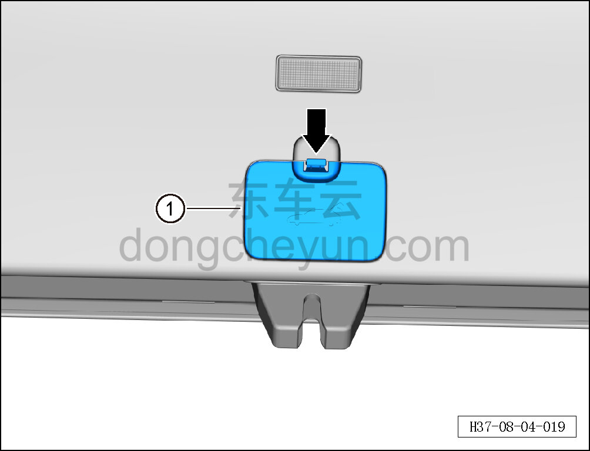

# Снятие и установка крышки аварийного люка

> Внутренняя и внешняя отделка › Система обивки дверей и крышек › Обивка двери багажника в сборе  
> Оригинал: `拆卸与安装逃生孔盖` · [dongcheyun 56746](https://dongcheyun.com/p/56746), страница `b0fd9f1678d447109ccf4a6aa164fd08` · [оглавление](../README.md)

**Порядок снятия**

1. Откройте дверь багажника.

2. Снимите крышку аварийного люка.

a. Пальцами возьмитесь за защёлку крышки аварийного люка и потяните крышку аварийного люка вниз ①.

**Порядок установки**

Установка выполняется в обратном порядке.
