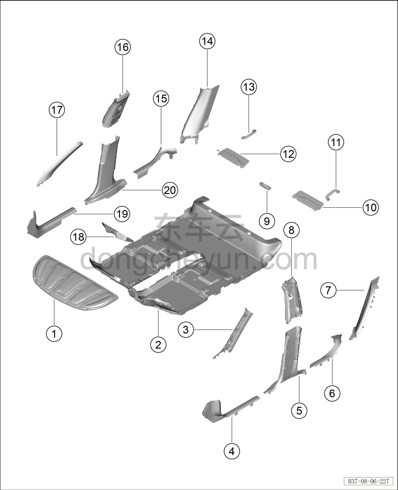
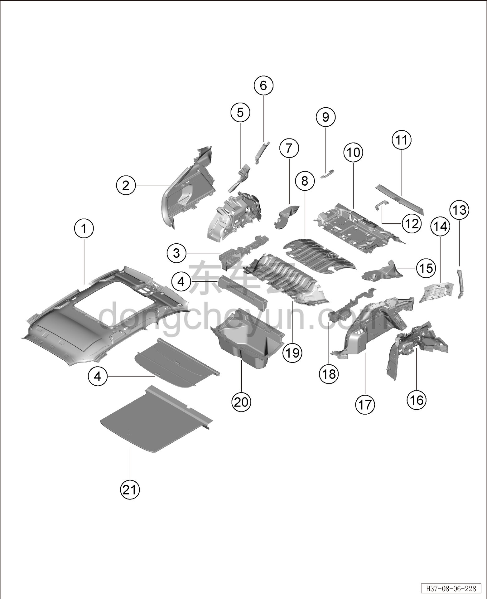

# Покомпонентный вид (деталировка)

> Внутренняя и внешняя отделка › Элементы отделки салона  
> Оригинал: `结构分解图` · [dongcheyun 56746](https://dongcheyun.com/p/56746), страница `fb2b99ca42134cf88ebd49d53c180dc8` · [оглавление](../README.md)

| № | Наименование детали | Кол-во на автомобиль | Примечание |
|---|---|---|---|
| 1 | Шумоизоляционная накладка капота | 1 | - |
| 2 | Передний ковёр переднего пола | 1 | - |
| 3 | Левая верхняя накладка стойки A | 1 | - |
| 4 | Левая накладка переднего порога | 1 | - |
| 5 | Левая нижняя накладка стойки B | 1 | - |
| 6 | Левая накладка заднего порога | 1 | - |
| 7 | Левая нижняя накладка стойки C | 1 | - |
| 8 | Левая верхняя накладка стойки B | 1 | - |
| 9 | Декоративная крышка камеры мониторинга заднего ряда | 1 | - |
| 10 | Левый солнцезащитный козырёк | 1 | - |
| 11 | Левая передняя ручка безопасности | 1 | - |
| 12 | Правый солнцезащитный козырёк | 1 | - |
| 13 | Правая передняя ручка безопасности | 1 | - |
| 14 | Правая нижняя накладка стойки C | 1 | - |
| 15 | Правая накладка заднего порога | 1 | - |
| 16 | Правая верхняя накладка стойки B | 1 | - |
| 17 | Правая верхняя накладка стойки A | 1 | - |
| 18 | Опорный блок ковра | 1 | - |
| 19 | Правая накладка переднего порога | 1 | - |
| 20 | Правая нижняя накладка стойки B | 1 | - |

| № | Наименование детали | Кол-во на автомобиль | Примечание |
|---|---|---|---|
| 1 | Обивка потолка | 1 | - |
| 2 | Левая обивка задней боковины | 1 | - |
| 3 | Монтажный кронштейн левой обивки задней боковины | 1 | - |
| 4 | Опорный блок багажника | 1 | - |
| 5 | Левая верхняя накладка стойки C | 1 | - |
| 6 | Обивка левого заднего углового стекла | 1 | - |
| 7 | Опорный блок заднего левого ковра | 1 | - |
| 8 | Наружная шумоизоляционная накладка пола багажника | 1 | - |
| 9 | Левая задняя ручка безопасности | 1 | - |
| 10 | Внутренняя шумоизоляционная накладка пола багажника | 1 | - |
| 11 | Накладка порога двери багажника | 1 | - |
| 12 | Правая задняя ручка безопасности | 1 | - |
| 13 | Обивка правого заднего углового стекла | 1 | - |
| 14 | Правая верхняя накладка стойки C | 1 | - |
| 15 | Опорный блок заднего правого ковра | 1 | - |
| 16 | Шумоизоляционная накладка правой задней колёсной арки | 1 | - |
| 17 | Правая обивка задней боковины | 1 | - |
| 18 | Монтажный кронштейн правой обивки задней боковины | 1 | - |
| 19 | Шумоизоляционная накладка под задним сиденьем | 1 | - |
| 20 | Вещевой ящик багажника | 1 | - |
| 21 | Шторка багажника | 1 | - |
