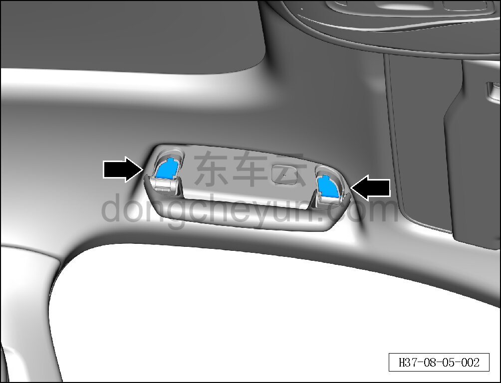
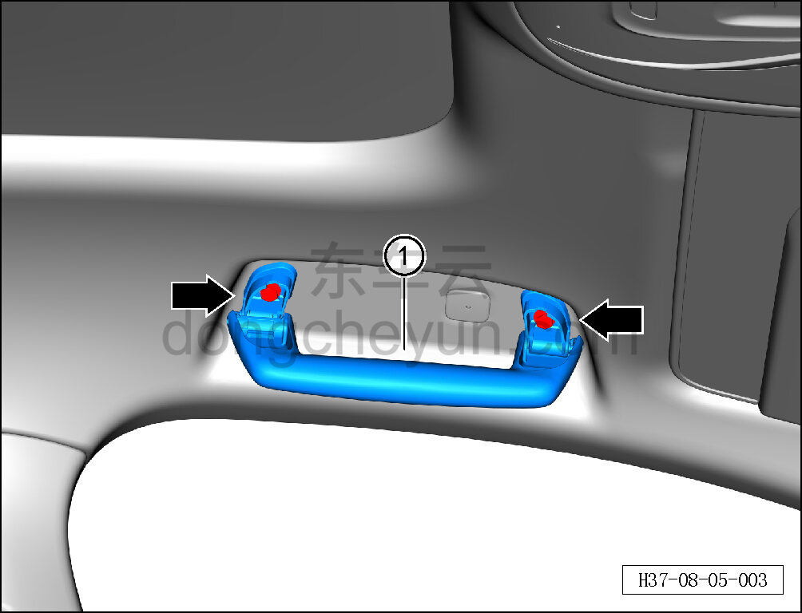

# Снятие и установка передней ручки безопасности

> Внутренняя и внешняя отделка › Элементы отделки салона › Ручки безопасности  
> Оригинал: `拆卸与安装前安全拉手` · [dongcheyun 56746](https://dongcheyun.com/p/56746), страница `bd332c58d3604148b8ea823ac4deaefd` · [оглавление](../README.md)

**Порядок снятия**

**Примечание:**

**- Ниже описано снятие и установка левой передней ручки безопасности, правая и задние выполняются по аналогии с левой.**

1. Снимите левую переднюю ручку безопасности.

a. Съёмником обивки снимите 2 заглушки левой передней ручки безопасности.

b. Торцевой головкой на 10 мм выверните 2 крепёжных болта левой передней ручки безопасности.

Момент затяжки болта: 4±1 Н·м

c. Снимите левую переднюю ручку безопасности ①.

**Порядок установки**

Установка выполняется в обратном порядке.

**Внимание:**

**- После завершения установки проверьте надёжность крепления ручки безопасности.**
