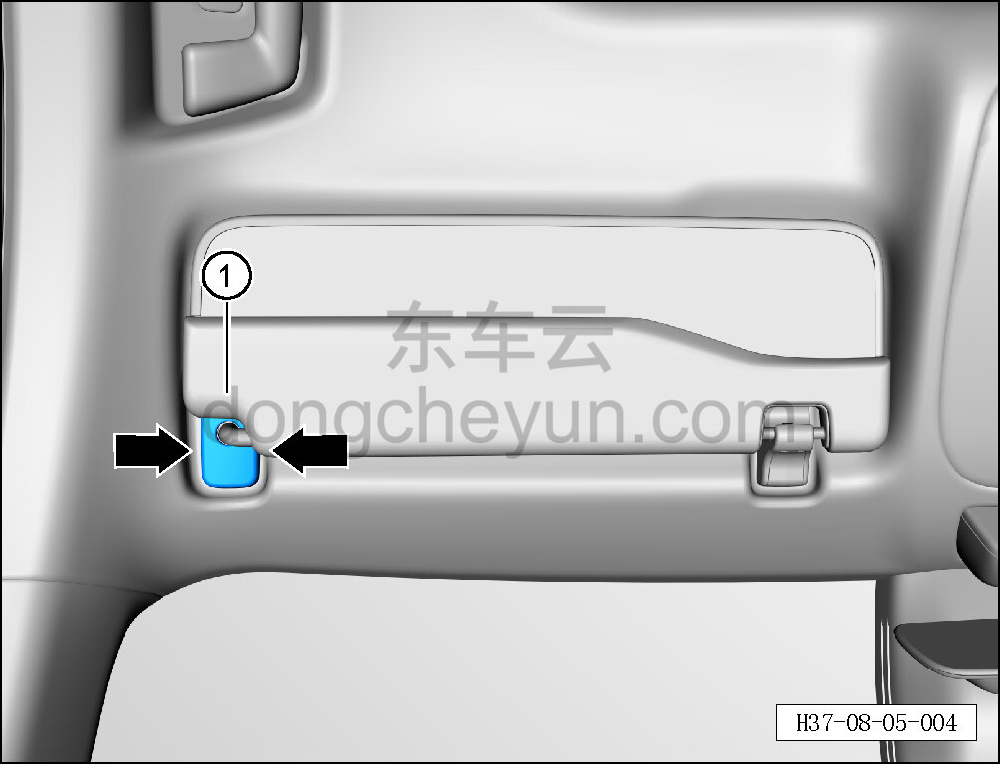

# Снятие и установка крышки основания левого солнцезащитного козырька

> Внутренняя и внешняя отделка › Элементы отделки салона › Солнцезащитные козырьки  
> Оригинал: `拆卸与安装左遮阳板底座盖板` · [dongcheyun 56746](https://dongcheyun.com/p/56746), страница `b4b275d7e73c484883e49310233491f0` · [оглавление](../README.md)

**Порядок снятия**

**Примечание:**

**- Ниже описано снятие и установка крышки основания левого солнцезащитного козырька, правая выполняется по аналогии с левой.**

1. Снимите крышку основания левого солнцезащитного козырька.

a. Съёмником обивки отсоедините крепёжные защёлки с обеих сторон крышки основания левого солнцезащитного козырька.

b. Снимите крышку основания левого солнцезащитного козырька ①.

**Внимание:**

**- При отжиме крышки съёмником обивки подложите под инструмент нетканый материал, чтобы не повредить окружающие элементы отделки в процессе снятия.**

**Порядок установки**

Установка выполняется в обратном порядке.

**Внимание:**

**- После завершения установки проверьте надёжность крепления крышки основания солнцезащитного козырька.**
