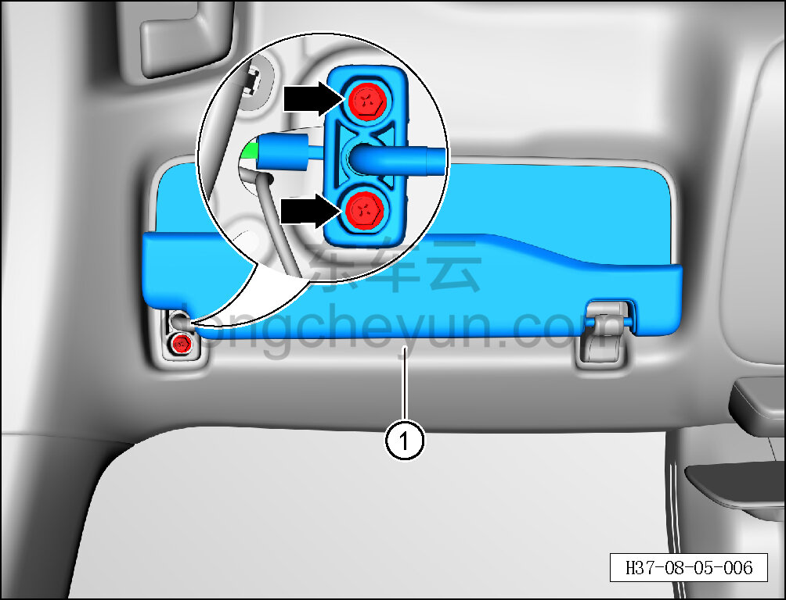
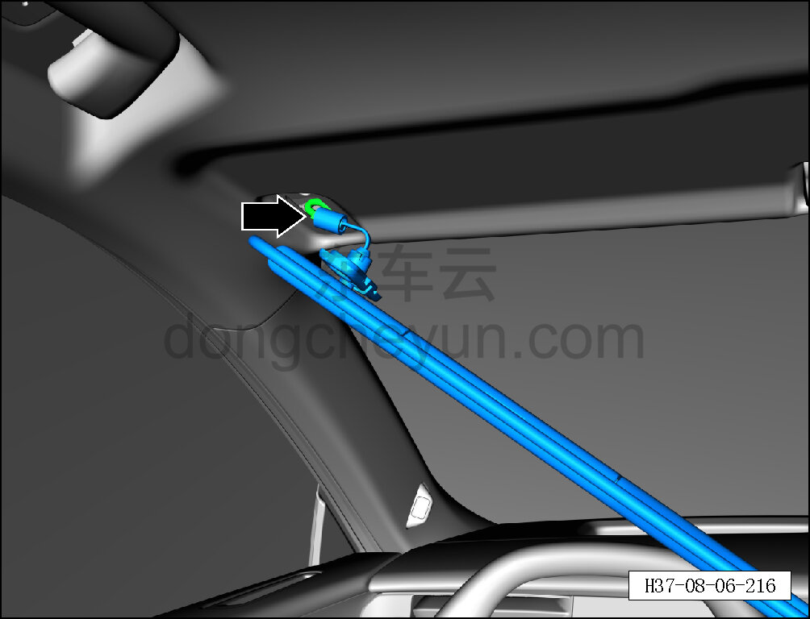
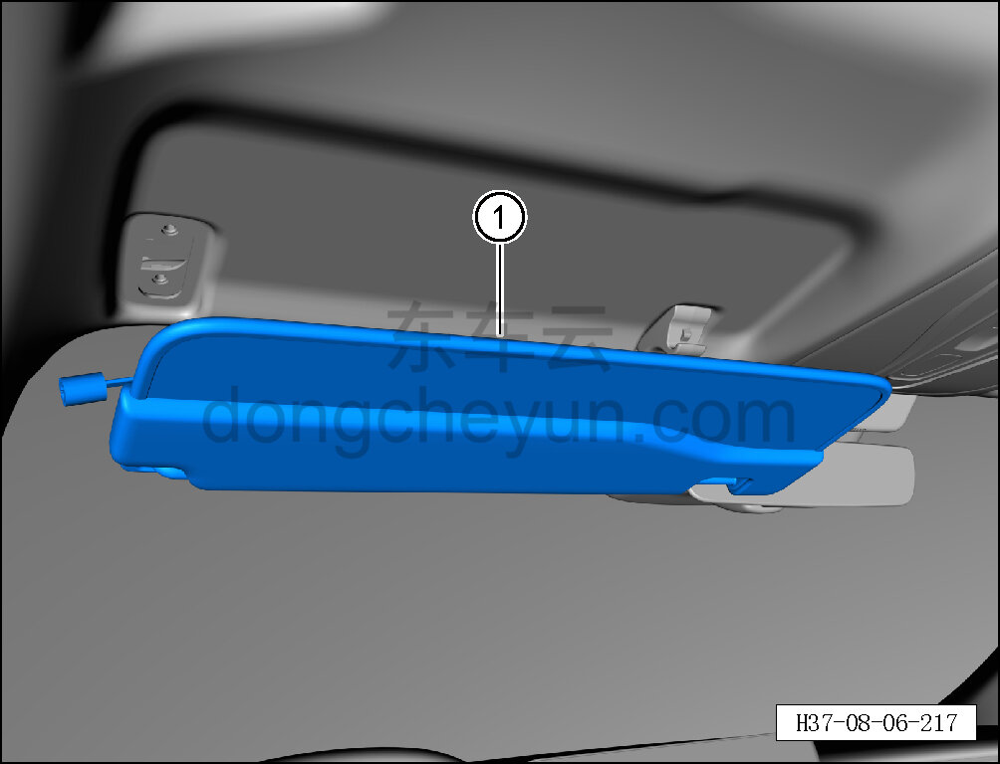

# Снятие и установка левого солнцезащитного козырька

> Внутренняя и внешняя отделка › Элементы отделки салона › Солнцезащитные козырьки  
> Оригинал: `拆卸与安装左遮阳板` · [dongcheyun 56746](https://dongcheyun.com/p/56746), страница `b0b940ad541d40f2b469b0b15757a7bf` · [оглавление](../README.md)

**Порядок снятия**

**Примечание:**

**- Ниже описано снятие и установка левого солнцезащитного козырька, правый выполняется по аналогии с левым.**

1. Выключите все электроприборы, отключите питание.

2. Выполните операцию обесточивания автомобиля для ремонта. См. [3.1.4.1 Обесточивание автомобиля](../03-техническое-обслуживание/005-обесточивание-автомобиля.md)

3. Снимите крышку основания левого солнцезащитного козырька. См. [8.5.4.1 Снятие и установка крышки основания левого солнцезащитного козырька](128-снятие-и-установка-крышки-основания-левого.md)

4. Снимите солнцезащитный козырёк.

a. Торцевой головкой на 10 мм выверните 2 крепёжных болта левого солнцезащитного козырька.

Момент затяжки болта: 4±1 Н·м

b. Снимите часть ① левого солнцезащитного козырька.

c. Удерживая фиксатор разъёма, отсоедините разъём подсветки левого солнцезащитного козырька.

d. Снимите левый солнцезащитный козырёк ①.

**Порядок установки**

Установка выполняется в обратном порядке.

**Внимание:**

**- После завершения установки проверьте исправность работы солнцезащитного козырька.**

**- Проверьте надёжность крепления солнцезащитного козырька.**
