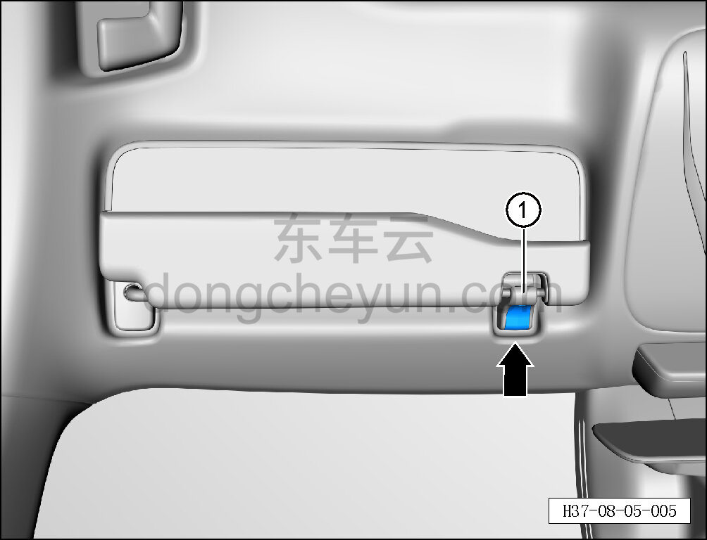
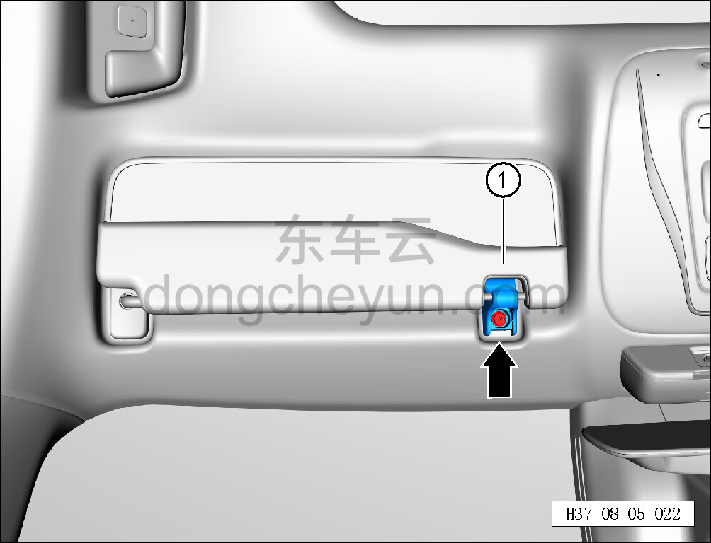

# Снятие и установка крючка солнцезащитного козырька

> Внутренняя и внешняя отделка › Элементы отделки салона › Солнцезащитные козырьки  
> Оригинал: `拆卸与安装遮阳板挂钩` · [dongcheyun 56746](https://dongcheyun.com/p/56746), страница `87d5bd9e87e24ff0b2c58d806ac7db6b` · [оглавление](../README.md)

**Порядок снятия**

**Примечание:**

**- Ниже описано снятие и установка крючка левого солнцезащитного козырька, правый выполняется по аналогии с левым.**

1. Снимите крючок левого солнцезащитного козырька.

a. Съёмником обивки отсоедините крепёжные защёлки под крышкой крючка левого солнцезащитного козырька и снимите крышку крючка левого солнцезащитного козырька ①.

**Внимание:**

**- При отжиме крючка съёмником обивки подложите под инструмент нетканый материал, чтобы не повредить окружающие элементы отделки в процессе снятия.**

b. Торцевой головкой на 10 мм выверните крепёжный винт крючка левого солнцезащитного козырька.

Момент затяжки винта: 4±1 Н·м

c. Снимите крючок левого солнцезащитного козырька ①.

**Порядок установки**

Установка выполняется в обратном порядке.

**Внимание:**

**- После завершения установки проверьте надёжность крепления крючка солнцезащитного козырька.**
