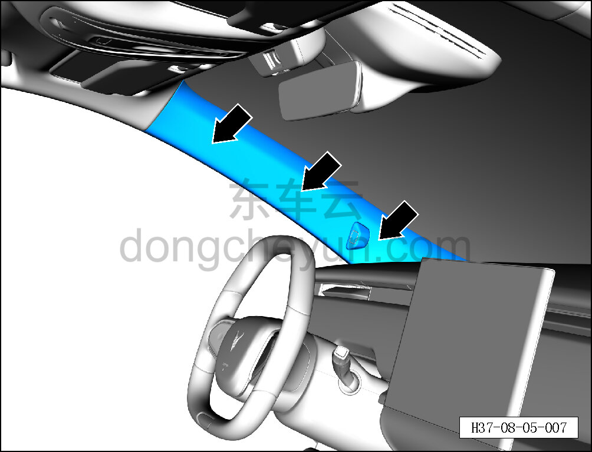
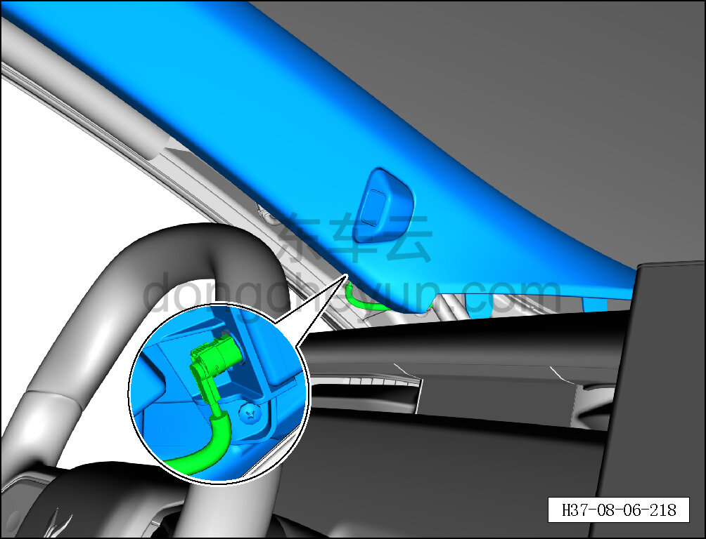
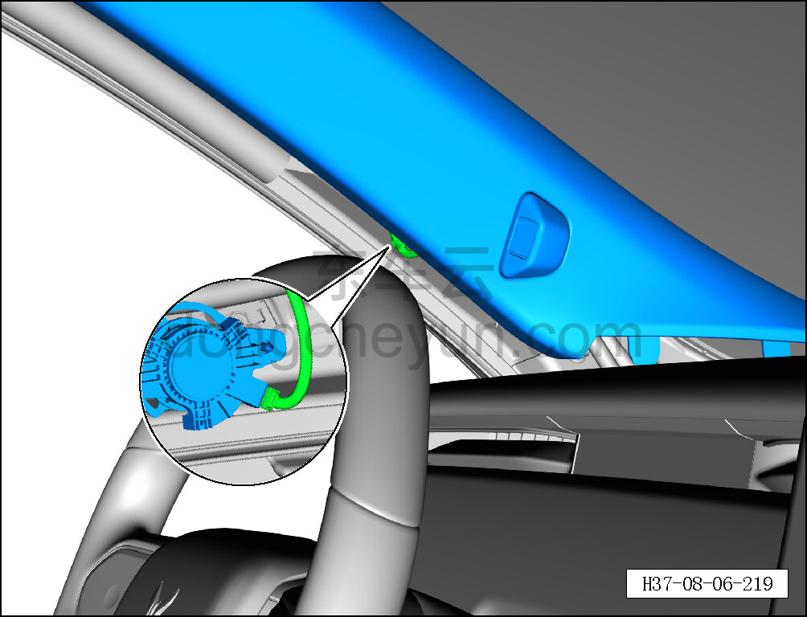
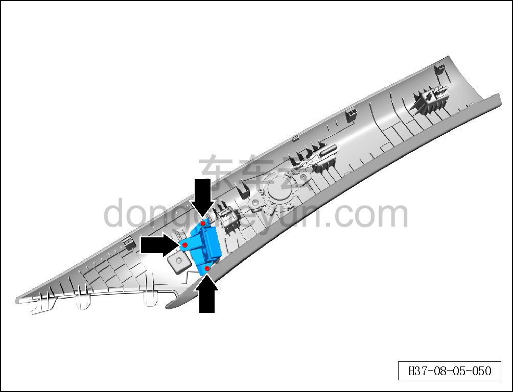
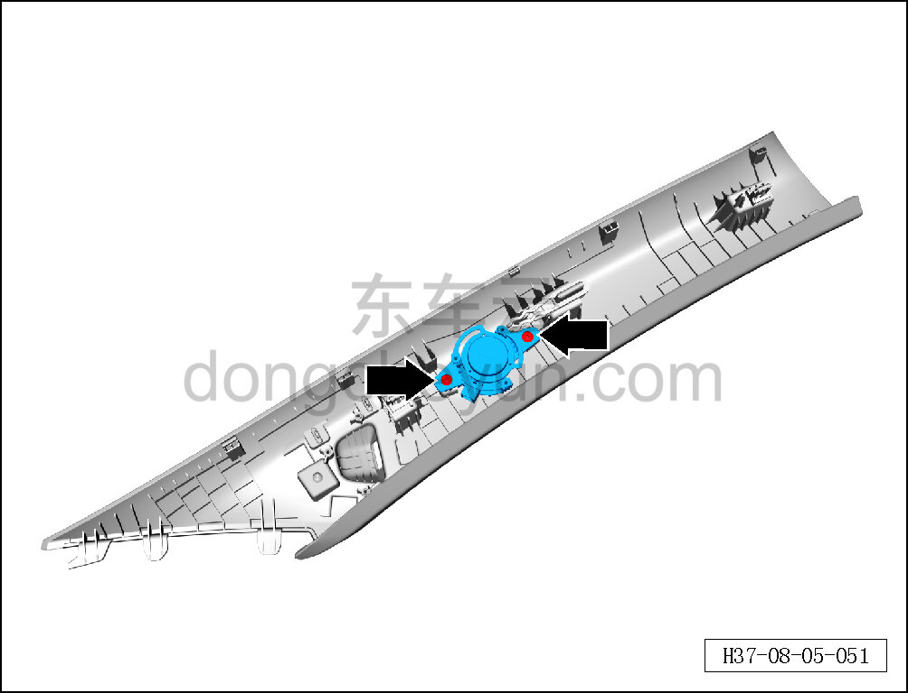
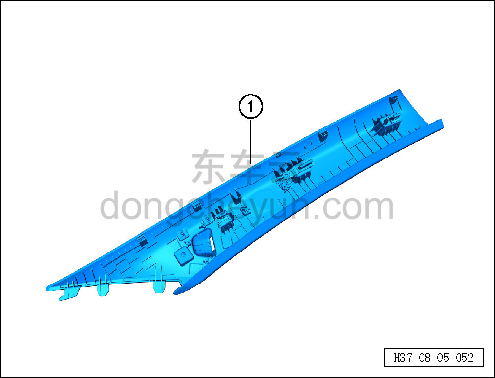

# Снятие и установка левой верхней накладки стойки A

> Внутренняя и внешняя отделка › Элементы отделки салона › Боковые элементы отделки  
> Оригинал: `拆卸与安装左A柱上护板` · [dongcheyun 56746](https://dongcheyun.com/p/56746), страница `9e981defabea4504912f9890058b03f6` · [оглавление](../README.md)

**Порядок снятия**

**Примечание:**

**- Ниже описано снятие и установка левой верхней накладки стойки A, правая выполняется по аналогии с левой.**

1. Выключите все электроприборы, отключите питание.

2. Выполните операцию обесточивания автомобиля для ремонта. См. [3.1.4.1 Обесточивание автомобиля](../03-техническое-обслуживание/005-обесточивание-автомобиля.md)

3. Снимите левую верхнюю накладку стойки A.

**Внимание:**

**- К задней стороне левой верхней накладки стойки A подключён жгут проводов; после отсоединения защёлок не тяните накладку резко, чтобы не повредить жгут.**

a. Съёмником обивки отожмите 3 крепёжные защёлки левой верхней накладки стойки A.

**Внимание:**

**-При отжимании накладки инструментом для внутренней облицовки можно подложить под инструмент нетканый материал, чтобы избежать царапин на окружающей внутренней облицовке в процессе снятия.**

b. Частично отсоедините левую верхнюю накладку стойки A, удерживая фиксатор разъёма, отсоедините разъём подключения камеры мониторинга водителя (DMS).

c. Удерживая фиксатор разъёма, отсоедините разъём подключения высокочастотного излучателя.

d. Крестовой отвёрткой выверните 3 крепёжных винта камеры мониторинга водителя (DMS) и снимите камеру мониторинга водителя (DMS).

Момент затяжки винта: 1±0,1 Н·м

e. Крестовой отвёрткой выверните 2 крепёжных винта высокочастотного излучателя и снимите высокочастотный излучатель.

Момент затяжки винта: 1±0,1 Н·м

**Внимание:**

**- Высокочастотный излучатель зафиксирован клеем 3M; для снятия требуется нагрев техническим феном, не прилагайте силу при снятии, чтобы не повредить высокочастотный излучатель.**

f. Снимите левую верхнюю накладку стойки A ①.

**Порядок установки**

Установка выполняется в обратном порядке.

**Внимание:**

**- Проверьте крепёжные защёлки на повреждения и при необходимости замените их.**

**- После завершения установки проверьте исправность работы высокочастотного излучателя и камеры мониторинга водителя (DMS).**
