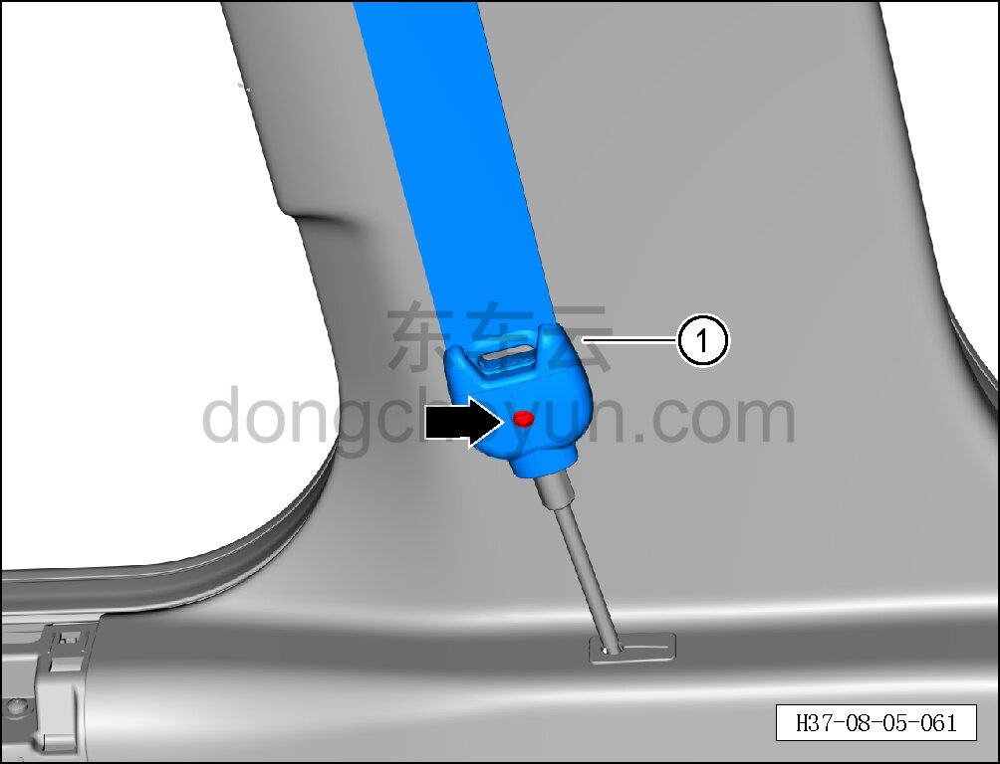
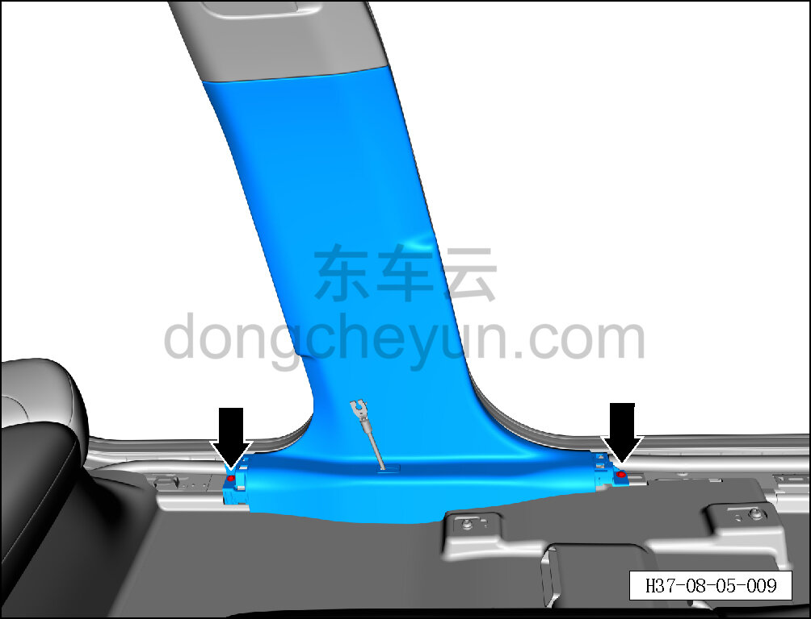
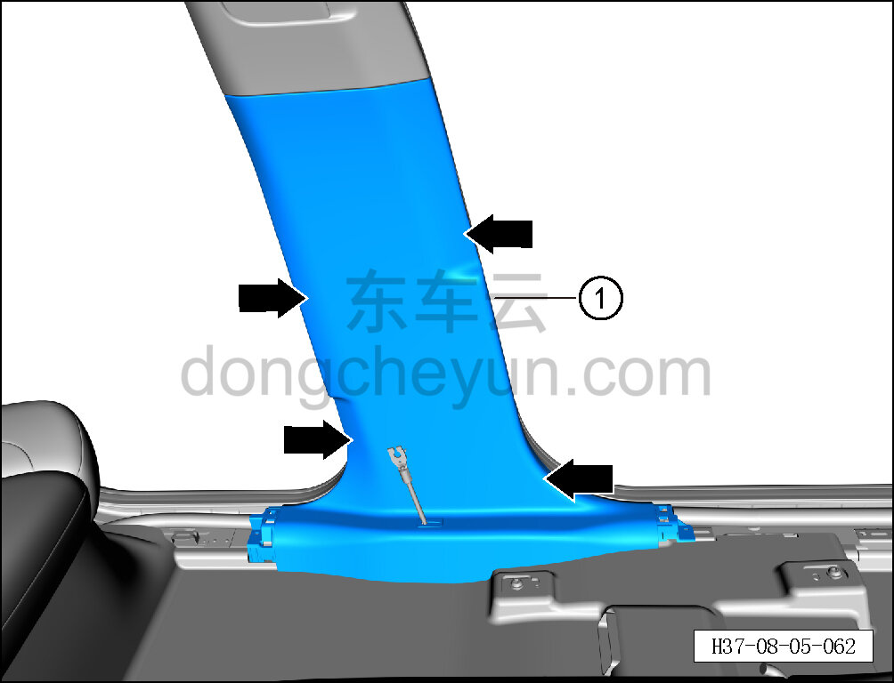
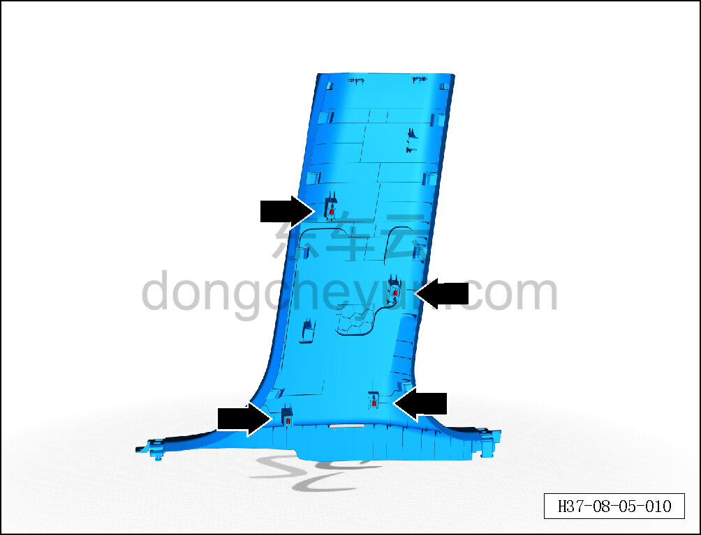

# Снятие и установка левой нижней накладки стойки B

> Внутренняя и внешняя отделка › Элементы отделки салона › Боковые элементы отделки  
> Оригинал: `拆卸与安装左B柱下护板` · [dongcheyun 56746](https://dongcheyun.com/p/56746), страница `6e5259b38b8e4c35ac5e8d8f125d4185` · [оглавление](../README.md)

**Порядок снятия**

**Примечание:**

**- Ниже описано снятие и установка левой нижней накладки стойки B, правая выполняется по аналогии с левой.**

1. Снимите левую накладку переднего порога. См. [8.5.7.1 Снятие и установка левой накладки переднего порога](143-снятие-и-установка-левой-накладки-переднего-порога.md)

2. Снимите левую накладку заднего порога. См. [8.5.7.2 Снятие и установка левой накладки заднего порога](144-снятие-и-установка-левой-накладки-заднего-порога.md)

3. Снимите левую нижнюю накладку стойки B.

a. Плоской отвёрткой поверните крепёжный болт, чтобы отделить левый ремень безопасности ① от левого преднатяжителя концевой пластины.

b. Крестовой отвёрткой выверните 2 крепёжных винта левой нижней накладки стойки B.

Момент затяжки винта: 1.5±0.5 Н·м

c. Съёмником обивки отсоедините 4 крепёжные защёлки по периметру левой нижней накладки стойки B.

d. Снимите левую нижнюю накладку стойки B ①.

**Внимание:**

**-При отжимании накладки инструментом для внутренней облицовки можно подложить под инструмент нетканый материал, чтобы избежать царапин на окружающей внутренней облицовке в процессе снятия.**

e. Крепёжные защёлки левой нижней накладки стойки B показаны на рисунке слева.

**Порядок установки**

Установка выполняется в обратном порядке.

**Внимание:**

**-Проверьте крепёжные клипсы на отсутствие повреждений, при необходимости замените.**

**- После завершения установки проверьте, что нижняя накладка стойки B установлена без перекоса и не отходит.**
