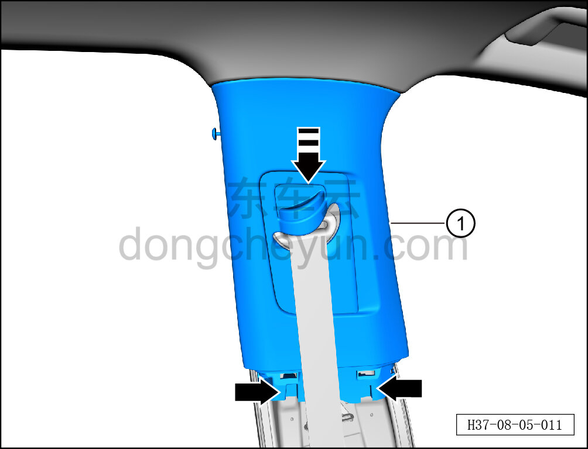
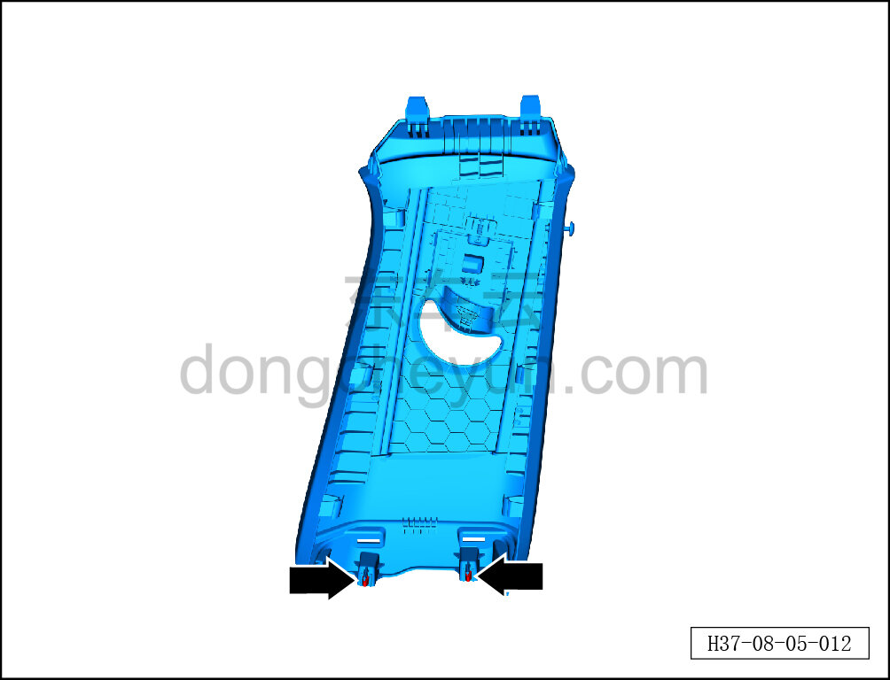

# Снятие и установка левой верхней накладки стойки B

> Внутренняя и внешняя отделка › Элементы отделки салона › Боковые элементы отделки  
> Оригинал: `拆卸与安装左B柱上护板` · [dongcheyun 56746](https://dongcheyun.com/p/56746), страница `8c9c60994a3246afa964e8b6f47c1293` · [оглавление](../README.md)

**Порядок снятия**

**Примечание:**

**- Ниже описано снятие и установка левой верхней накладки стойки B, правая выполняется по аналогии с левой.**

1. Снимите левую нижнюю накладку стойки B. См. [8.5.5.2 Снятие и установка левой нижней накладки стойки B](132-снятие-и-установка-левой-нижней-накладки-стойки-b.md)

2. Снимите левую верхнюю накладку стойки B.

a. Съёмником обивки отсоедините 2 крепёжные защёлки под левой верхней накладкой стойки B и выньте левую верхнюю накладку стойки B в направлении стрелки ①.

**Внимание:**

**-При отжимании накладки инструментом для внутренней облицовки можно подложить под инструмент нетканый материал, чтобы избежать царапин на окружающей внутренней облицовке в процессе снятия.**

b. Крепёжные защёлки левой верхней накладки стойки B показаны на рисунке слева.

**Порядок установки**

Установка выполняется в обратном порядке.

**Внимание:**

**-Проверьте крепёжные клипсы на отсутствие повреждений, при необходимости замените.**

**- После завершения установки проверьте, что верхняя накладка стойки B установлена без перекоса и не отходит.**
