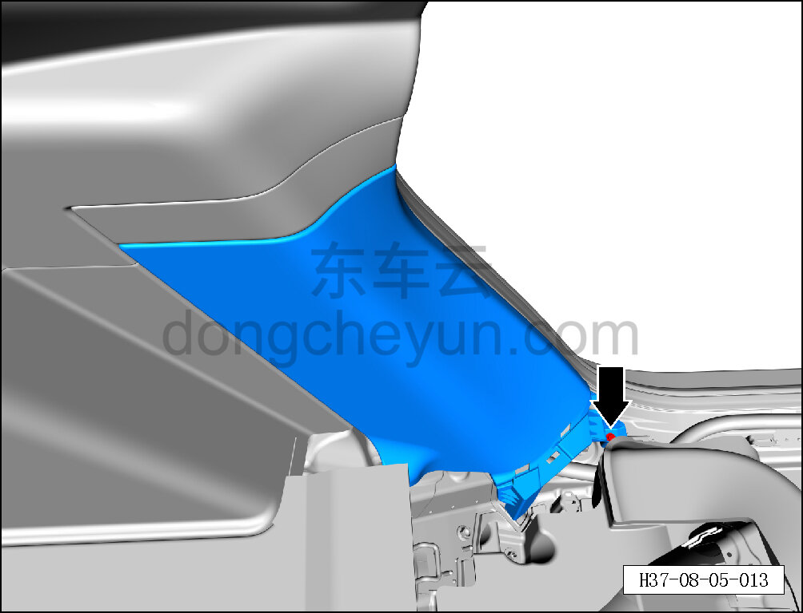
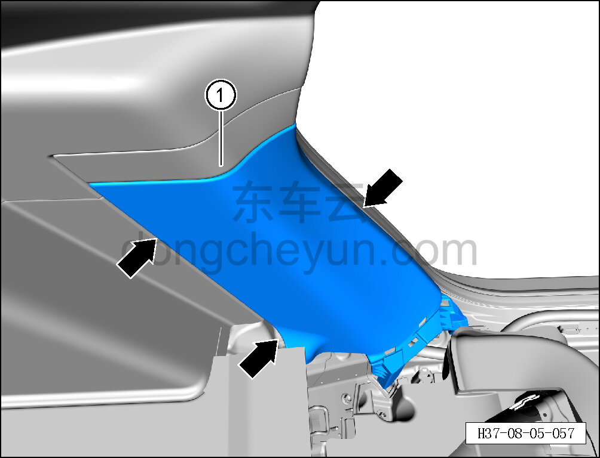
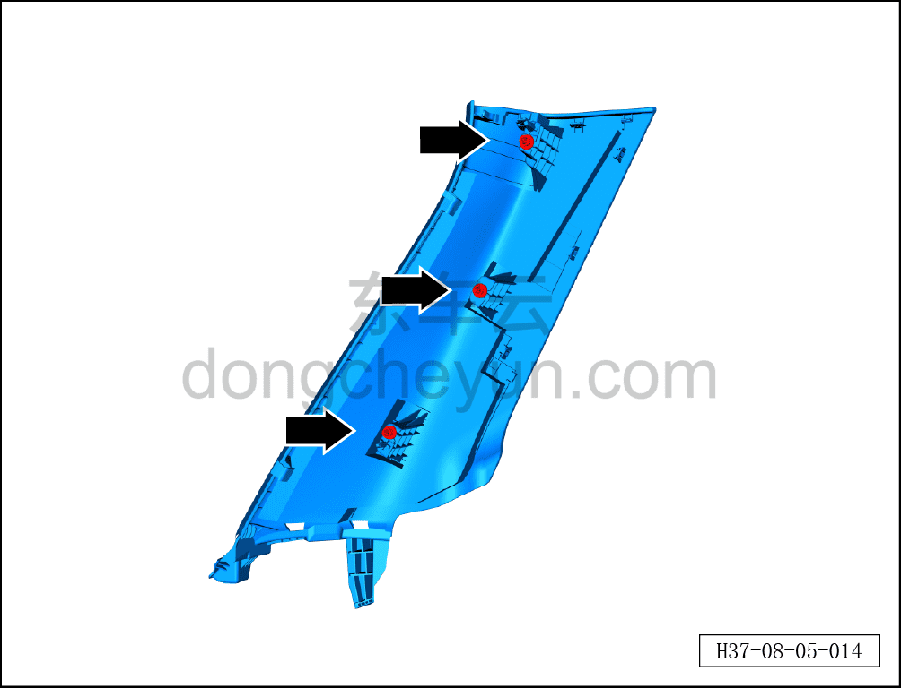

# Снятие и установка левой нижней накладки стойки C

> Внутренняя и внешняя отделка › Элементы отделки салона › Боковые элементы отделки  
> Оригинал: `拆卸与安装左C柱下护板` · [dongcheyun 56746](https://dongcheyun.com/p/56746), страница `f77f4b5c21f8485e92bf91b6a1752eb7` · [оглавление](../README.md)

**Порядок снятия**

**Примечание:**

**- Ниже описано снятие и установка левой нижней накладки стойки C, правая выполняется по аналогии с левой.**

1. Выключите все электроприборы, отключите питание.

2. Снимите левую накладку заднего порога. См. [8.5.7.2 Снятие и установка левой накладки заднего порога](144-снятие-и-установка-левой-накладки-заднего-порога.md)

3. Снимите левую спинку заднего сиденья в сборе. См. [8.1.5.6 Снятие и установка левой спинки заднего сиденья в сборе](034-снятие-и-установка-левой-спинки-заднего-сиденья.md)

4. Снимите левую нижнюю накладку стойки C.

a. Крестовой отвёрткой выверните крепёжный винт левой нижней накладки стойки C.

Момент затяжки винта: 1.5±0.5 Н·м

b. Съёмником обивки отсоедините 3 крепёжные защёлки левой нижней накладки стойки C.

c. Снимите левую нижнюю накладку стойки C ①.

**Внимание:**

**-При отжимании накладки инструментом для внутренней облицовки можно подложить под инструмент нетканый материал, чтобы избежать царапин на окружающей внутренней облицовке в процессе снятия.**

d. Крепёжные защёлки левой нижней накладки стойки C показаны на рисунке слева.

**Порядок установки**

Установка выполняется в обратном порядке.

Внимание:

**-Проверьте крепёжные клипсы на отсутствие повреждений, при необходимости замените.**

**- После завершения установки проверьте, что нижняя накладка стойки C установлена без перекоса и не отходит.**
