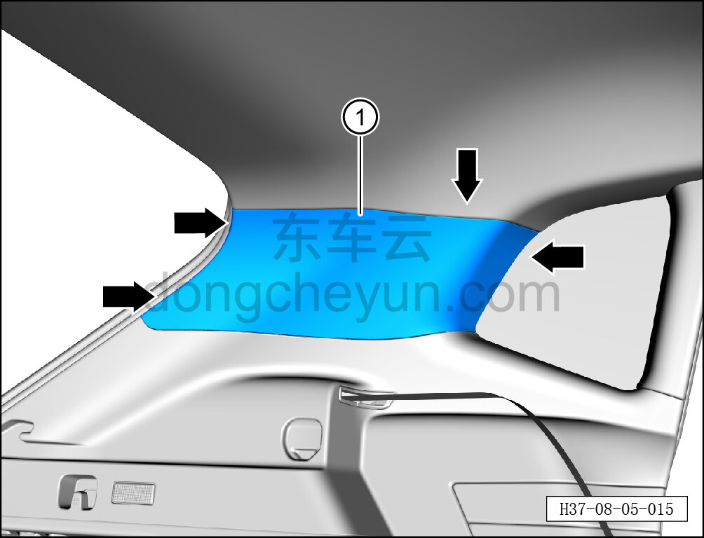
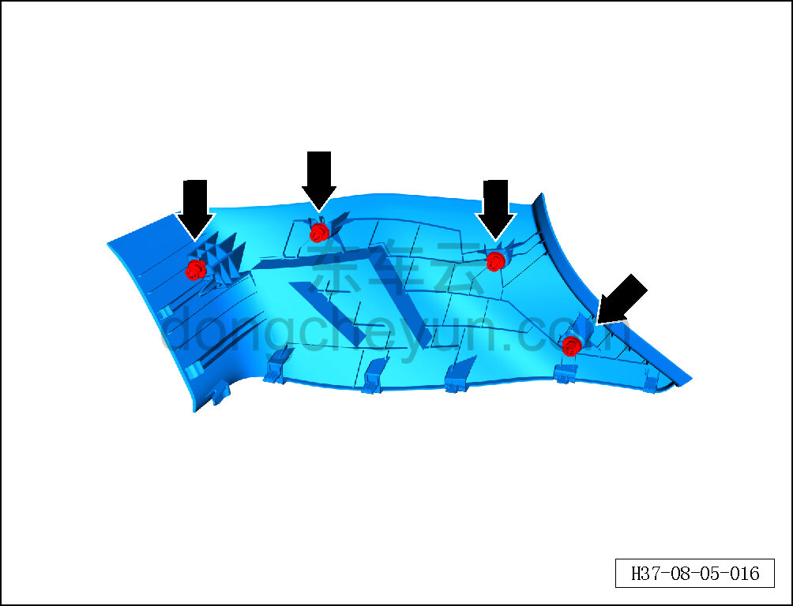

# Снятие и установка левой верхней накладки стойки C

> Внутренняя и внешняя отделка › Элементы отделки салона › Боковые элементы отделки  
> Оригинал: `拆卸与安装左C柱上护板` · [dongcheyun 56746](https://dongcheyun.com/p/56746), страница `8c315ef398894ff78ac89be078c8e020` · [оглавление](../README.md)

**Порядок снятия**

**Примечание:**

**- Ниже описано снятие и установка левой верхней накладки стойки C, правая выполняется по аналогии с левой.**

1. Снимите левую верхнюю накладку стойки C.

a. Съёмником обивки отсоедините 4 крепёжные защёлки по периметру левой верхней накладки стойки C.

b. Снимите левую верхнюю накладку стойки C ①.

**Внимание:**

**-При отжимании накладки инструментом для внутренней облицовки можно подложить под инструмент нетканый материал, чтобы избежать царапин на окружающей внутренней облицовке в процессе снятия.**

c. Крепёжные защёлки левой верхней накладки стойки C показаны на рисунке слева.

**Порядок установки**

Установка выполняется в обратном порядке.

**Внимание:**

**-Проверьте крепёжные клипсы на отсутствие повреждений, при необходимости замените.**

**- После завершения установки проверьте, что верхняя накладка стойки C установлена без перекоса и не отходит.**
