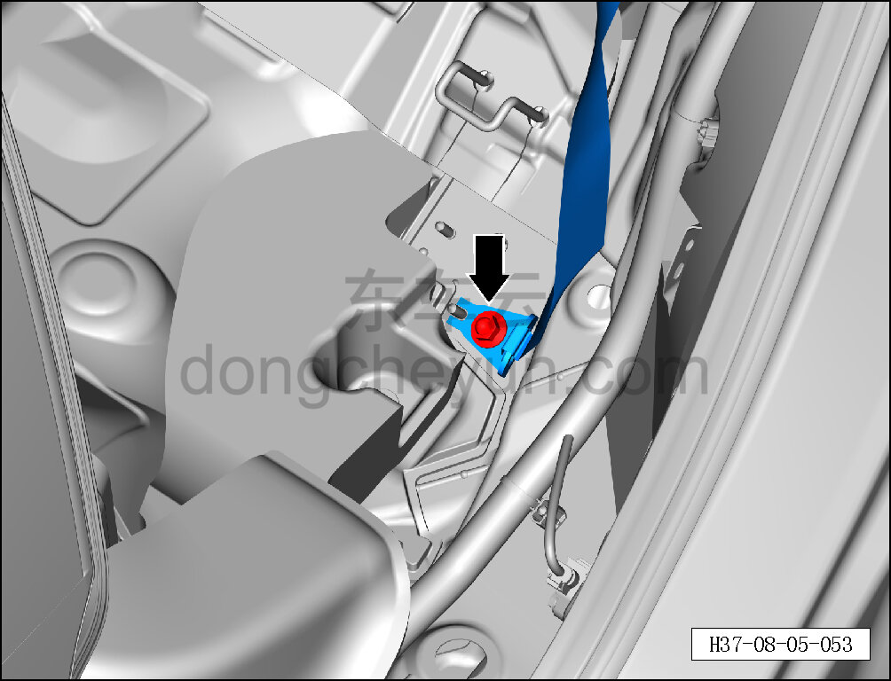
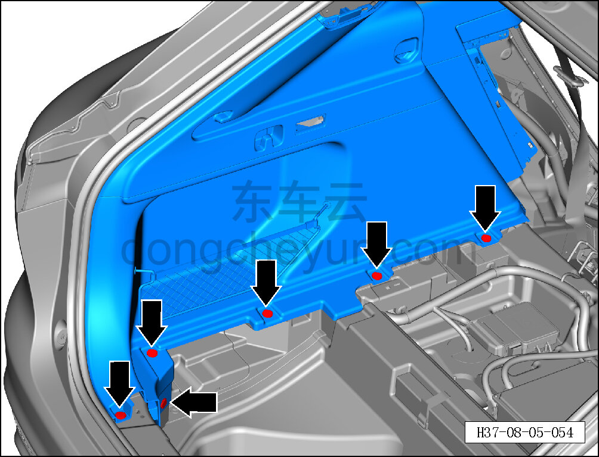
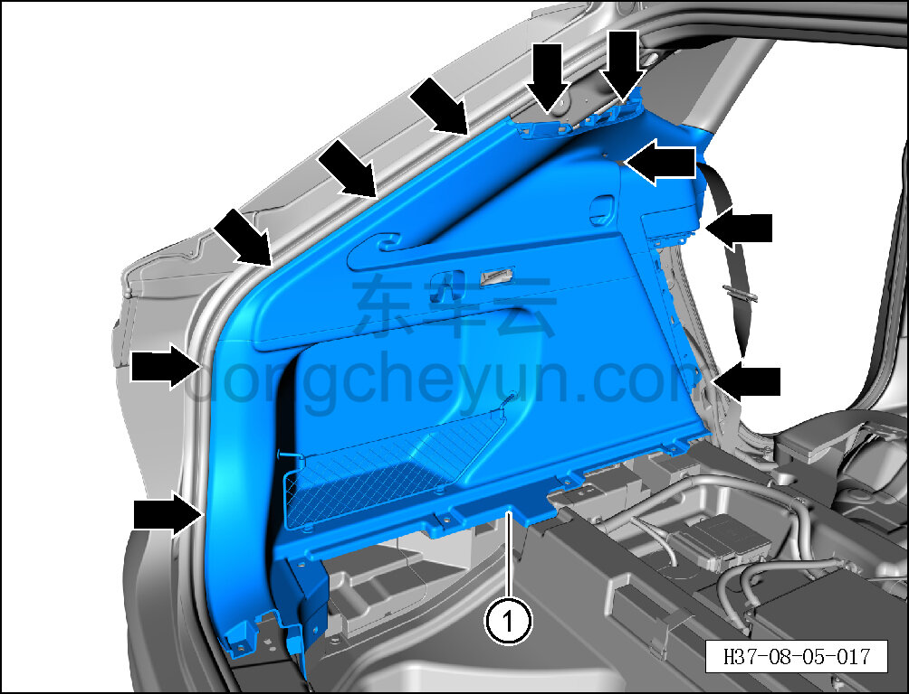
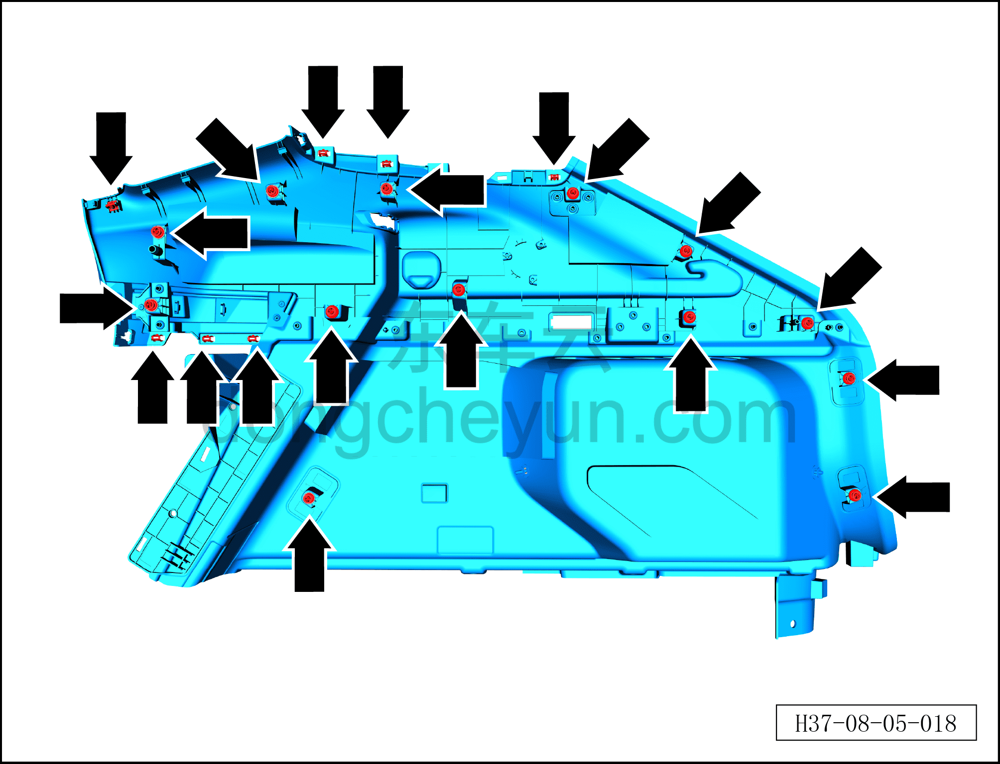

# Снятие и установка левой обивки задней боковины

> Внутренняя и внешняя отделка › Элементы отделки салона › Боковые элементы отделки  
> Оригинал: `拆卸与安装左后侧围内饰板` · [dongcheyun 56746](https://dongcheyun.com/p/56746), страница `ec92783a02cc447d8b17bd3ffc05307f` · [оглавление](../README.md)

**Порядок снятия**

**Примечание:**

**- Ниже описано снятие и установка левой обивки задней боковины, правая выполняется по аналогии с левой.**

**Примечание:**

- **Перед снятием правой обивки задней боковины в сборе необходимо снять жгут проводов комбинированного зарядного разъёма быстрой и медленной зарядки. См. [5.3.4.1 Снятие и установка комбинированного зарядного разъёма быстрой и медленной зарядки](../05-силовая-система-на-новых-источниках/034-снятие-и-установка-комбинированного-разъёма-быстрой.md)**

1. Выключите все электроприборы, отключите питание.

2. Выполните операцию обесточивания автомобиля для ремонта. См. [3.1.4.1 Обесточивание автомобиля](../03-техническое-обслуживание/005-обесточивание-автомобиля.md)

3. Снимите левую нижнюю накладку стойки C. См. [8.5.5.4 Снятие и установка левой нижней накладки стойки C](134-снятие-и-установка-левой-нижней-накладки-стойки-c.md)

4. Снимите левую верхнюю накладку стойки C. См. [8.5.5.5 Снятие и установка левой верхней накладки стойки C](135-снятие-и-установка-левой-верхней-накладки-стойки-c.md)

5. Снимите шторку багажника. См. [8.5.8.1 Снятие и установка шторки багажника](146-снятие-и-установка-шторки-багажника.md)

6. Снимите накладку порога двери багажника. См. [8.5.7.3 Снятие и установка накладки порога двери багажника](145-снятие-и-установка-накладки-порога-двери-багажника.md)

7. Снимите правый светильник багажника. См. [9.9.10.1 Снятие и установка правого светильника багажника](../09-электрическая-и-электронная-система/090-снятие-и-установка-правого-светильника-освещения.md)

8. Снимите левую обивку задней боковины.

a. Торцевой головкой на 16 мм выверните крепёжный болт левого ремня безопасности второго ряда.

Момент затяжки болта: 50±8 Н·м

b. Отсоедините уплотнитель дверного проёма по периметру левой обивки задней боковины.

c. Съёмником обивки отсоедините 6 крепёжных защёлок левой обивки задней боковины.

d. Съёмником обивки отсоедините крепёжные защёлки по периметру левой обивки задней боковины.

e. Частично отсоедините левую обивку задней боковины и отсоедините левый ремень безопасности второго ряда.

f. Снимите левую обивку задней боковины ①.

g. Крепёжные защёлки левой обивки задней боковины показаны на рисунке слева.

**Порядок установки**

Установка выполняется в обратном порядке.

**Внимание:**

**-Проверьте крепёжные клипсы на отсутствие повреждений, при необходимости замените.**

**- После завершения установки проверьте, что обивка задней боковины установлена без перекоса и не отходит.**
