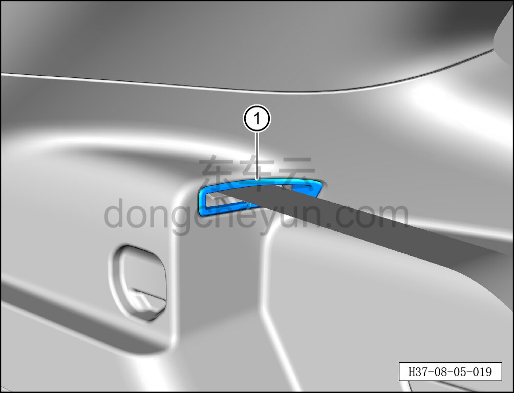

# Снятие и установка левой крышки ремня безопасности

> Внутренняя и внешняя отделка › Элементы отделки салона › Боковые элементы отделки  
> Оригинал: `拆卸与安装安全带左盖板` · [dongcheyun 56746](https://dongcheyun.com/p/56746), страница `5b1a1e79a19f4b71818d1c57423ca07b` · [оглавление](../README.md)

**Порядок снятия**

**Примечание:**

**- Ниже описано снятие и установка левой крышки ремня безопасности, правая выполняется по аналогии с левой.**

1. Снимите левую крышку ремня безопасности.

a. Съёмником обивки отожмите и снимите левую крышку ремня безопасности ①.

**Порядок установки**

Установка выполняется в обратном порядке.

**Внимание:**

**- После завершения установки проверьте надёжность крепления крышки ремня безопасности.**
