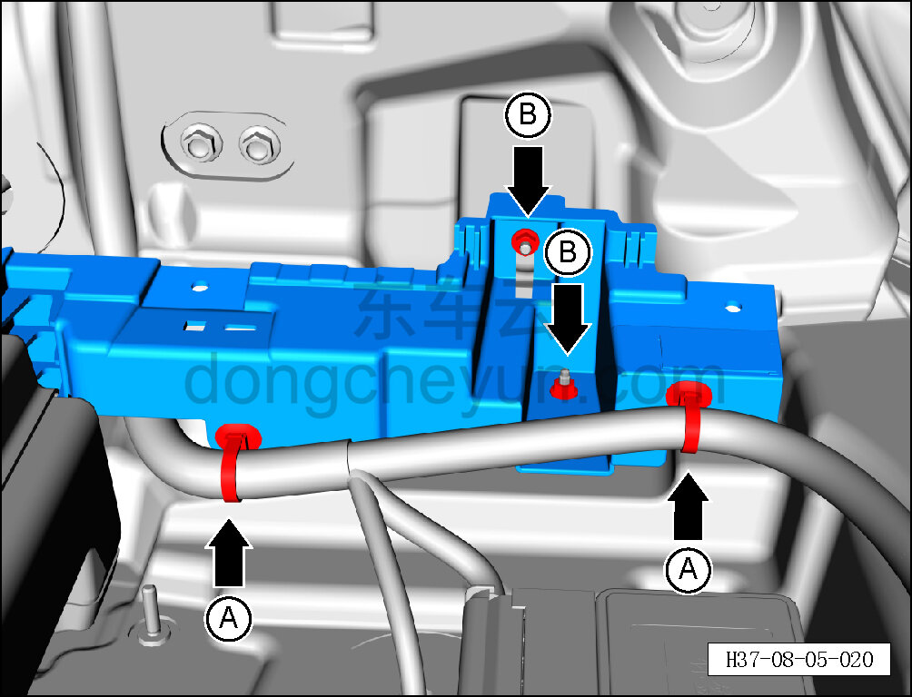
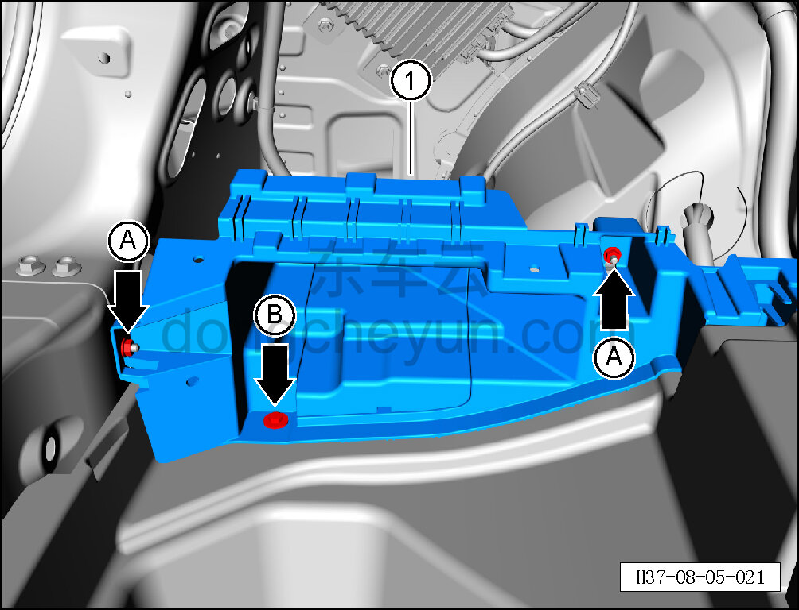

# Снятие и установка нижнего кронштейна левой задней боковины

> Внутренняя и внешняя отделка › Элементы отделки салона › Боковые элементы отделки  
> Оригинал: `拆卸与安装左后侧围下部支架` · [dongcheyun 56746](https://dongcheyun.com/p/56746), страница `f3516e0a99a04b9197b856b3d062a2bf` · [оглавление](../README.md)

**Порядок снятия**

1. Выключите все электроприборы, отключите питание.

2. Выполните операцию обесточивания автомобиля для ремонта. См. [3.1.4.1 Обесточивание автомобиля](../03-техническое-обслуживание/005-обесточивание-автомобиля.md)

3. Снимите левую обивку задней боковины. См. [8.5.5.6 Снятие и установка левой обивки задней боковины](136-снятие-и-установка-левой-обивки-задней-боковины.md)

4. Снимите нижний кронштейн левой задней боковины.

a. Съёмником обивки отсоедините 2 крепёжные защёлки A соединения нижнего кронштейна левой задней боковины с жгутом проводов кузова.

b. Торцевой головкой на 10 мм выверните 2 крепёжные гайки B нижнего кронштейна левой задней боковины.

Момент затяжки гайки: 4±0,5 Н·м

c. Торцевой головкой на 10 мм выверните 2 крепёжные гайки A нижнего кронштейна левой задней боковины.

Момент затяжки гайки: 4±0,5 Н·м

d. Головкой T10 выверните крепёжный болт B нижнего кронштейна левой задней боковины.

Момент затяжки болта: 4±0,5 Н·м

e. Снимите нижний кронштейн левой задней боковины ①.

**Порядок установки**

Установка выполняется в обратном порядке.

**Внимание:**

**-Проверьте крепёжные клипсы на отсутствие повреждений, при необходимости замените.**

**- После завершения установки проверьте надёжность крепления монтажного кронштейна левой задней боковины.**
