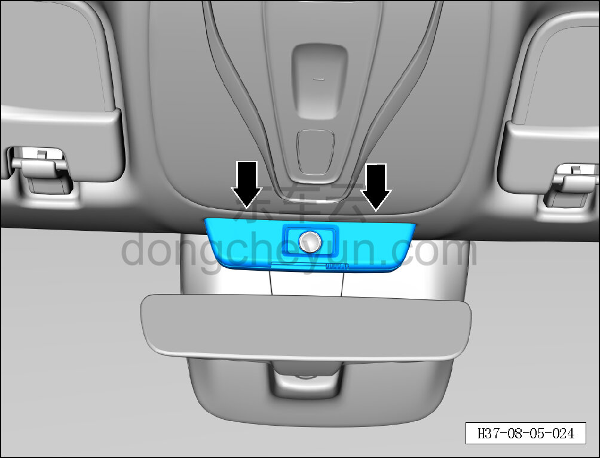
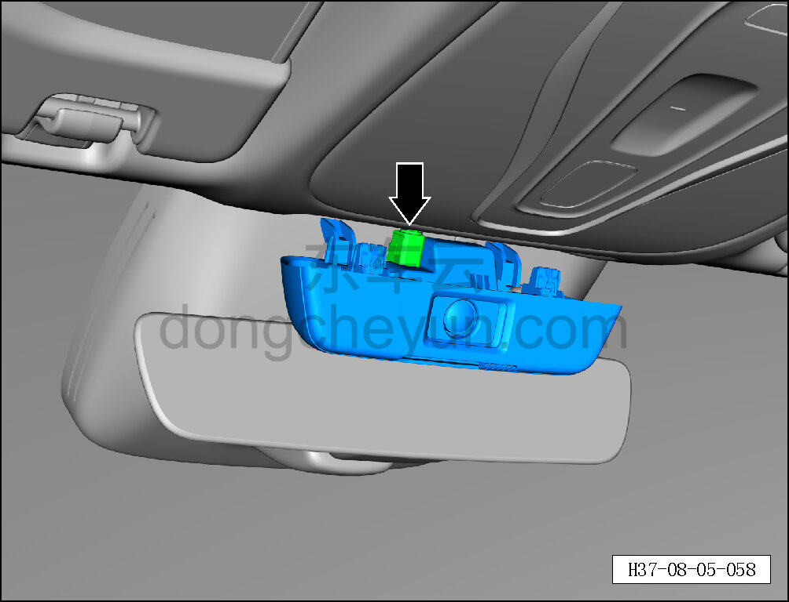
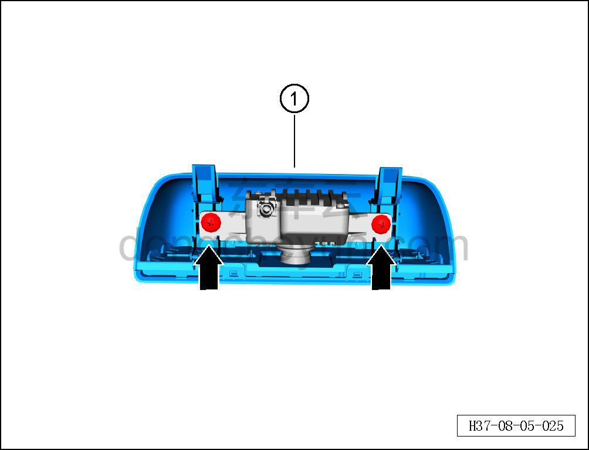

# Снятие и установка декоративной крышки камеры мониторинга заднего ряда

> Внутренняя и внешняя отделка › Элементы отделки салона › Боковые элементы отделки  
> Оригинал: `拆卸与安装后排监测摄像头装饰盖` · [dongcheyun 56746](https://dongcheyun.com/p/56746), страница `7b87d0dc3b4246ce8137dbf5c148a651` · [оглавление](../README.md)

**Порядок снятия**

1. Выключите все электроприборы, отключите питание.

2. Выполните операцию обесточивания автомобиля для ремонта. См. [3.1.4.1 Обесточивание автомобиля](../03-техническое-обслуживание/005-обесточивание-автомобиля.md)

3. Снимите декоративную крышку камеры мониторинга заднего ряда.

a. Съёмником обивки отсоедините 2 крепёжные защёлки декоративной крышки камеры мониторинга заднего ряда.

b. Частично отсоедините декоративную крышку камеры мониторинга заднего ряда и отсоедините разъём подключения камеры мониторинга заднего ряда.

c. Крестовой отвёрткой выверните 2 крепёжных винта камеры мониторинга заднего ряда.

Момент затяжки винта: 1.5±0.5 Н·м

d. Снимите декоративную крышку камеры мониторинга заднего ряда ①.

**Порядок установки**

Установка выполняется в обратном порядке.

**Внимание:**

**- Проверьте крепёжные защёлки на повреждения и при необходимости замените их.**

**- После завершения установки проверьте исправность работы камеры мониторинга заднего ряда.**
