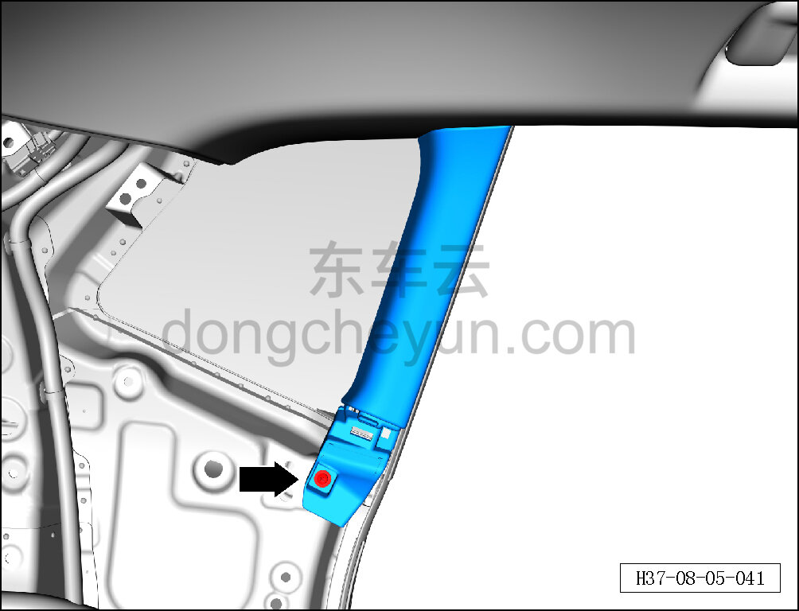
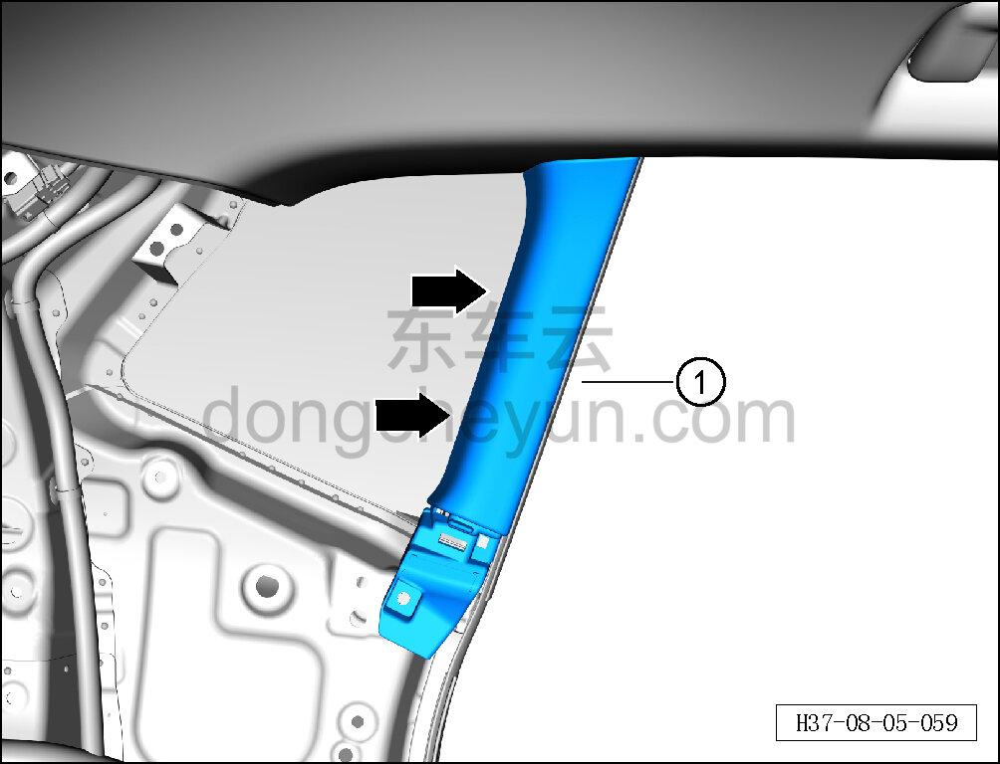
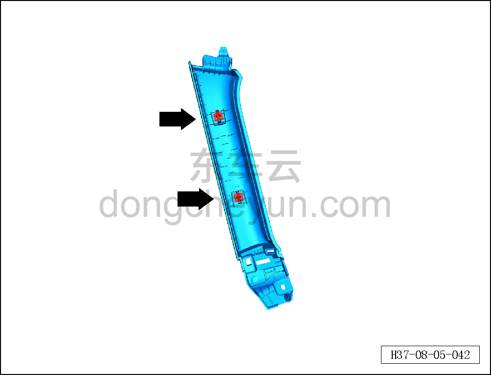

# Снятие и установка обивки левого заднего углового стекла

> Внутренняя и внешняя отделка › Элементы отделки салона › Боковые элементы отделки  
> Оригинал: `拆卸与安装左后角窗内饰板` · [dongcheyun 56746](https://dongcheyun.com/p/56746), страница `ce6311f4724344b98fe6501dd97e26e0` · [оглавление](../README.md)

**Порядок снятия**

**- Ниже описано снятие и установка обивки левого заднего углового стекла, правая выполняется по аналогии с левой.**

1. Выключите все электроприборы, отключите питание.

2. Выполните операцию обесточивания автомобиля для ремонта. См. [3.1.4.1 Обесточивание автомобиля](../03-техническое-обслуживание/005-обесточивание-автомобиля.md)

3. Снимите левую обивку задней боковины. См. [8.5.5.6 Снятие и установка левой обивки задней боковины](136-снятие-и-установка-левой-обивки-задней-боковины.md)

4. Снимите обивку левого заднего углового стекла.

a. Крестовой отвёрткой выверните крепёжный винт обивки левого заднего углового стекла.

Момент затяжки винта: 1.5±0.5 Н·м

b. Съёмником обивки отсоедините 2 крепёжные защёлки обивки левого заднего углового стекла.

c. Снимите обивку левого заднего углового стекла ①.

**Внимание:**

**- При отжиме накладки съёмником обивки подложите под инструмент нетканый материал, чтобы не повредить окружающие элементы отделки в процессе снятия.**

d. Крепёжные защёлки обивки левого заднего углового стекла показаны на рисунке слева.

**Порядок установки**

Установка выполняется в обратном порядке.

**Внимание:**

**-Проверьте крепёжные клипсы на отсутствие повреждений, при необходимости замените.**

**- После завершения установки проверьте надёжность крепления обивки заднего углового стекла.**
