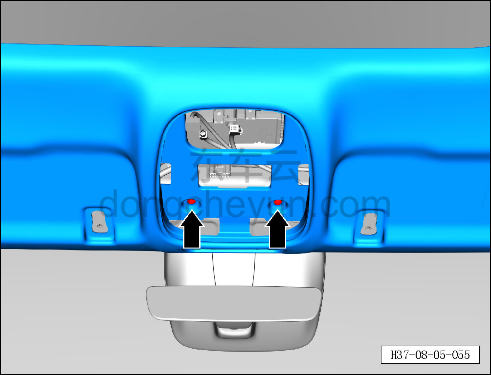
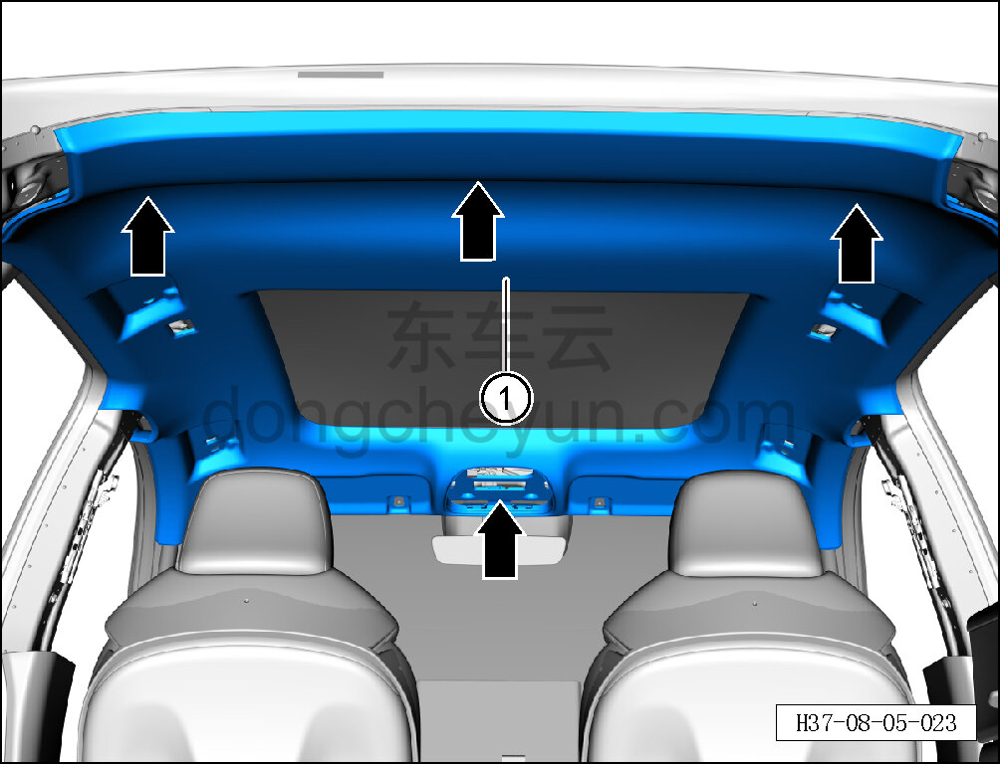

# Снятие и установка обивки потолка

> Внутренняя и внешняя отделка › Элементы отделки салона › Система обивки потолка  
> Оригинал: `拆卸与安装顶盖内饰板` · [dongcheyun 56746](https://dongcheyun.com/p/56746), страница `f43023efd3404f06adc5b05272dd13f7` · [оглавление](../README.md)

**Порядок снятия**

1. Выключите все электроприборы, отключите питание.

2. Выполните операцию обесточивания автомобиля для ремонта. См. [3.1.4.1 Обесточивание автомобиля](../03-техническое-обслуживание/005-обесточивание-автомобиля.md)

3. Снимите левый и правый солнцезащитные козырьки. См. [8.5.4.2 Снятие и установка левого солнцезащитного козырька](129-снятие-и-установка-левого-солнцезащитного-козырька.md)

4. Снимите левый и правый крючки солнцезащитных козырьков. См. [8.5.4.3 Снятие и установка крючка солнцезащитного козырька](130-снятие-и-установка-крючка-солнцезащитного-козырька.md)

5. Снимите передний потолочный светильник. См. [9.9.10.2 Снятие и установка переднего потолочного светильника](../09-электрическая-и-электронная-система/091-снятие-и-установка-переднего-потолочного-светильника.md)

6. Снимите микрофон. См. [9.1.8.1 Снятие и установка микрофона](../09-электрическая-и-электронная-система/016-снятие-и-установка-микрофона.md)

7. Снимите декоративную крышку камеры мониторинга заднего ряда. См. [8.5.5.10 Снятие и установка декоративной крышки камеры мониторинга заднего ряда](140-снятие-и-установка-декоративной-крышки-камеры.md)

8. Снимите левый и правый задние потолочные светильники. См. [9.9.10.3 Снятие и установка левого заднего потолочного светильника](../09-электрическая-и-электронная-система/092-снятие-и-установка-левого-заднего-потолочного.md)

9. Снимите левую и правую верхние накладки стойки A. См. [8.5.5.1 Снятие и установка левой верхней накладки стойки A](131-снятие-и-установка-левой-верхней-накладки-стойки-a.md)

10. Снимите левую и правую верхние накладки стойки B. См. [8.5.5.3 Снятие и установка левой верхней накладки стойки B](133-снятие-и-установка-левой-верхней-накладки-стойки-b.md)

11. Снимите левую и правую верхние накладки стойки C. См. [8.5.5.5 Снятие и установка левой верхней накладки стойки C](135-снятие-и-установка-левой-верхней-накладки-стойки-c.md)

12. Снимите передние и задние ручки безопасности. См. [8.5.3.1 Снятие и установка передней ручки безопасности](127-снятие-и-установка-передней-ручки-безопасности.md)

13. Снимите обивку потолка.

a. Крестовой отвёрткой выверните 2 крепёжных винта обивки потолка.

Момент затяжки винта: 2±1 Н·м

**Внимание:**

**- Перед началом ремонта убедитесь, что рабочее место чистое и без загрязнений, чтобы не испачкать обивку потолка.**

b. Съёмником обивки отсоедините 4 крепёжные защёлки обивки потолка.

c. Снимите обивку потолка ①.

**Внимание:**

**- При снятии сначала опустите заднее сиденье, затем медленно отсоединяйте обивку от передней части к задней.**

**Порядок установки**

Установка выполняется в обратном порядке.

**Внимание:**

**- Проверьте крепёжные защёлки на повреждения и при необходимости замените их.**

**- После завершения установки проверьте исправность работы электрооборудования и отсутствие заломов на обивке потолка.**
