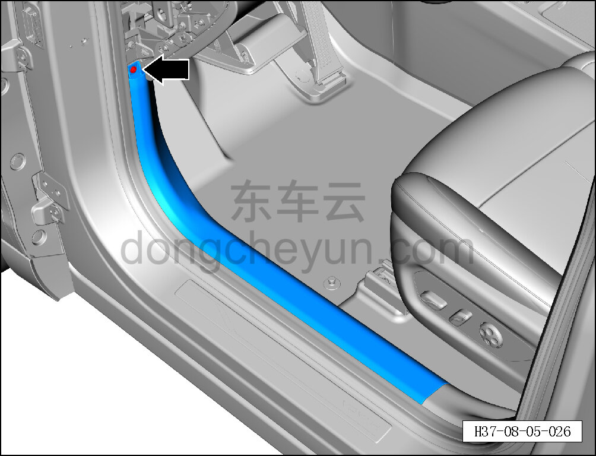
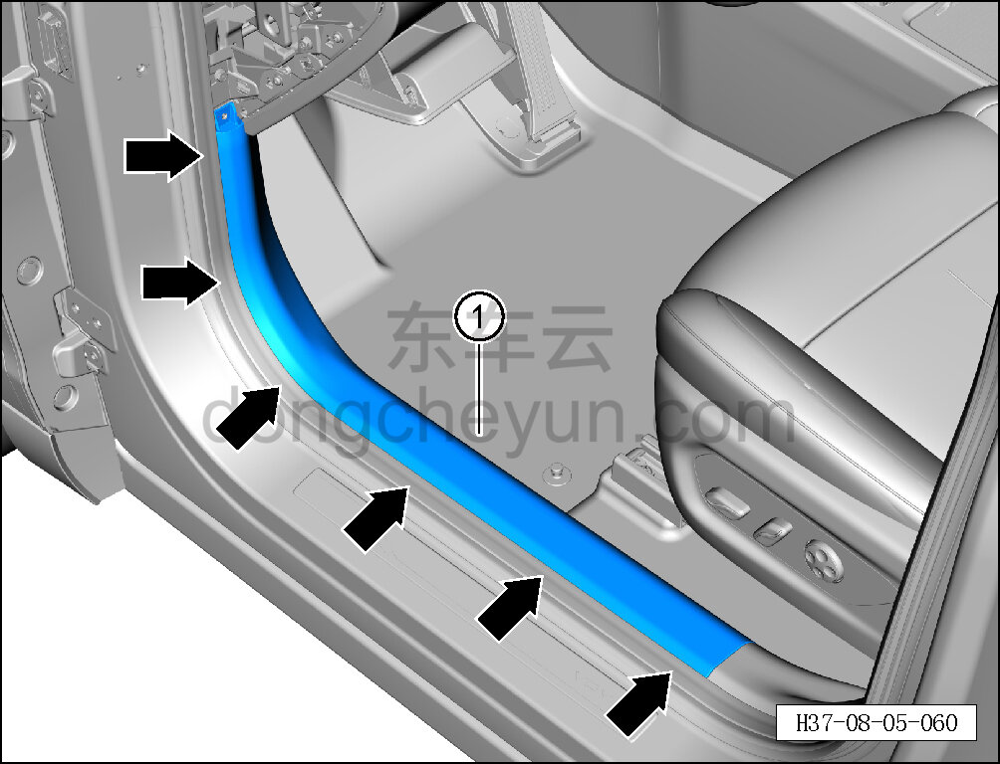

# Снятие и установка левой накладки переднего порога

> Внутренняя и внешняя отделка › Элементы отделки салона › Обивка порогов  
> Оригинал: `拆卸与安装左前门槛装饰件` · [dongcheyun 56746](https://dongcheyun.com/p/56746), страница `4d8b61a712004c46b23dcaf3ecd3d3c5` · [оглавление](../README.md)

**Порядок снятия**

**Примечание:**

**- Ниже описано снятие и установка левой накладки переднего порога, правая выполняется по аналогии с левой.**

1. Снимите левую торцевую крышку панели приборов. См. [8.2.4.1 Снятие и установка левой торцевой крышки панели приборов](054-снятие-и-установка-левой-торцевой-крышки-панели.md)

2. Снимите левую накладку переднего порога.

a. Головкой T25 выверните крепёжный винт левой накладки переднего порога.

Момент затяжки винта: 1.5±0.5 Н·м

b. Съёмником обивки отсоедините 6 крепёжных защёлок левой накладки переднего порога.

c. Снимите левую накладку переднего порога ①.

**Внимание:**

**- При отжиме накладки порога съёмником обивки подложите под инструмент нетканый материал, чтобы не повредить окружающие элементы отделки в процессе снятия.**

**Порядок установки**

Установка выполняется в обратном порядке.

**Внимание:**

**-Проверьте крепёжные клипсы на отсутствие повреждений, при необходимости замените.**

**- После завершения установки проверьте, что левая накладка переднего порога установлена без перекоса и не отходит.**
