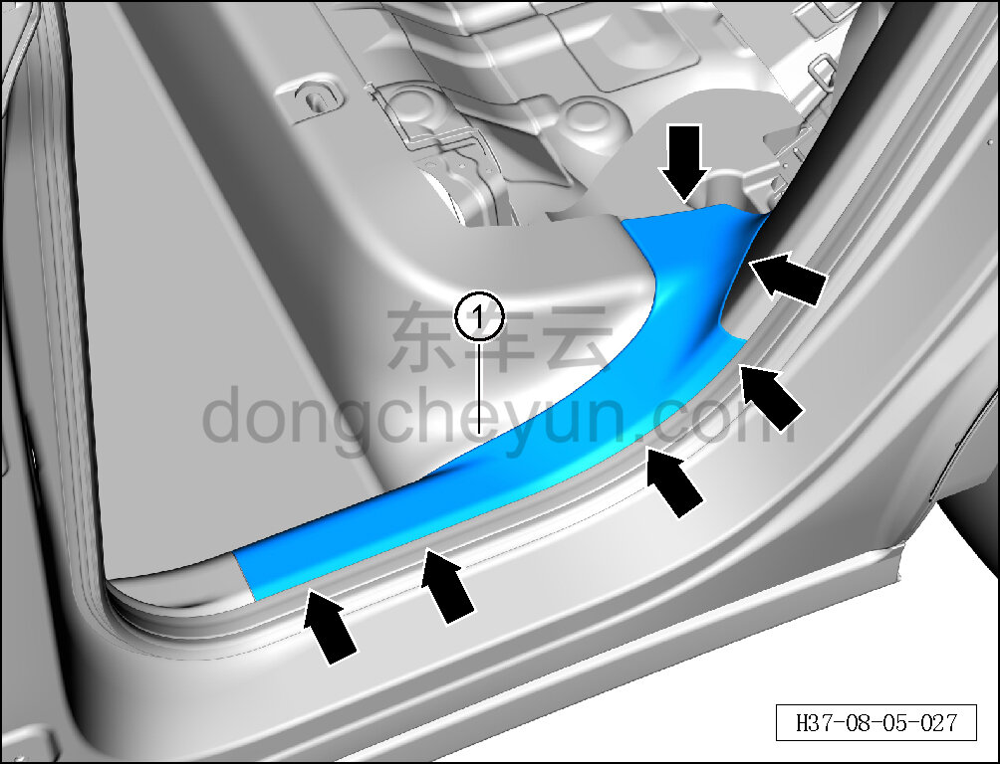

# Снятие и установка левой накладки заднего порога

> Внутренняя и внешняя отделка › Элементы отделки салона › Обивка порогов  
> Оригинал: `拆卸与安装左后门槛装饰件` · [dongcheyun 56746](https://dongcheyun.com/p/56746), страница `4b94b608b960438bada0751d31cffbfc` · [оглавление](../README.md)

**Порядок снятия**

**Примечание:**

**- Ниже описано снятие и установка левой накладки заднего порога, правая выполняется по аналогии с левой.**

1. Выполните операцию обесточивания автомобиля для ремонта. См. [3.1.4.1 Обесточивание автомобиля](../03-техническое-обслуживание/005-обесточивание-автомобиля.md)

2. Снимите подушку заднего сиденья в сборе. См. [8.1.5.1 Снятие и установка подушки заднего сиденья в сборе](029-снятие-и-установка-подушки-заднего-сиденья.md)

a. Съёмником обивки отсоедините 6 крепёжных защёлок левой накладки заднего порога.

b. Снимите левую накладку заднего порога ①.

**Внимание:**

**- При отжиме накладки порога съёмником обивки подложите под инструмент нетканый материал, чтобы не повредить окружающие элементы отделки в процессе снятия.**

**Порядок установки**

Установка выполняется в обратном порядке.

**Внимание:**

**-Проверьте крепёжные клипсы на отсутствие повреждений, при необходимости замените.**

**- После завершения установки проверьте, что левая накладка заднего порога установлена без перекоса и не отходит.**
