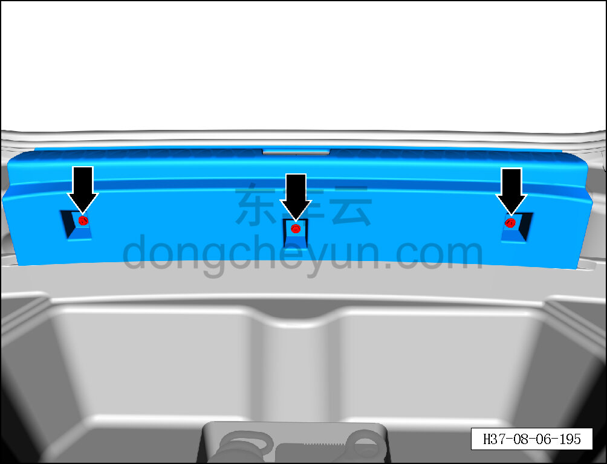
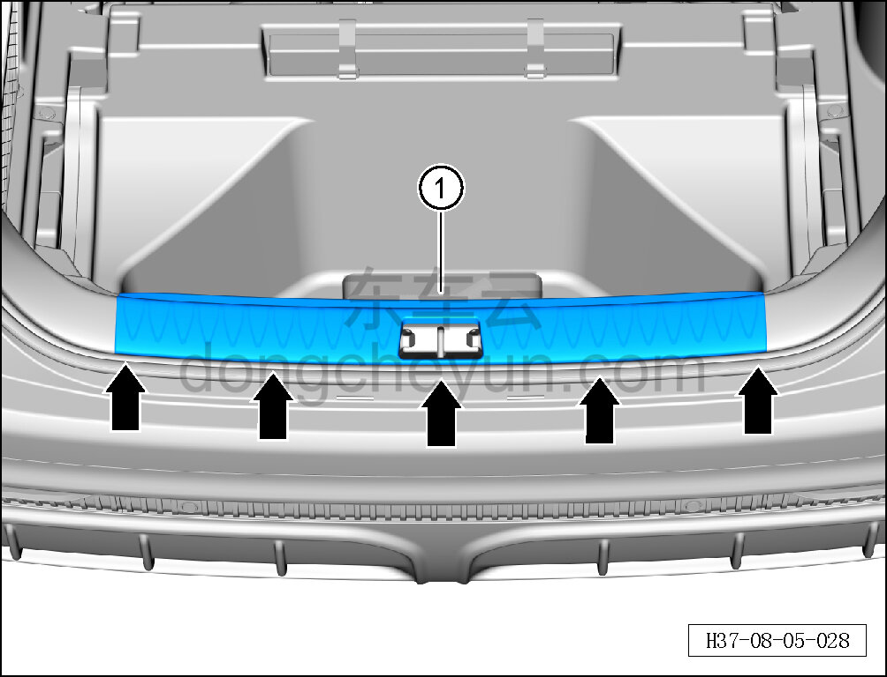

# Снятие и установка накладки порога двери багажника

> Внутренняя и внешняя отделка › Элементы отделки салона › Обивка порогов  
> Оригинал: `拆卸与安装背门门槛护板` · [dongcheyun 56746](https://dongcheyun.com/p/56746), страница `5c8c88f515cd4cf88a75c8b26aed7fbb` · [оглавление](../README.md)

**Порядок снятия**

1. Снимите накладку порога двери багажника.

a. Откройте крышку пола багажника.

b. Крестовой отвёрткой выверните 3 крепёжных болта накладки порога двери багажника.

Момент затяжки болта: 2±0,5 Н·м

c. Съёмником обивки отсоедините 5 крепёжных защёлок накладки порога двери багажника.

d. Снимите накладку порога двери багажника ①.

**Внимание:**

**- При отжиме накладки порога съёмником обивки подложите под инструмент нетканый материал, чтобы не повредить окружающие элементы отделки в процессе снятия.**

**Порядок установки**

Установка выполняется в обратном порядке.

**Внимание:**

**-Проверьте крепёжные клипсы на отсутствие повреждений, при необходимости замените.**

**- После завершения установки проверьте, что накладка порога двери багажника установлена без перекоса и не отходит.**
