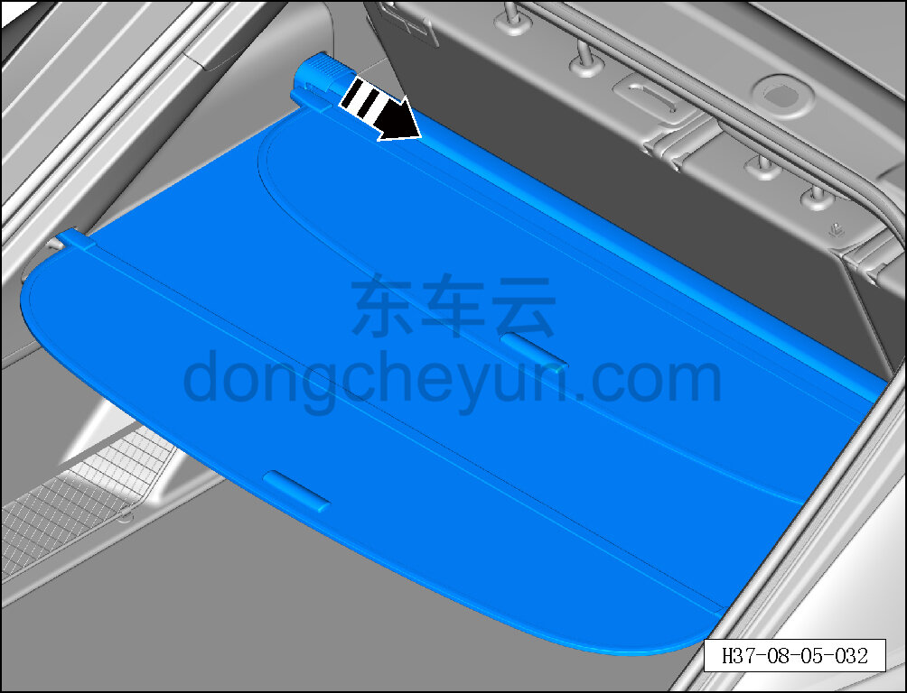
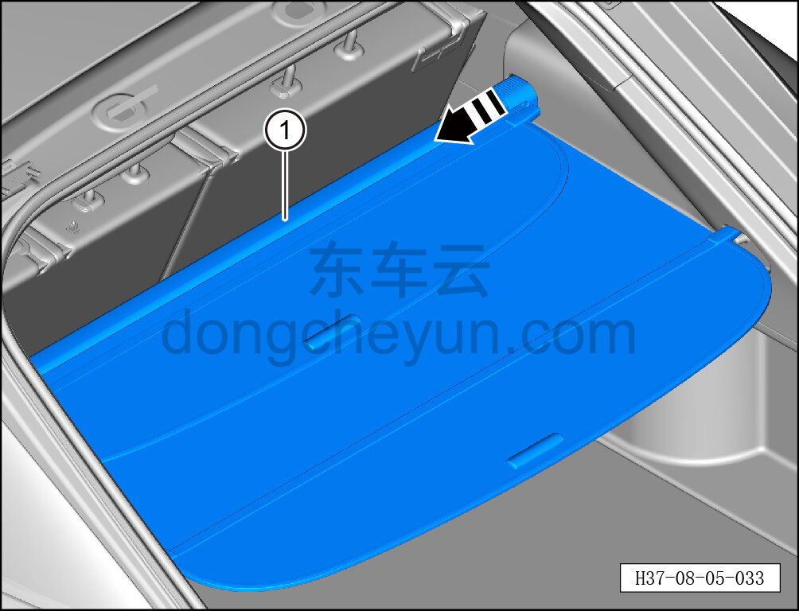

# Снятие и установка шторки багажника

> Внутренняя и внешняя отделка › Элементы отделки салона › Отделка заднего багажного отсека  
> Оригинал: `拆卸与安装遮物帘` · [dongcheyun 56746](https://dongcheyun.com/p/56746), страница `a4b358002b7d4b7da6bbd674d548d457` · [оглавление](../README.md)

**Порядок снятия**

1. Откройте дверь багажника в сборе.

2. Снимите шторку багажника.

a. Отсоедините левую сторону шторки багажника, вытянув её наружу в направлении стрелки.

b. Отсоедините правую сторону шторки багажника, вытянув её наружу в направлении стрелки.

c. Снимите шторку багажника ①.

**Порядок установки **

Установка выполняется в обратном порядке.

**Внимание:**

**- После завершения установки проверьте нормальность выдвижения и втягивания шторки багажника.**
