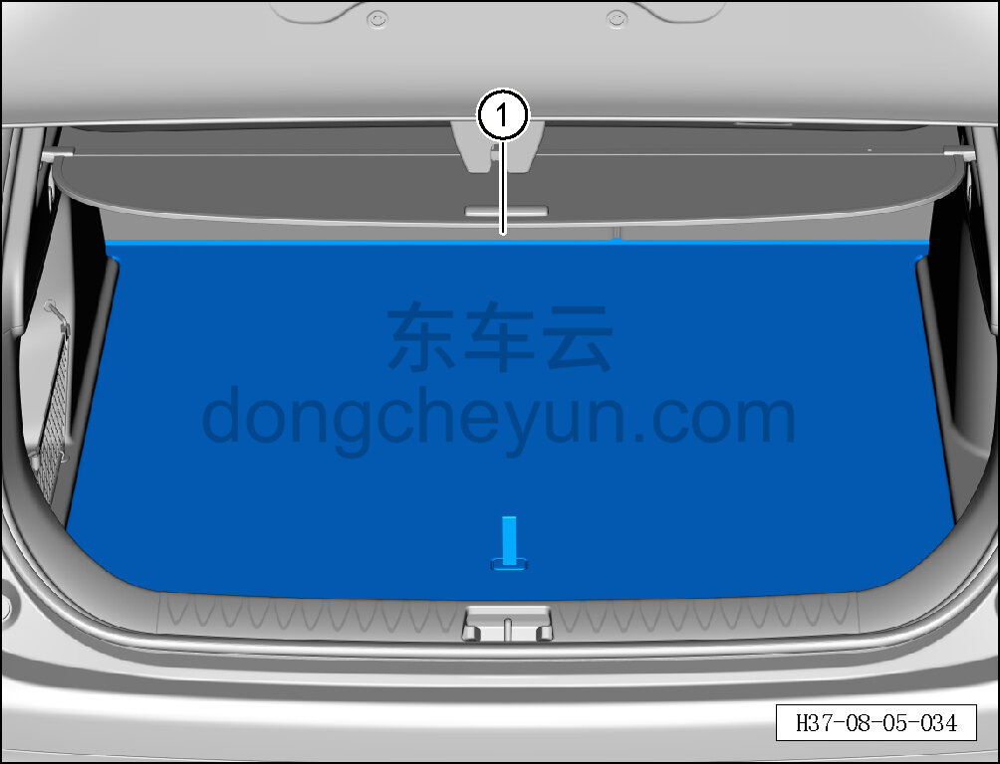

# Снятие и установка крышки пола багажника

> Внутренняя и внешняя отделка › Элементы отделки салона › Отделка заднего багажного отсека  
> Оригинал: `拆卸与安装行李箱盖板` · [dongcheyun 56746](https://dongcheyun.com/p/56746), страница `0dd6fb20d4fc4d4d9ed544d0653f3d8a` · [оглавление](../README.md)

**Порядок снятия**

1. Откройте дверь багажника в сборе.

2. Снимите крышку пола багажника.

a. Снимите крышку пола багажника ①.

**Порядок установки**

Установка выполняется в обратном порядке.
