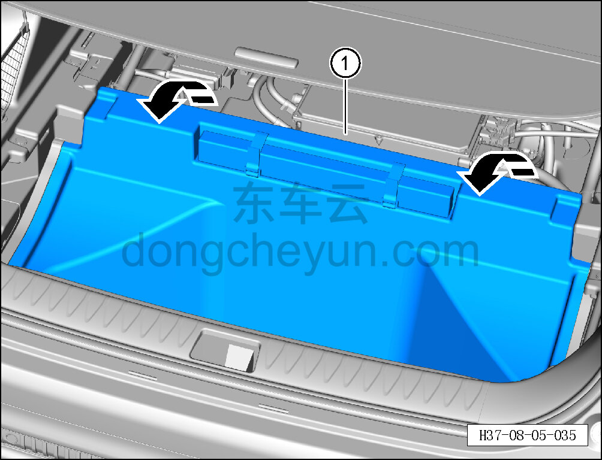
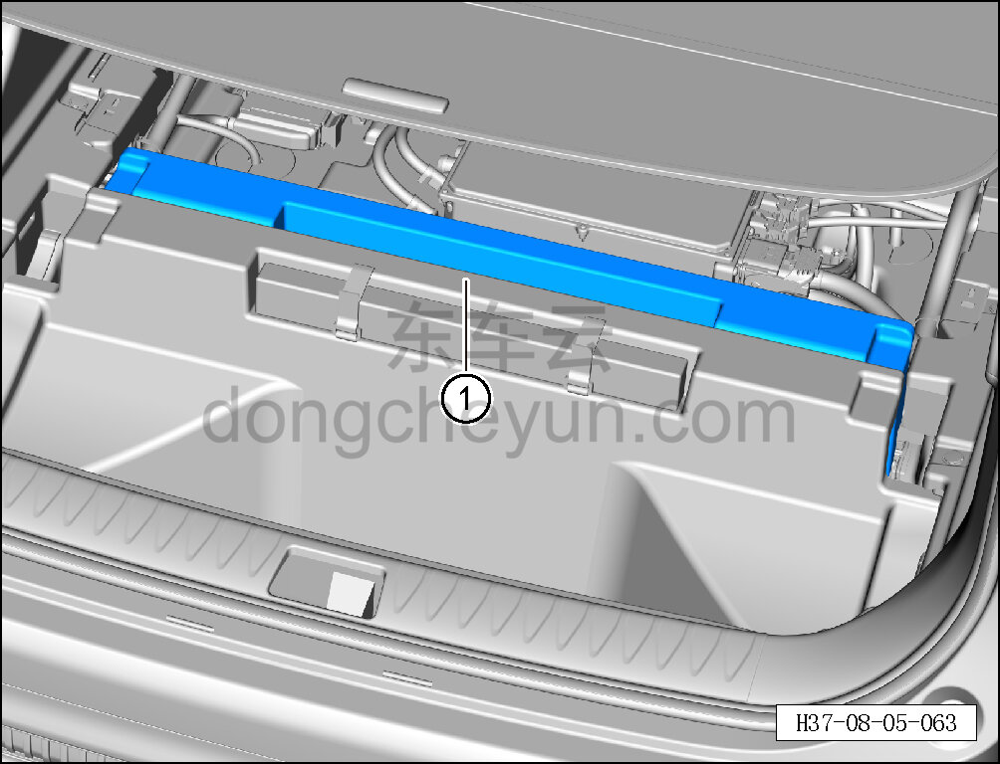

# Снятие и установка опорного блока багажника

> Внутренняя и внешняя отделка › Элементы отделки салона › Отделка заднего багажного отсека  
> Оригинал: `拆卸与安装行李箱支撑块` · [dongcheyun 56746](https://dongcheyun.com/p/56746), страница `e350a08760a94745b4a04f51cf2db0b1` · [оглавление](../README.md)

**Порядок снятия**

1. Снимите крышку пола багажника. См. [8.5.8.2 Снятие и установка крышки пола багажника](147-снятие-и-установка-крышки-пола-багажника.md)

2. Снимите опорный блок багажника.

a. Откиньте вещевой ящик багажника в направлении стрелки ①.

b. Снимите опорный блок багажника ①.

**Порядок установки **

Установка выполняется в обратном порядке.
