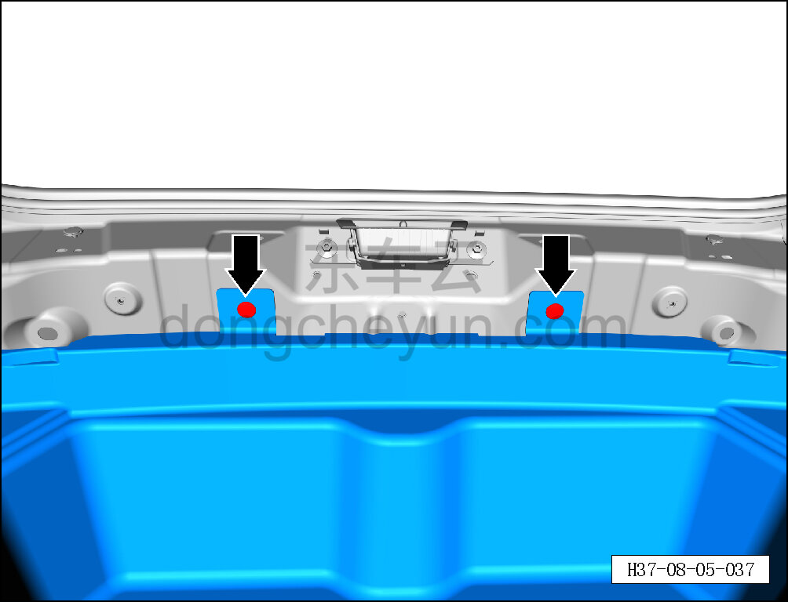
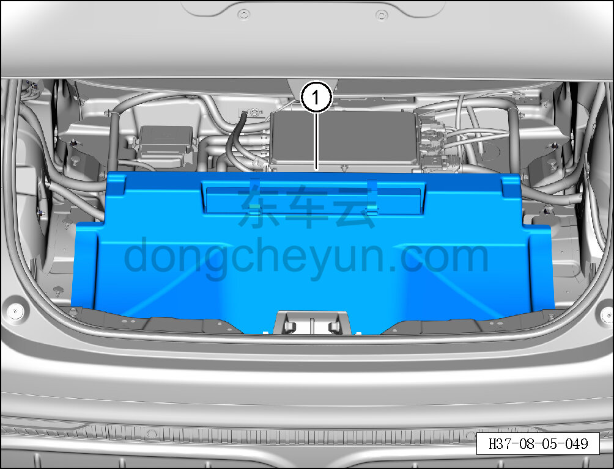

# Снятие и установка вещевого ящика багажника

> Внутренняя и внешняя отделка › Элементы отделки салона › Отделка заднего багажного отсека  
> Оригинал: `拆卸与安装行李箱储物盒` · [dongcheyun 56746](https://dongcheyun.com/p/56746), страница `d3363b22e6744e068b3c28f4befef901` · [оглавление](../README.md)

**Порядок снятия**

1. Выключите все электроприборы, отключите питание.

2. Снимите накладку порога двери багажника. См. [8.5.7.3 Снятие и установка накладки порога двери багажника](145-снятие-и-установка-накладки-порога-двери-багажника.md)

3. Снимите нижний кронштейн левой задней боковины. См. [8.5.5.8 Снятие и установка нижнего кронштейна левой задней боковины](138-снятие-и-установка-нижнего-кронштейна-левой-задней.md)

4. Снимите нижний кронштейн правой задней боковины. См. [8.5.5.9 Снятие и установка нижнего кронштейна правой задней боковины](139-снятие-и-установка-нижнего-кронштейна-правой-задней.md)

5. Снимите вещевой ящик багажника.

a. Съёмником обивки отожмите 2 крепёжные защёлки вещевого ящика багажника.

b. Снимите вещевой ящик багажника ①.

**Порядок установки**

Установка выполняется в обратном порядке.

**Внимание:**

**- Проверьте крепёжные защёлки на повреждения и при необходимости замените их.**
