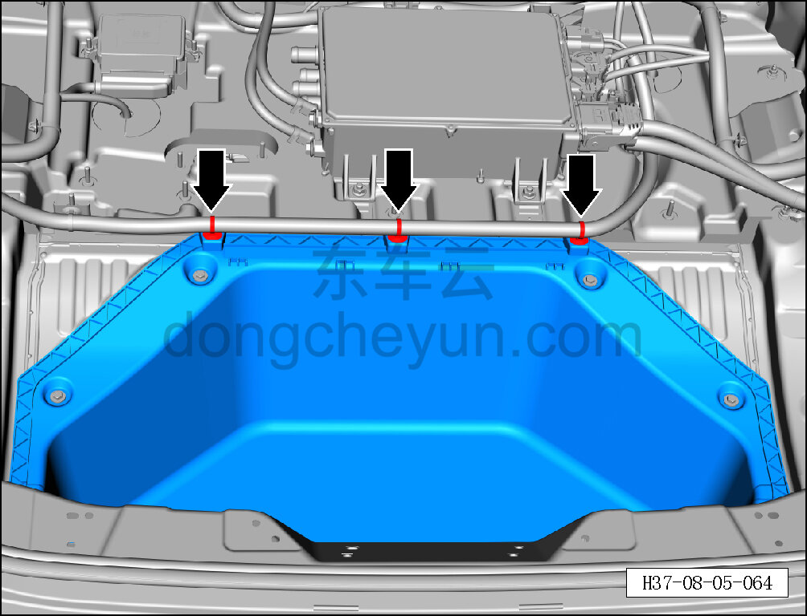
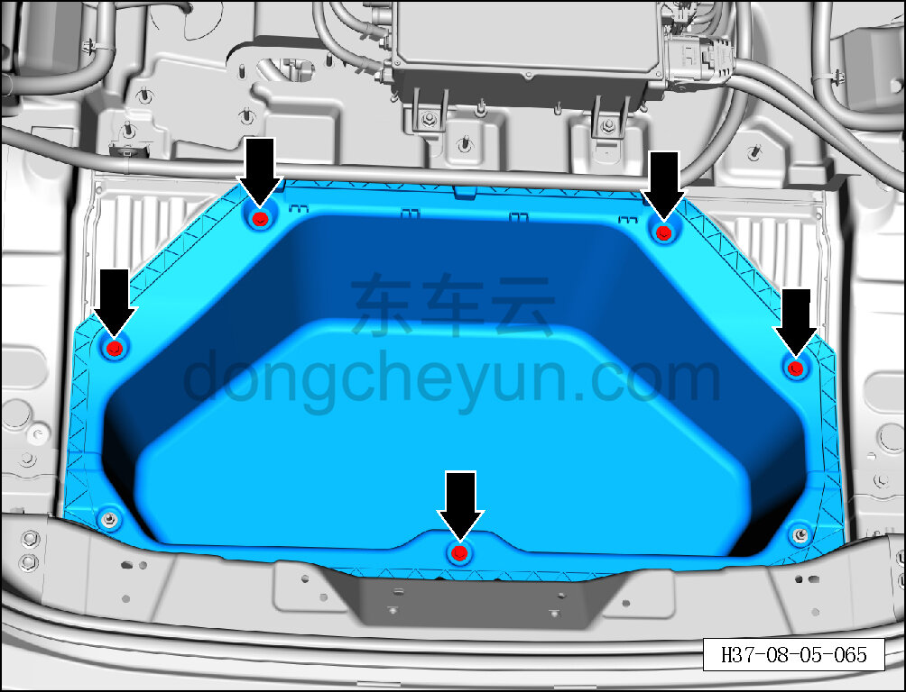
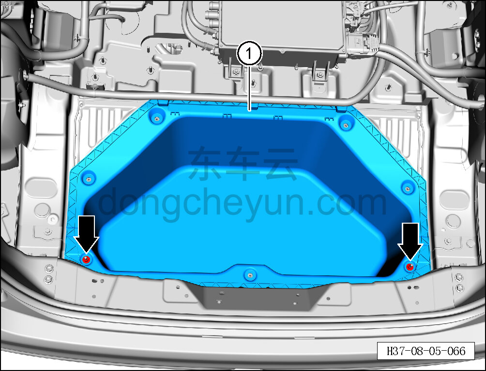

# Снятие и установка заднего вещевого ящика в сборе

> Внутренняя и внешняя отделка › Элементы отделки салона › Отделка заднего багажного отсека  
> Оригинал: `拆卸与安装后储物盒总成` · [dongcheyun 56746](https://dongcheyun.com/p/56746), страница `3f27617e58a84402abfd6e2729cecd8b` · [оглавление](../README.md)

**Порядок снятия**

1. Выключите все электроприборы, отключите питание.

2. Снимите нижний кронштейн левой задней боковины. См. [8.5.5.8 Снятие и установка нижнего кронштейна левой задней боковины](138-снятие-и-установка-нижнего-кронштейна-левой-задней.md)

3. Снимите нижний кронштейн правой задней боковины. См. [8.5.5.9 Снятие и установка нижнего кронштейна правой задней боковины](139-снятие-и-установка-нижнего-кронштейна-правой-задней.md)

4. Снимите вещевой ящик багажника. См. [8.5.8.4 Снятие и установка вещевого ящика багажника](149-снятие-и-установка-вещевого-ящика-багажника.md)

5. Снимите задний вещевой ящик в сборе.

a. Съёмником обивки отсоедините 3 защёлки жгута проводов заднего вещевого ящика в сборе.

b. Торцевой головкой на 10 мм выверните 5 крепёжных болтов заднего вещевого ящика в сборе.

Момент затяжки винта: 8±1 Н·м

c. Торцевой головкой на 10 мм выверните 2 крепёжные гайки заднего вещевого ящика в сборе.

Момент затяжки гайки: 8±1 Н·м

d. Снимите задний вещевой ящик в сборе ①.

**Внимание:**

**- Задний вещевой ящик в сборе также приклеен к кузову силиконовым герметиком; перед снятием необходимо разрезать клеевой шов.**

**Порядок установки**

Установка выполняется в обратном порядке.

**Внимание:**

**- Перед установкой необходимо удалить с кузова остатки старого герметика, нанести новый герметик и затем установить задний вещевой ящик в сборе.**

**- При установке затягивайте крепёжные детали по принципу перекрёстной последовательности.**

**- В течение 48 часов после завершения установки не подвергайте задний вещевой ящик в сборе внешним нагрузкам, иначе качество склеивания снизится.**
