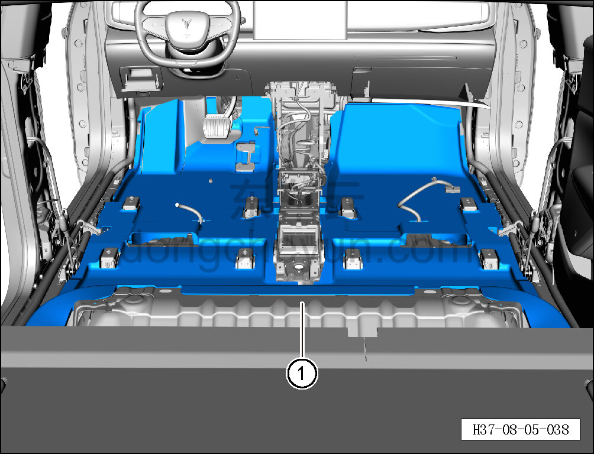

# Снятие и установка переднего ковра переднего пола

> Внутренняя и внешняя отделка › Элементы отделки салона › Ковровые покрытия  
> Оригинал: `拆卸与安装前地板前地毯` · [dongcheyun 56746](https://dongcheyun.com/p/56746), страница `18b7f0aa695e491d91c7d41f0699ea99` · [оглавление](../README.md)

**Порядок снятия**

1. Выключите все электроприборы, отключите питание.

2. Выполните операцию обесточивания автомобиля для ремонта. См. [3.1.4.1 Обесточивание автомобиля](../03-техническое-обслуживание/005-обесточивание-автомобиля.md)

3. Снимите левую и правую нижние накладки стойки B. См. [8.5.5.2 Снятие и установка левой нижней накладки стойки B](132-снятие-и-установка-левой-нижней-накладки-стойки-b.md)

4. Снимите переднее сиденье в сборе. См. [8.1.3.1 Снятие и установка переднего сиденья в сборе](003-снятие-и-установка-сиденья-водителя-в-сборе.md)

5. Снимите центральную консоль в сборе. См. [8.3.4.13 Снятие и установка центральной консоли в сборе](098-снятие-и-установка-центральной-консоли-в-сборе.md)

6. Снимите подушку заднего сиденья в сборе. См. [8.1.5.1 Снятие и установка подушки заднего сиденья в сборе](029-снятие-и-установка-подушки-заднего-сиденья.md)

7. Снимите передний ковёр переднего пола.

a. Снимите передний ковёр переднего пола ①.

**Порядок установки**

Установка выполняется в обратном порядке.

**Внимание:**

**- После завершения установки проверьте, что передний ковёр переднего пола установлен без перекоса и не отходит.**
