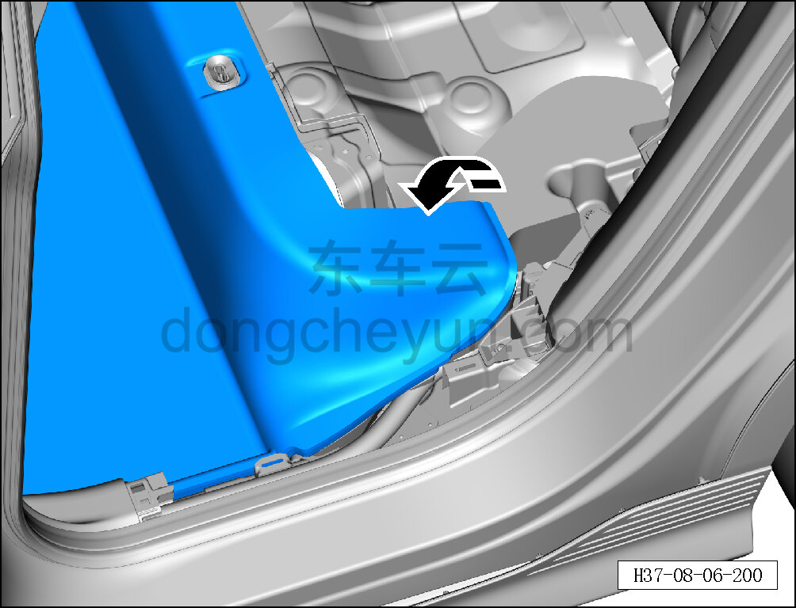
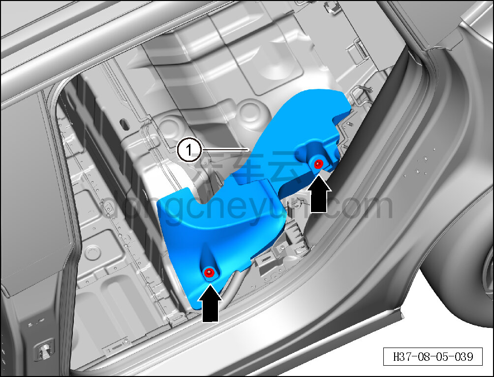

# Снятие и установка опорного блока заднего левого ковра

> Внутренняя и внешняя отделка › Элементы отделки салона › Ковровые покрытия  
> Оригинал: `拆卸与安装左后地毯支撑块` · [dongcheyun 56746](https://dongcheyun.com/p/56746), страница `09a60f74bc434c4495dd6b093a77860e` · [оглавление](../README.md)

**Порядок снятия**

**Примечание:**

**- Ниже описано снятие и установка опорного блока заднего левого ковра, правая выполняется по аналогии с левой.**

1. Выключите все электроприборы, отключите питание.

2. Снимите левую накладку заднего порога. См. [8.5.7.2 Снятие и установка левой накладки заднего порога](144-снятие-и-установка-левой-накладки-заднего-порога.md)

3. Снимите опорный блок заднего левого ковра.

a. Откиньте передний ковёр переднего пола в направлении стрелки.

b. Торцевой головкой на 10 мм выверните крепёжную пластиковую гайку опорного блока заднего левого ковра.

c. Снимите опорный блок заднего левого ковра ①.

**Порядок установки**

Установка выполняется в обратном порядке.

**Внимание:**

**- Проверьте крепёжные защёлки на повреждения и при необходимости замените их.**
