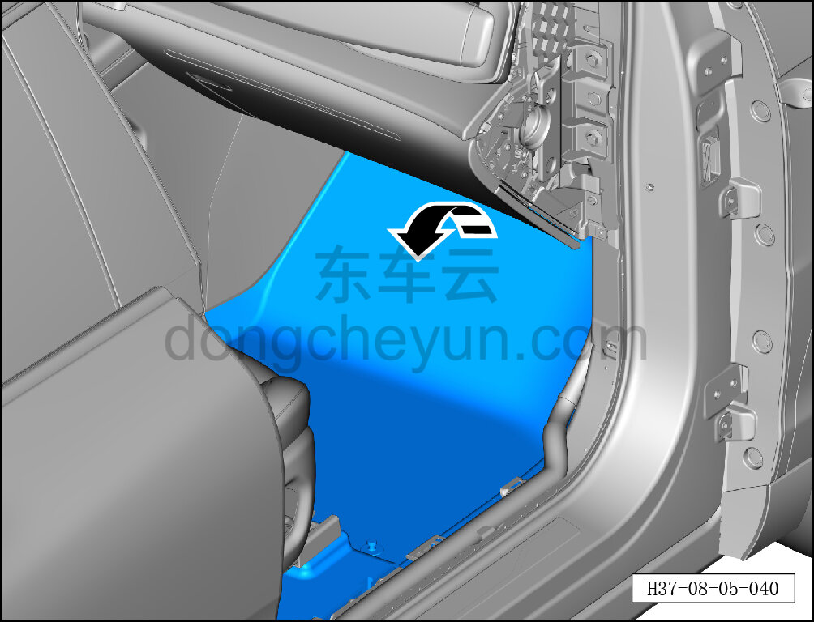
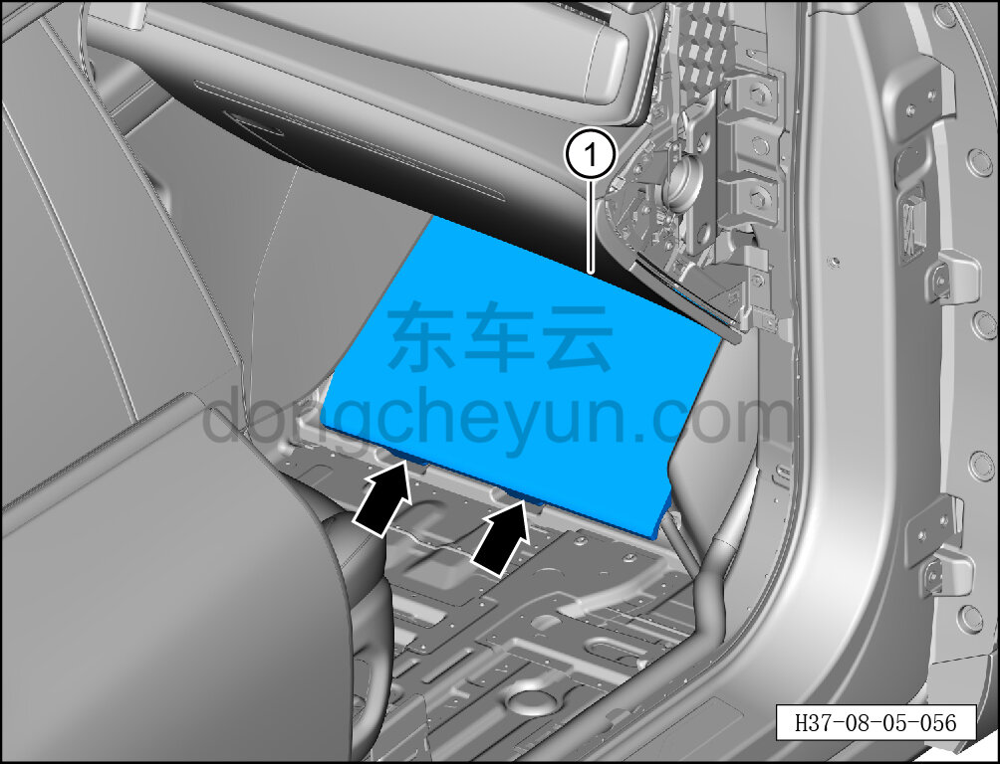

# Снятие и установка опорного блока ковра

> Внутренняя и внешняя отделка › Элементы отделки салона › Ковровые покрытия  
> Оригинал: `拆卸与安装地毯支撑块` · [dongcheyun 56746](https://dongcheyun.com/p/56746), страница `586d7d0263bd440bb0bb5ff0f827655d` · [оглавление](../README.md)

**Порядок снятия**

1. Выключите все электроприборы, отключите питание.

2. Выполните операцию обесточивания автомобиля для ремонта. См. [3.1.4.1 Обесточивание автомобиля](../03-техническое-обслуживание/005-обесточивание-автомобиля.md)

3. Снимите центральную консоль в сборе. См. [8.3.4.8 Снятие и установка центральной консоли в сборе](098-снятие-и-установка-центральной-консоли-в-сборе.md)

4. Снимите правую накладку переднего порога. См. [8.5.7.1 Снятие и установка левой накладки переднего порога](143-снятие-и-установка-левой-накладки-переднего-порога.md)

5. Снимите опорный блок ковра.

a. Откиньте передний ковёр переднего пола в направлении стрелки.

b. Снимите опорный блок ковра ①.

**Порядок установки**

Установка выполняется в обратном порядке.
