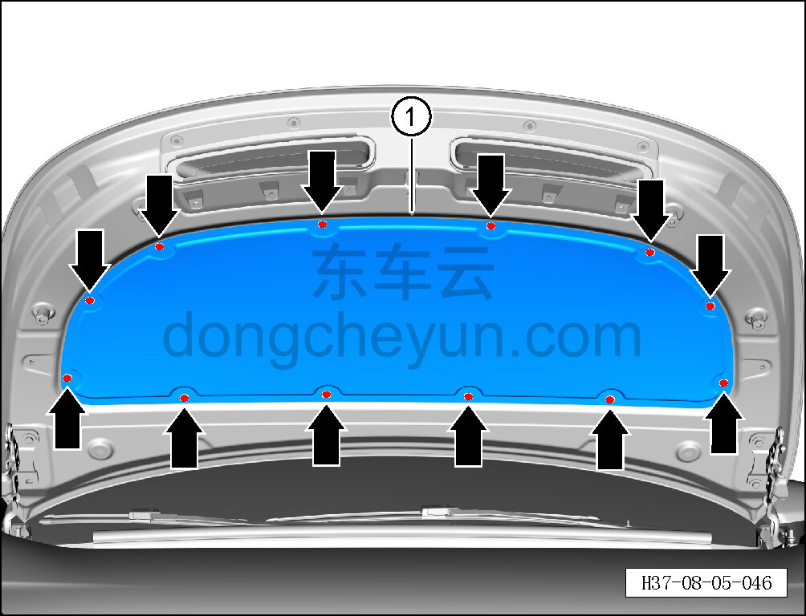

# Снятие и установка шумоизоляционной накладки капота

> Внутренняя и внешняя отделка › Элементы отделки салона › Шумоизоляционные материалы  
> Оригинал: `拆卸与安装前罩隔音垫` · [dongcheyun 56746](https://dongcheyun.com/p/56746), страница `958dbd3882d74620a2defb5e49ba0ae5` · [оглавление](../README.md)

**Порядок снятия**

1. Откройте капот в сборе.

2. Снимите шумоизоляционную накладку капота.

a. Съёмником обивки отсоедините 12 крепёжных защёлок шумоизоляционной накладки капота.

b. Снимите шумоизоляционную накладку капота ①.

**Порядок установки**

Установка выполняется в обратном порядке.

**Внимание:**

**- Проверьте крепёжные защёлки на повреждения и при необходимости замените их.**
