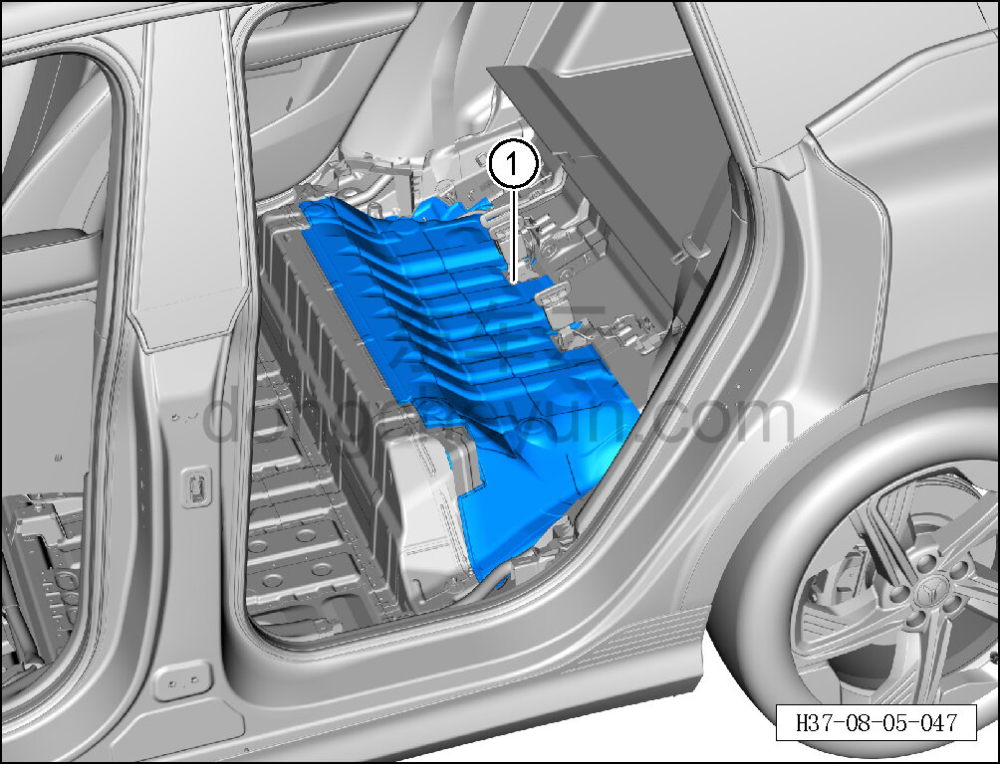

# Снятие и установка шумоизоляционной накладки под задним сиденьем

> Внутренняя и внешняя отделка › Элементы отделки салона › Шумоизоляционные материалы  
> Оригинал: `拆卸与安装后座椅下隔音垫` · [dongcheyun 56746](https://dongcheyun.com/p/56746), страница `4c53df33e2464385879050c0aaea80f1` · [оглавление](../README.md)

**Порядок снятия**

1. Выключите все электроприборы, отключите питание.

2. Выполните операцию обесточивания автомобиля для ремонта. См. [3.1.4.1 Обесточивание автомобиля](../03-техническое-обслуживание/005-обесточивание-автомобиля.md)

3. Снимите левый и правый опорные блоки заднего ковра. См. [8.5.9.2 Снятие и установка опорного блока заднего левого ковра](152-снятие-и-установка-опорного-блока-заднего-левого-ковра.md)

4. Снимите шумоизоляционную накладку под задним сиденьем.

a. Снимите шумоизоляционную накладку под задним сиденьем ①.

**Порядок установки**

Установка выполняется в обратном порядке.

**Внимание:**

**- После завершения установки проверьте, что шумоизоляционная накладка под задним сиденьем установлена без перекоса и не отходит.**
