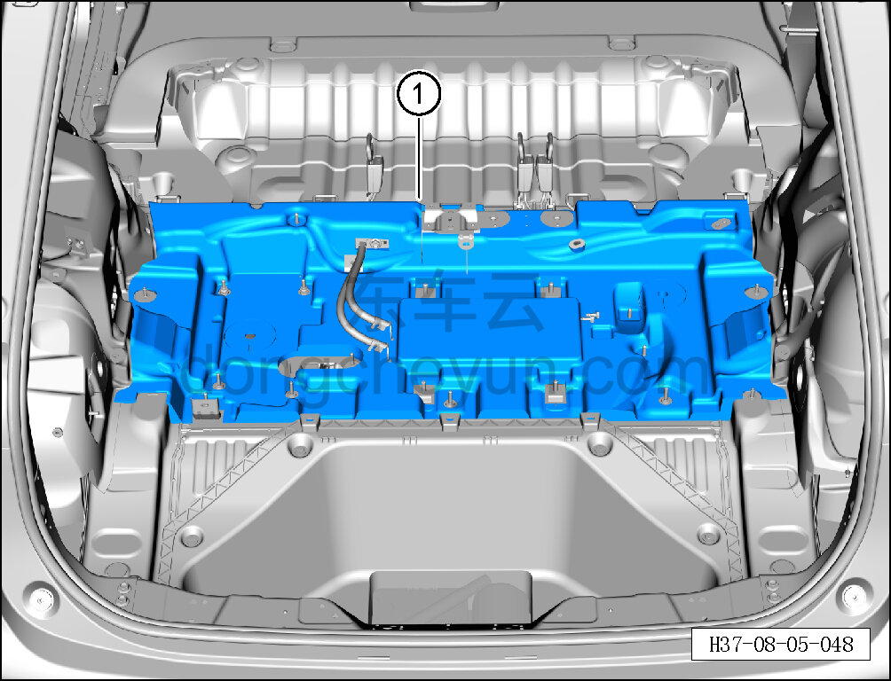

# Снятие и установка внутренней шумоизоляционной накладки пола багажника

> Внутренняя и внешняя отделка › Элементы отделки салона › Шумоизоляционные материалы  
> Оригинал: `拆卸与安装行李箱地板内隔音垫` · [dongcheyun 56746](https://dongcheyun.com/p/56746), страница `0cee652fe98249798ea5aebe9428e8a4` · [оглавление](../README.md)

**Порядок снятия**

1. Выключите все электроприборы, отключите питание.

2. Выполните операцию обесточивания автомобиля для ремонта. См. [3.1.4.1 Обесточивание автомобиля](../03-техническое-обслуживание/005-обесточивание-автомобиля.md)

3. Снимите опорный блок багажника. См. [8.5.8.3 Снятие и установка опорного блока багажника](148-снятие-и-установка-опорного-блока-багажника.md)

4. Снимите бортовое зарядное устройство (OBC). См. [5.3.5.1 Снятие и установка бортового зарядного устройства (OBC) (400 В)](../05-силовая-система-на-новых-источниках/036-снятие-и-установка-бортового-зарядного-устройства-400-в.md)

5. Снимите нижний кронштейн левой задней боковины. См. [8.5.5.8 Снятие и установка нижнего кронштейна левой задней боковины](138-снятие-и-установка-нижнего-кронштейна-левой-задней.md)

6. Снимите нижний кронштейн правой задней боковины. См. [8.5.5.9 Снятие и установка нижнего кронштейна правой задней боковины](139-снятие-и-установка-нижнего-кронштейна-правой-задней.md)

7. Снимите контроллер электронного стояночного тормоза (EPB). См. [6.6.6.9 Снятие и установка контроллера EPB](../06-система-шасси/081-снятие-и-установка-контроллера-epb.md)

8. Снимите внутреннюю шумоизоляционную накладку пола багажника.

a. Снимите внутреннюю шумоизоляционную накладку пола багажника ①.

**Порядок установки**

Установка выполняется в обратном порядке.

**Внимание:**

**- После завершения установки проверьте, что внутренняя шумоизоляционная накладка пола багажника установлена без перекоса и не отходит.**
