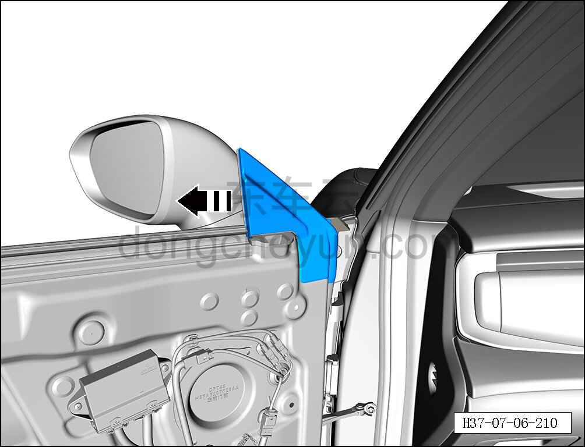
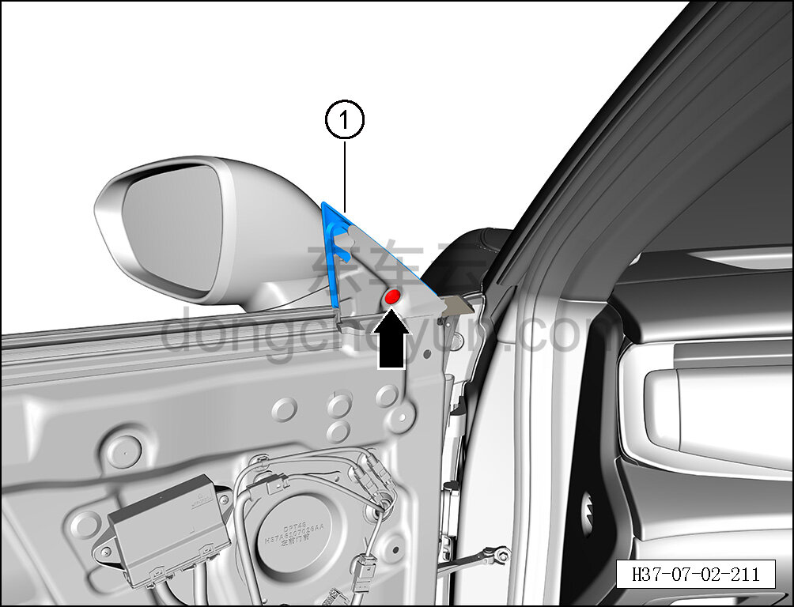

# Снятие и установка левой треугольной накладки передней двери

> Внутренняя и внешняя отделка › Наружные элементы отделки › Декоративные элементы окон  
> Оригинал: `拆卸与安装左前门三角装饰板` · [dongcheyun 56746](https://dongcheyun.com/p/56746), страница `deb676b9319d46579144d560a2a73fce` · [оглавление](../README.md)

**Порядок снятия**

**Примечание:**

**- Ниже описано снятие и установка левой треугольной накладки передней двери, правая выполняется по аналогии с левой.**

1. Выключите все электроприборы, отключите питание.

2. Выполните операцию обесточивания автомобиля для ремонта. См. [3.1.4.1 Обесточивание автомобиля](../03-техническое-обслуживание/005-обесточивание-автомобиля.md)

3. Снимите внутреннюю обивку левой передней двери. См. [8.4.2.1 Снятие и установка внутренней обивки левой передней двери](117-снятие-и-установка-обивки-левой-передней-двери.md)

4. Снимите левую треугольную накладку передней двери.

a. Отсоедините направляющую стекла стойки A левой передней двери в направлении стрелки.

**Примечание:**

**- Снимать направляющую стекла стойки A передней двери полностью не требуется — достаточно освободить доступ для выворачивания крепёжного болта треугольной накладки передней двери в сборе на следующем шаге.**

b. Головкой T30 выверните крепёжный винт левой треугольной накладки передней двери.

Момент затяжки винта: 8±1 Н·м

c. Снимите левую треугольную накладку передней двери ①.

**Порядок установки**

Установка выполняется в обратном порядке.

**Внимание:**

**-Проверьте крепёжные клипсы на отсутствие повреждений, при необходимости замените.**

**- После завершения установки проверьте правильность установки левой треугольной накладки передней двери.**
