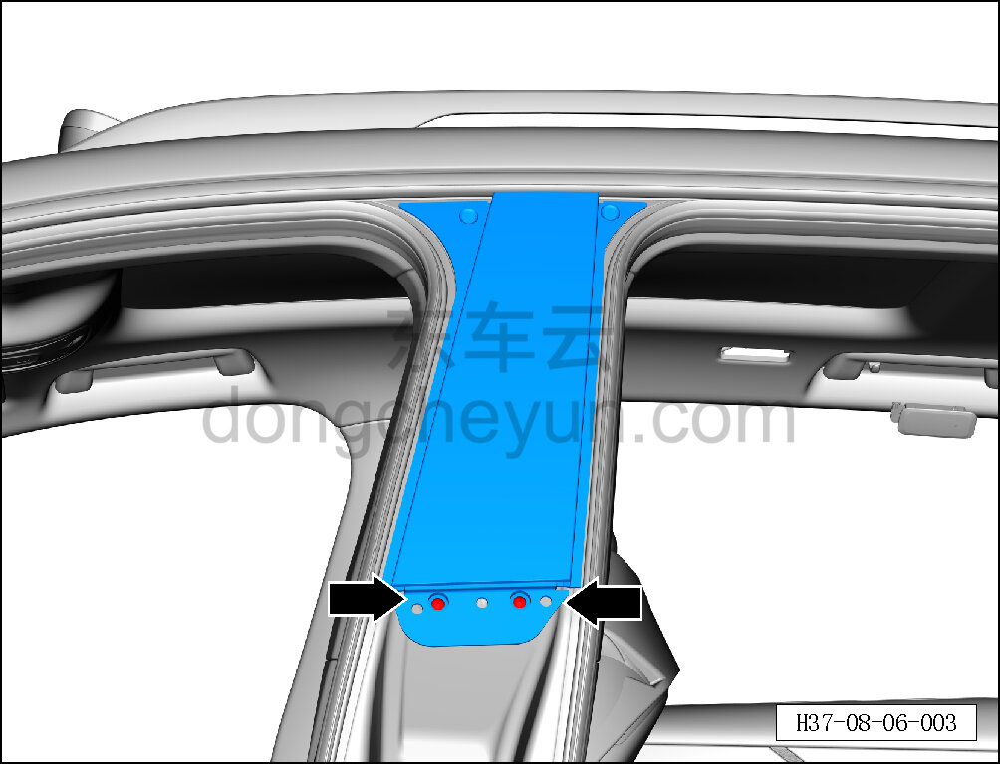
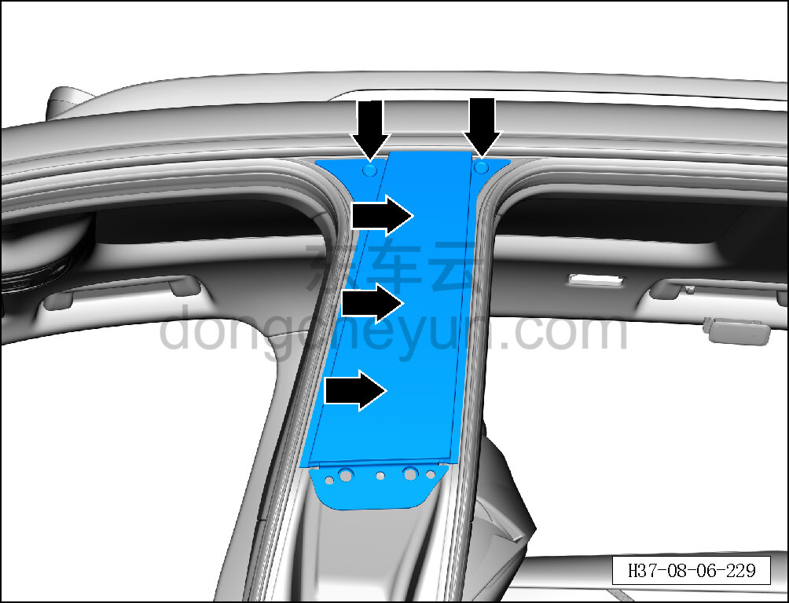

# Снятие и установка наружной накладки стойки B левой боковины

> Внутренняя и внешняя отделка › Наружные элементы отделки › Декоративные элементы окон  
> Оригинал: `拆卸与安装左侧围B柱外装饰板` · [dongcheyun 56746](https://dongcheyun.com/p/56746), страница `d0733e84bc154ca89d473496142031f5` · [оглавление](../README.md)

**Порядок снятия**

**Примечание:**

**- Ниже описано снятие и установка наружной накладки стойки B левой боковины, правая выполняется по аналогии с левой.**

1. Снимите левую направляющую стекла стойки B. См. [7.3.4.15 Снятие и установка левой направляющей стекла стойки B](../07-открывающиеся-элементы-кузова/050-снятие-и-установка-направляющей-стекла-левой-стойки-b.md)

2. Снимите наружную накладку стойки B левой боковины.

a. Крестовой отвёрткой выверните 2 крепёжных винта наружной накладки стойки B левой боковины.

Момент затяжки винта: 1.5±0.5 Н·м

b. Съёмником обивки отсоедините 5 крепёжных защёлок наружной накладки стойки B левой боковины.

c. Снимите наружную накладку стойки B левой боковины ①.

**Порядок установки**

Установка выполняется в обратном порядке.

**Внимание:**

**-Проверьте крепёжные клипсы на отсутствие повреждений, при необходимости замените.**

**- После завершения установки проверьте, что наружная накладка стойки B левой боковины установлена без перекоса и не отходит.**
