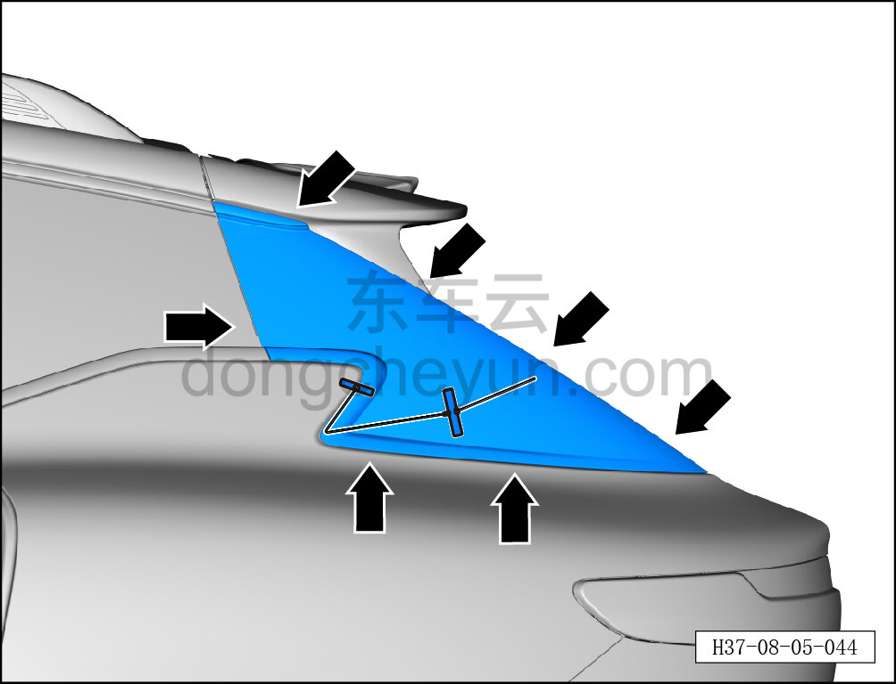
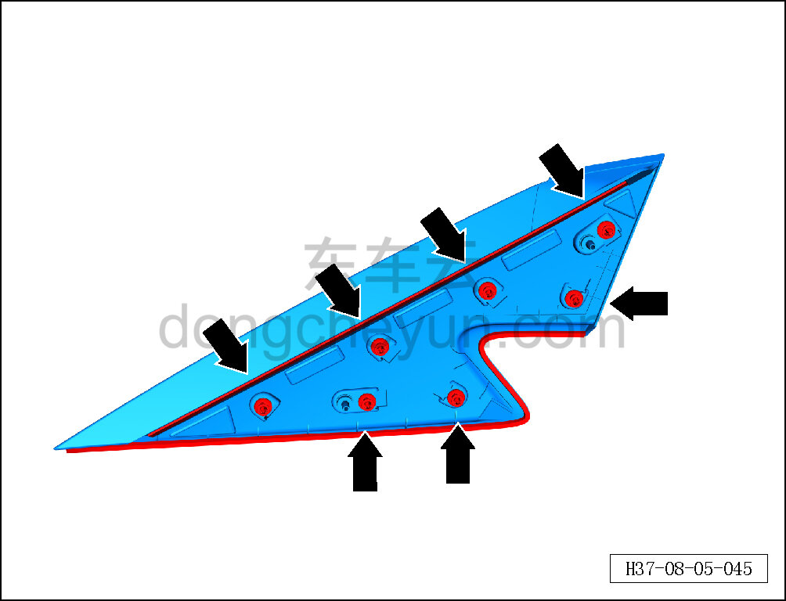

# Снятие и установка накладки стойки D левой задней боковины

> Внутренняя и внешняя отделка › Наружные элементы отделки › Декоративные элементы окон  
> Оригинал: `拆卸与安装左侧后围D柱饰板` · [dongcheyun 56746](https://dongcheyun.com/p/56746), страница `6d5c6e4e3133429db1dcac9ac1abb6c1` · [оглавление](../README.md)

**Порядок снятия**

**Примечание:**

**- Ниже описано снятие и установка наружной накладки стойки D левой боковины, правая выполняется по аналогии с левой.**

1. Снимите наружную накладку стойки D левой боковины.

a. Съёмником обивки отсоедините 7 крепёжных защёлок наружной накладки стойки B левой боковины.

b. Шилом проколите клеевой герметизирующий материал, протяните разрезающую нить внутрь автомобиля и разрежьте герметик.

c. Снимите наружную накладку стойки D левой боковины.

d. Места нанесения герметика на наружной накладке стойки D левой боковины показаны на рисунке слева.

e. Крепёжные защёлки наружной накладки стойки D левой боковины показаны на рисунке слева.

**Порядок установки**

Установка выполняется в обратном порядке.

**Внимание:**

**-Проверьте крепёжные клипсы на отсутствие повреждений, при необходимости замените.**

**- При установке сначала удалите остатки старого герметика с автомобиля, затем нанесите новый герметик и только после этого производите установку.**
