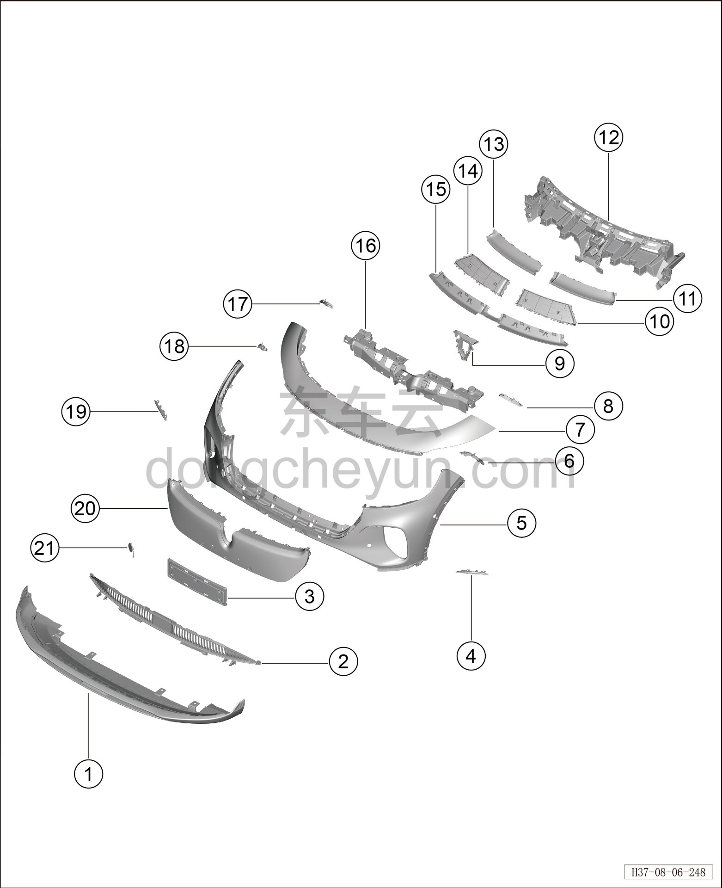
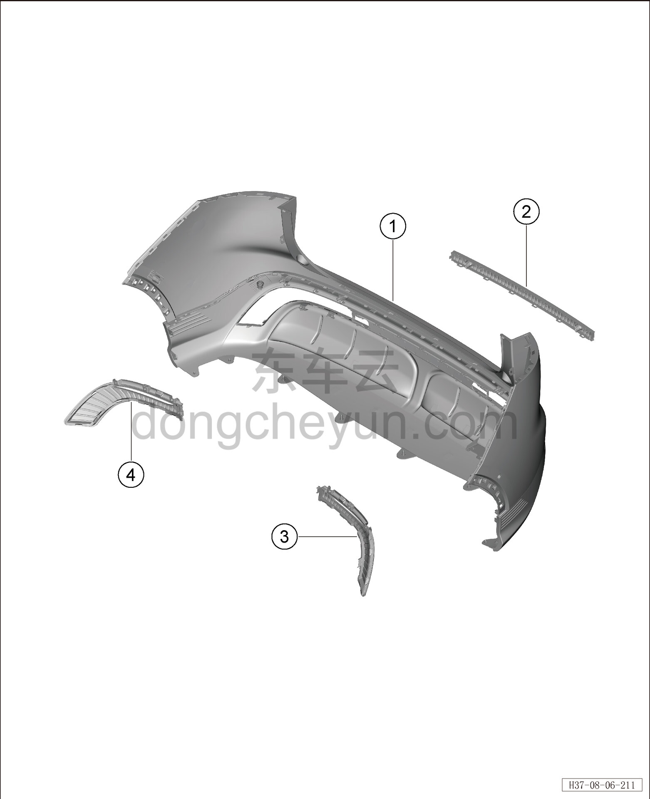

# Покомпонентный вид (деталировка)

> Внутренняя и внешняя отделка › Наружные элементы отделки › Система бамперов и решёток  
> Оригинал: `结构分解图` · [dongcheyun 56746](https://dongcheyun.com/p/56746), страница `1b366dd0600f4247904684594d07ff51` · [оглавление](../README.md)

| № | Наименование детали | Кол-во на автомобиль | Примечание |
|---|---|---|---|
| 1 | Нижняя облицовка переднего бампера | 1 | - |
| 2 | Нижняя решётка переднего бампера | 1 | - |
| 3 | Передняя рамка номерного знака | 1 | - |
| 4 | Левая накладка переднего бампера | 1 | - |
| 5 | Облицовка переднего бампера | 1 | - |
| 6 | Левый монтажный кронштейн переднего бампера | 1 | - |
| 7 | Верхняя часть переднего бампера в сборе | 1 | - |
| 8 | Левый верхний монтажный кронштейн переднего бампера | 1 | - |
| 9 | Передняя накладка переднего габаритного фонаря | 1 | - |
| 10 | Левый верхний воздуховод переднего бампера | 1 | - |
| 11 | Левая декоративная накладка передней решётки | 1 | - |
| 12 | Центральная опорная панель переднего бампера | 1 | - |
| 13 | Правая декоративная накладка передней решётки | 1 | - |
| 14 | Правый верхний воздуховод переднего бампера | 1 | - |
| 15 | Задняя накладка переднего габаритного фонаря | 1 | - |
| 16 | Центральный кронштейн переднего бампера | 1 | - |
| 17 | Правый верхний монтажный кронштейн переднего бампера | 1 | - |
| 18 | Правый монтажный кронштейн переднего бампера | 1 | - |
| 19 | Правая накладка переднего бампера | 1 | - |
| 20 | Передняя решётка | 1 | - |
| 21 | Заглушка переднего буксировочного крюка | 1 | - |

| № | Наименование детали | Кол-во на автомобиль | Примечание |
|---|---|---|---|
| 1 | Облицовка заднего бампера | 1 | - |
| 2 | Центральная декоративная накладка нижней облицовки заднего бампера | 1 | - |
| 3 | Левая декоративная накладка нижней облицовки заднего бампера | 1 | - |
| 4 | Правая декоративная накладка нижней облицовки заднего бампера | 1 | - |
