# Снятие и установка переднего бампера в сборе

> Внутренняя и внешняя отделка › Наружные элементы отделки › Система бамперов и решёток  
> Оригинал: `拆卸与安装前保险杠总成` · [dongcheyun 56746](https://dongcheyun.com/p/56746), страница `73fb908b4f364498aaf4a8332eacca9a` · [оглавление](../README.md)

**Порядок снятия**

1. Выключите все электроприборы, отключите питание.

2. Выполните операцию обесточивания автомобиля для ремонта. См. [3.1.4.1 Обесточивание автомобиля](../03-техническое-обслуживание/005-обесточивание-автомобиля.md)

3. Снимите декоративную накладку моторного отсека. См. [8.6.6.10 Снятие и установка декоративной накладки моторного отсека](223-снятие-и-установка-декоративной-накладки-моторного.md)

4. Снимите левую и правую передние накладки колёсных арок. См. [8.6.6.1 Снятие и установка левой передней накладки колёсной арки](214-снятие-и-установка-левой-передней-накладки-колёсной.md)

5. Снимите передний бампер в сборе.

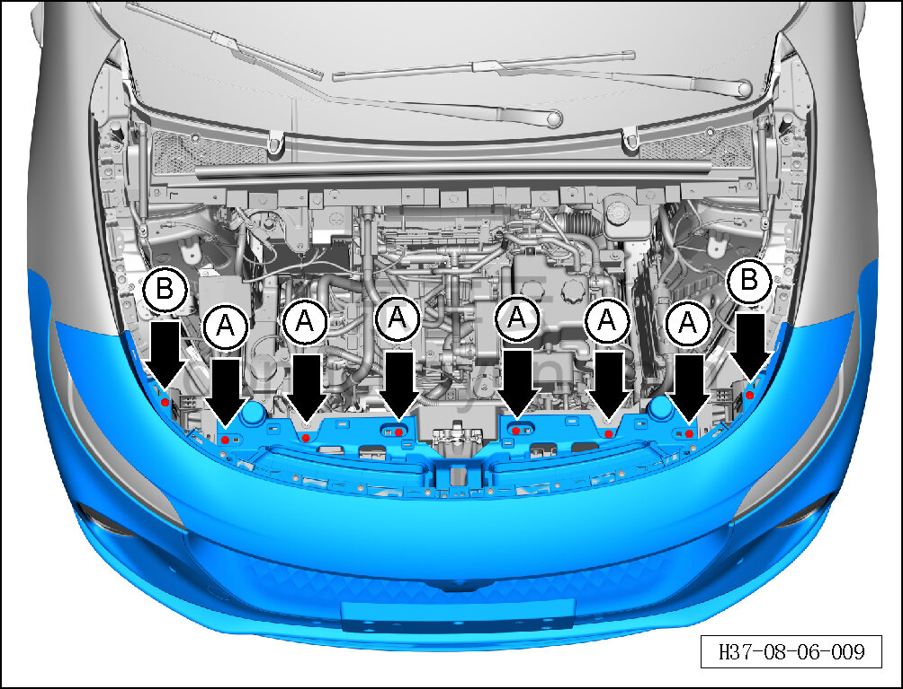

a. Торцевой головкой на 10 мм выверните 6 крепёжных болтов A переднего бампера в сборе.

Момент затяжки болта: 4±1 Н·м

b. Головкой T25 выверните 2 крепёжных винта B переднего бампера в сборе.

Момент затяжки винта: 1.5±0.5 Н·м

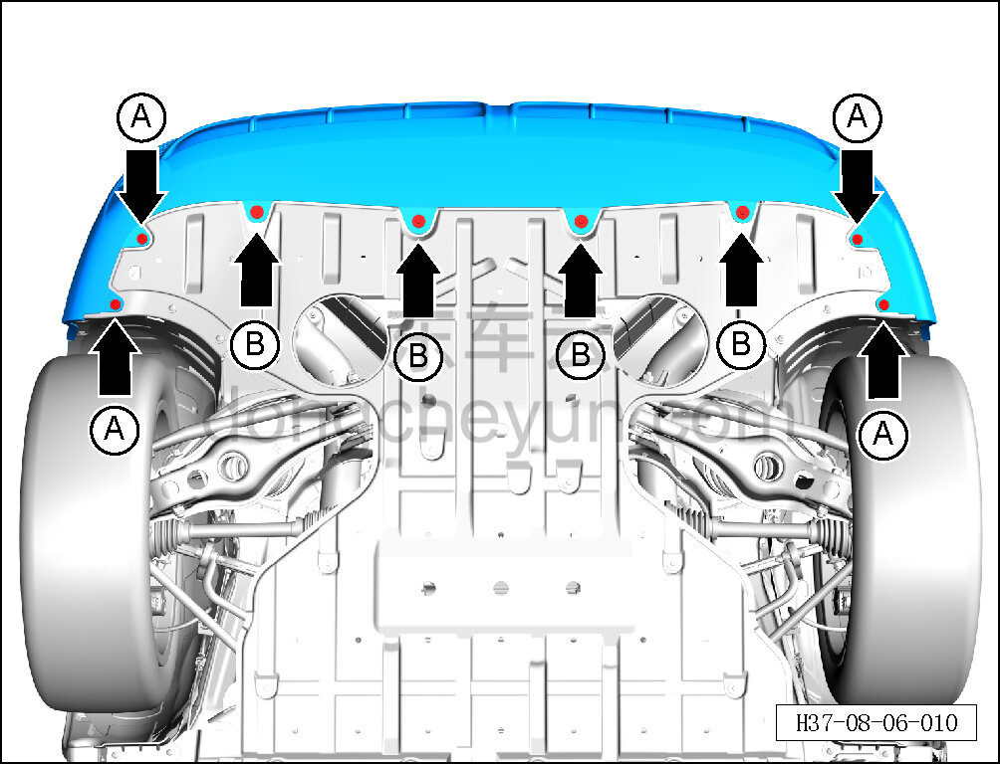

c. Поднимите автомобиль на подъёмнике.

d. Головкой T25 выверните 4 крепёжных винта A переднего бампера в сборе.

Момент затяжки винта: 1.5±0.5 Н·м

e. Торцевой головкой на 10 мм выверните 4 крепёжных болта B переднего бампера в сборе.

Момент затяжки болта: 4±1 Н·м

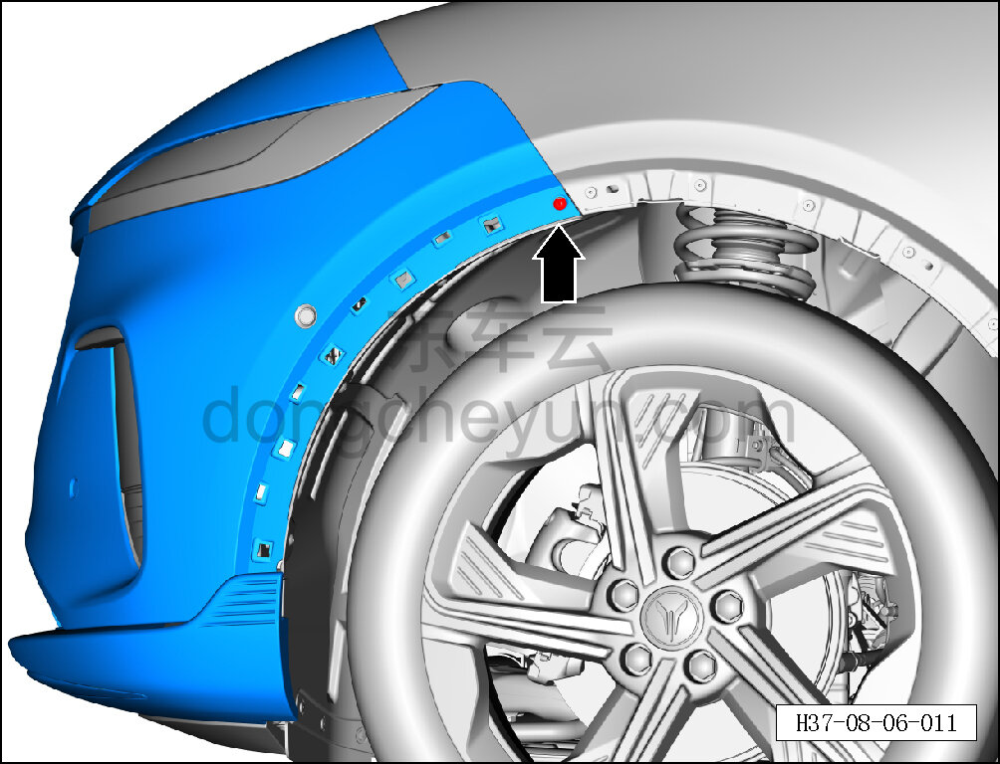

f. Головкой T25 выверните крепёжный винт переднего бампера в сборе.

Момент затяжки винта: 1.5±0.5 Н·м

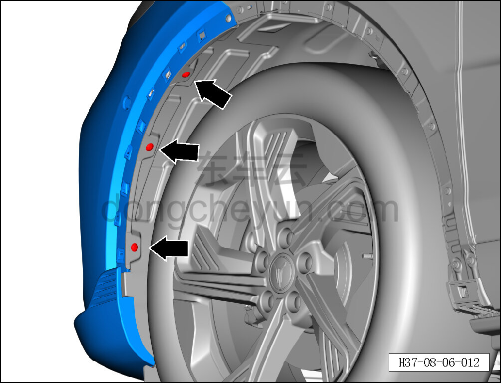

g. Головкой T25 выверните 3 крепёжных винта переднего бампера в сборе.

Момент затяжки винта: 1.5±0.5 Н·м

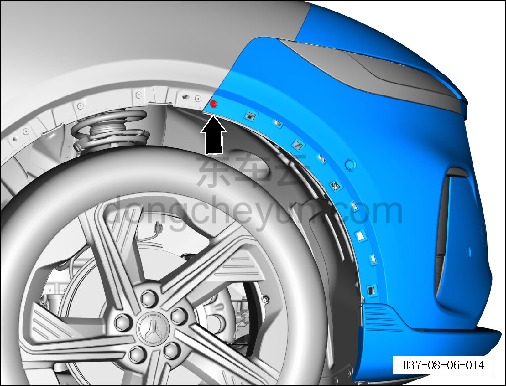

h. Головкой T25 выверните крепёжный винт переднего бампера в сборе.

Момент затяжки винта: 1.5±0.5 Н·м

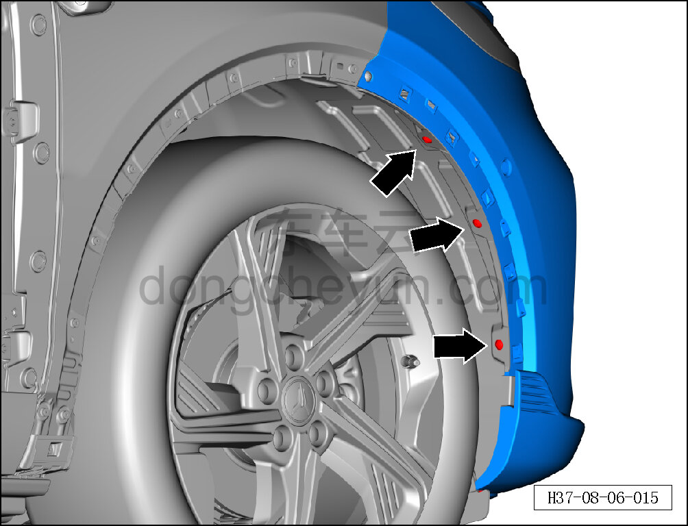

i. Головкой T25 выверните 3 крепёжных винта переднего бампера в сборе.

Момент затяжки винта: 1.5±0.5 Н·м

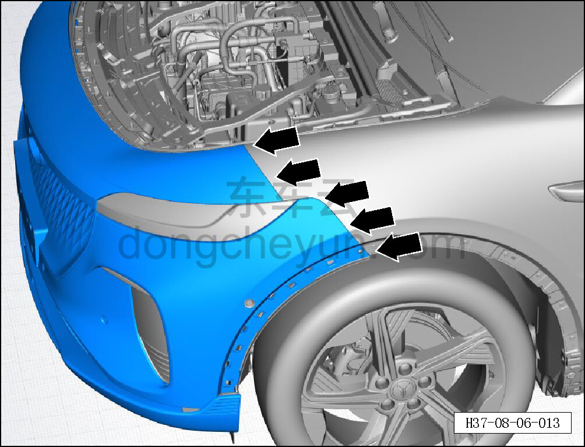

j. Отсоедините крепёжные защёлки левой стороны переднего бампера в сборе от левого монтажного кронштейна переднего бампера и левого верхнего монтажного кронштейна переднего бампера.

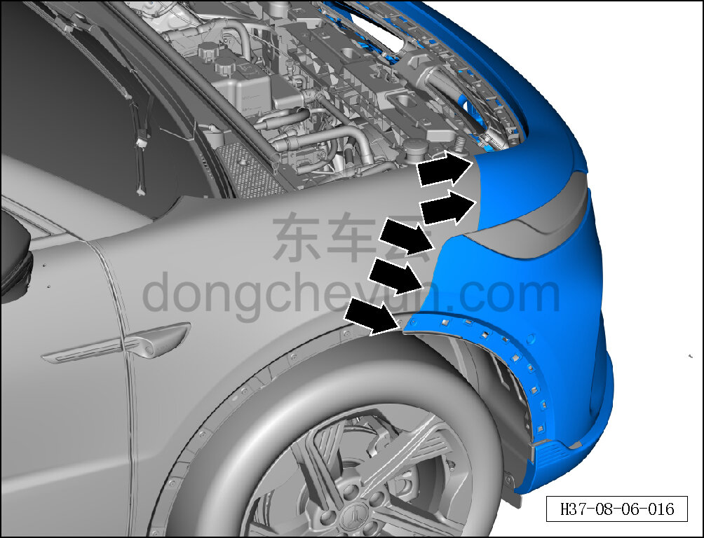

k. Отсоедините крепёжные защёлки правой стороны переднего бампера в сборе от левого монтажного кронштейна переднего бампера и левого верхнего монтажного кронштейна переднего бампера.

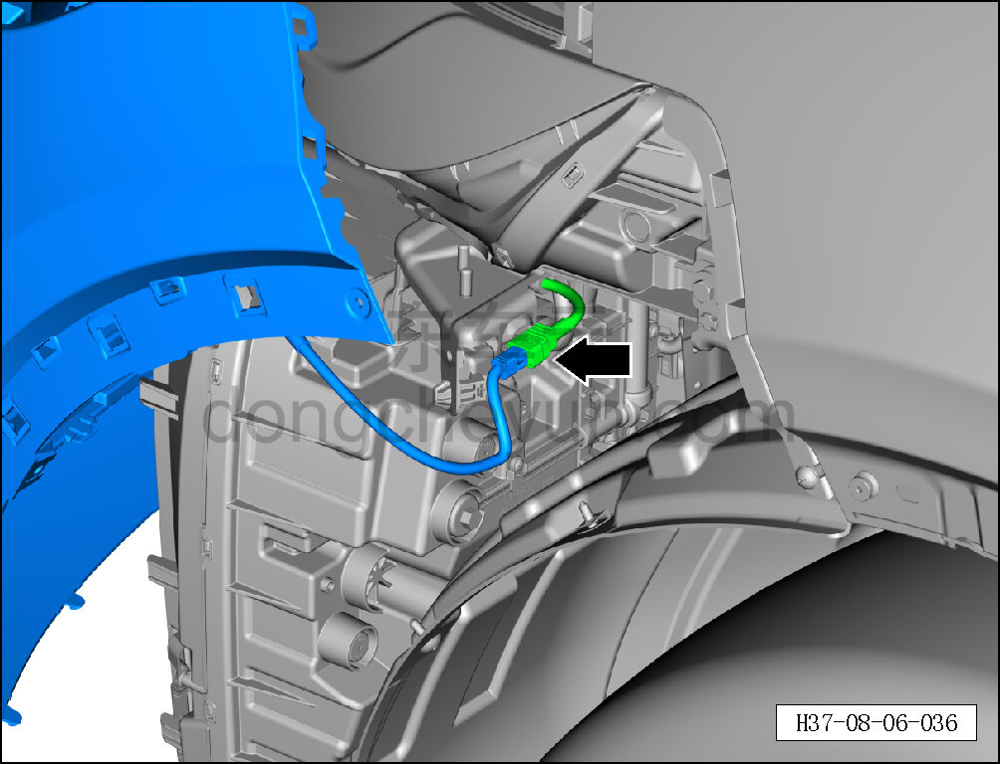

l. Вдвоём отделите передний бампер в сборе от кузова: один удерживает передний бампер, второй сначала нажимает на фиксатор разъёма жгута проводов переднего бампера и отсоединяет разъём жгута проводов переднего бампера.

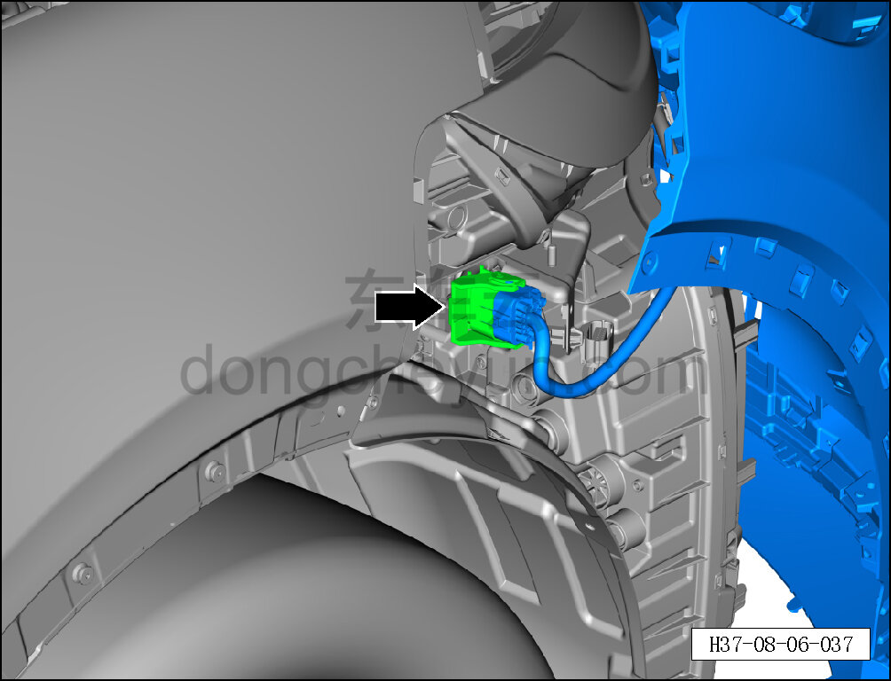

m. Сначала отожмите фиксатор разъёма жгута проводов переднего бампера, затем отсоедините разъём жгута проводов переднего бампера.

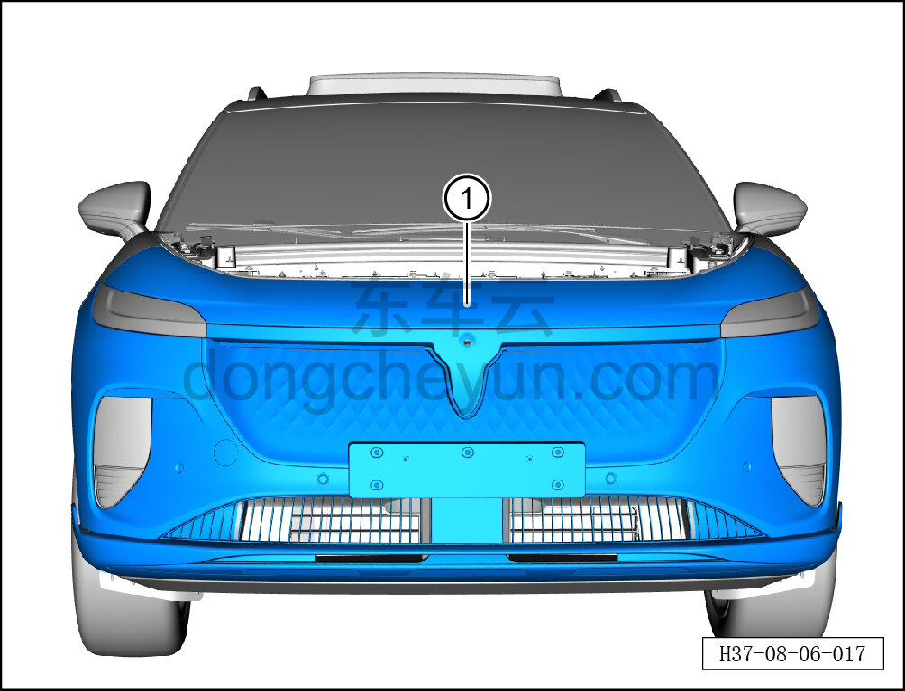

n. Вдвоём снимите передний бампер в сборе ①.

**Внимание:**

**- После снятия положите передний бампер на мягкую подкладку, чтобы не поцарапать и не повредить лакокрасочное покрытие.**

**Порядок установки**

Установка выполняется в обратном порядке.

**Внимание:**

**- При замене бампера на новый необходимо снять с него навесные элементы, а также специальным инструментом просверлить отверстия в центре маркировки на новом бампере в месте установки радара.**

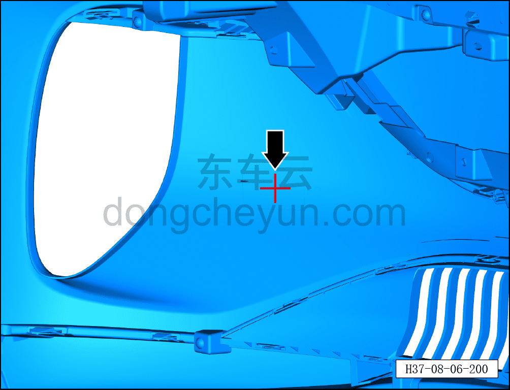

a. Электродрелью просверлите базовое отверстие в центре маркировки на облицовке переднего бампера, затем специальным инструментом произведите вырезание по контуру маркировки, вырезав монтажное отверстие для радара.

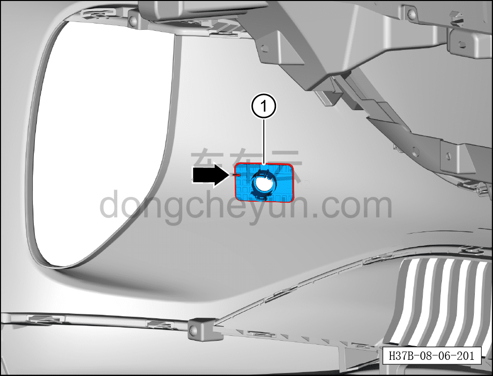

b. После вырезания монтажного отверстия для радара установите передний кронштейн радара ① в положение установки.

**Внимание:**

**- Перед установкой очистите соответствующее место приклеивания на 3M-скотч 50%-ным раствором изопропилового спирта; изопропиловый спирт можно заменить обычным спиртом; приклеивание производить только после испарения растворителя.**

**- Перед установкой нанесите на зону крепления кронштейна необходимое количество грунтовки, тип грунтовки: 3M 94#.**

**- Перед установкой слегка прогрейте фиксирующий клей переднего кронштейна радара строительным феном.**

**- После установки прижмите зажимом или грузом на некоторое время, чтобы не снизилась прочность склеивания.**

**- После завершения установки убедитесь в надёжности крепления переднего кронштейна радара.**

**-Проверьте крепёжные клипсы на отсутствие повреждений, при необходимости замените.**

**- После завершения установки проверьте нормальность зазоров переднего бампера в сборе.**

**- Проверьте и убедитесь в исправной работе звукового сигнала, передних сигнальных фонарей, передней камеры; с помощью диагностического сканера проверьте наличие кодов неисправностей, при наличии — найдите причину и очистите коды неисправностей.**
